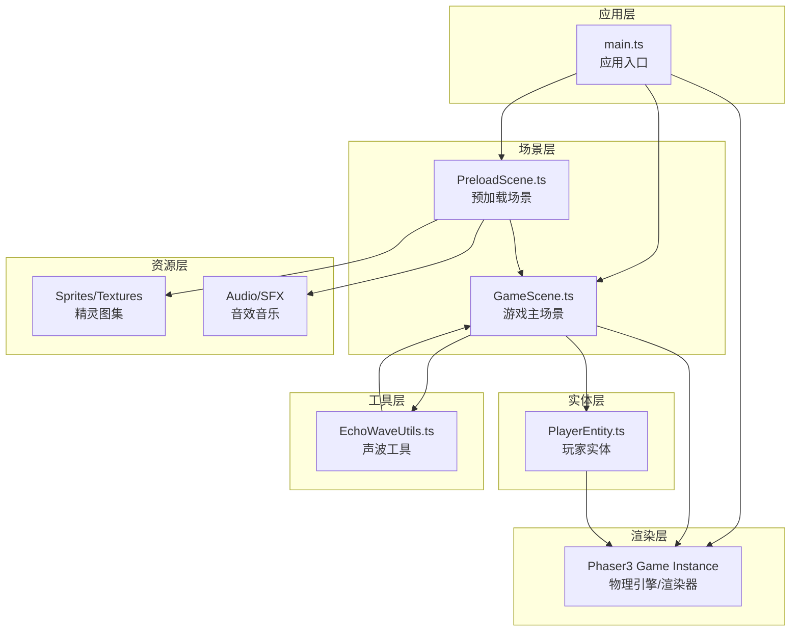

## 1. 架构设计



**模块调用关系说明：**
- `main.ts` 作为入口，初始化 Phaser 游戏实例并注册两个场景
- `PreloadScene.ts` 负责预加载所有资源，完成后自动跳转到 `GameScene.ts`
- `GameScene.ts` 是核心场景，管理物理世界、游戏逻辑，调用 `PlayerEntity` 和 `EchoWaveUtils`
- `PlayerEntity.ts` 封装玩家行为，向 `GameScene` 报告状态
- `EchoWaveUtils.ts` 是纯工具类，提供声波计算功能，返回结果给 `GameScene`

---

## 2. 技术描述

| 类别 | 技术选型 | 版本 | 说明 |
|------|----------|------|------|
| 游戏引擎 | Phaser3 | ^3.70.0 | 2D游戏框架，提供物理引擎、渲染、输入管理 |
| 开发语言 | TypeScript | ^5.3.0 | 静态类型检查，严格模式 |
| 构建工具 | Vite | ^5.0.0 | 快速构建与热更新 |
| 类型定义 | @types/phaser | ^3.60.0 | Phaser3的TypeScript类型定义 |

**项目初始化：** 使用 `npm create vite@latest . -- --template vanilla-ts` 初始化项目，然后添加 phaser 相关依赖。

---

## 3. 文件结构定义

```
EchoLedge/
├── index.html                          # 入口HTML，全屏渲染容器
├── package.json                        # 项目依赖与脚本
├── tsconfig.json                       # TypeScript配置(严格模式)
├── vite.config.js                      # Vite构建配置
└── src/
    ├── main.ts                         # 应用入口，初始化Phaser实例
    ├── scenes/
    │   ├── PreloadScene.ts             # 预加载场景
    │   └── GameScene.ts                # 游戏主场景
    ├── entities/
    │   └── PlayerEntity.ts             # 玩家实体类
    ├── utils/
    │   └── EchoWaveUtils.ts            # 声波计算工具
    └── assets/                         # 游戏资源(运行时生成或加载)
        ├── sprites/                    # 精灵图集
        └── audio/                      # 音效与背景音乐
```

### 3.1 文件职责与调用关系

| 文件 | 职责 | 依赖 | 被依赖 | 关键数据流向 |
|------|------|------|--------|--------------|
| `main.ts` | 初始化Phaser游戏配置，注册场景，启动游戏 | Phaser | 无 | 配置 → Game实例 → 场景启动 |
| `PreloadScene.ts` | 加载所有资源，显示进度条，完成后跳转 | Phaser.Scene | `main.ts` | 资源加载进度 → 100% → 启动GameScene |
| `GameScene.ts` | 物理世界管理、关卡生成、碰撞检测、游戏循环 | Phaser.Scene, `PlayerEntity`, `EchoWaveUtils` | `main.ts`, `PreloadScene.ts` | 输入 → 玩家动作 → 声波计算 → 平台显现 → 碰撞判定 → HUD更新 |
| `PlayerEntity.ts` | 玩家移动、跳跃、发射声波、状态管理 | Phaser.Physics.Arcade.Sprite | `GameScene.ts` | 位置/状态 → GameScene；输入 → 动作执行 |
| `EchoWaveUtils.ts` | 声波方向、反弹路径、碰撞探测计算 | 纯函数工具 | `GameScene.ts` | 发射参数 → 路径计算 → 平台位置列表 |

---

## 4. 数据模型定义

### 4.1 核心类型定义

```typescript
// 平台类型
interface Platform {
    id: string;
    x: number;
    y: number;
    width: number;
    height: number;
    isHidden: boolean;
    isRevealed: boolean;
    physicsBody?: Phaser.Physics.Arcade.StaticBody;
}

// 声波脉冲
interface EchoWave {
    id: string;
    x: number;
    y: number;
    direction: number;  // 弧度
    speed: number;
    spreadAngle: number;  // 张角(弧度)
    maxBounces: number;
    currentBounces: number;
    lifetime: number;  // 剩余存活时间(ms)
    pathPoints: {x: number, y: number}[];
    particles: Phaser.GameObjects.Particles.ParticleEmitter;
}

// 玩家状态
interface PlayerState {
    x: number;
    y: number;
    velocityX: number;
    velocityY: number;
    isGrounded: boolean;
    jumpsRemaining: number;
    lives: number;
    facingRight: boolean;
}

// 敌人类型
type EnemyType = 'turret' | 'bat';

interface Enemy {
    id: string;
    type: EnemyType;
    x: number;
    y: number;
    health: number;
    patrolPath?: {x: number, y: number}[];  // 蝙蝠巡逻路径
    shootCooldown?: number;  // 炮台射击冷却
    physicsBody: Phaser.Physics.Arcade.Sprite;
}

// 宝石
interface Gem {
    id: string;
    x: number;
    y: number;
    collected: boolean;
    physicsBody: Phaser.Physics.Arcade.StaticBody;
}

// 游戏状态
interface GameState {
    currentLevel: number;
    currentChapter: number;
    totalGems: number;
    collectedGems: number;
    lives: number;
    score: number;
    startTime: number;
    echoCooldown: number;  // 剩余冷却时间(ms)
}
```

---

## 5. 核心算法与数据流

### 5.1 声波探测算法

```
输入: 玩家位置(x, y)、朝向角度(direction)
输出: 探测到的隐藏平台ID列表

步骤:
1. 初始化声波参数: 速度=300px/s, 张角=120°, 最大反弹=3次, 存活=800ms
2. 沿初始方向发射声波，记录路径点
3. 每帧更新声波位置，检测碰撞:
   a. 碰撞到墙壁/地面 → 计算反射向量，反弹次数+1，继续传播
   b. 碰撞到隐藏平台 → 标记平台为可显现，添加到结果列表
   c. 碰撞到已显现平台 → 计算反射，继续传播
4. 终止条件: 反弹次数>3 或 存活时间<=0
5. 返回所有探测到的隐藏平台
```

### 5.2 关卡生成算法

```
输入: 关卡等级(level)
输出: 平台列表、敌人列表、宝石列表、传送门位置

步骤:
1. 根据关卡等级计算难度参数:
   - 隐藏平台比例 = 40% + level * 2% (最高60%)
   - 平台间距 = 80px + level * 5px
   - 敌人数量 = 2 + floor(level / 2)
2. 生成固定结构: 地面、两侧墙壁、立柱
3. 生成随机平台路径，确保可达性:
   a. 从起点向终点方向生成平台链
   b. 按比例标记部分平台为隐藏
4. 在路径附近和隐藏区域放置宝石(5颗)
5. 放置敌人: 炮台在固定平台上，蝙蝠沿路径巡逻
6. 放置终点传送门
```

### 5.3 碰撞检测数据流

```
玩家输入 → PlayerEntity.update() → 位置/速度更新
              ↓
GameScene.physics.collide() → 碰撞检测
              ↓
├─ 玩家 vs 平台 → 站立判定、跳跃重置
├─ 玩家 vs 敌人顶部 → 踩踏判定 → 敌人死亡 → 掉落道具
├─ 玩家 vs 敌人侧面/子弹 → 伤害判定 → 生命-1 → 无敌时间
├─ 玩家 vs 宝石 → 距离<20px → 自动拾取 → 宝石计数+1
├─ 玩家 vs 传送门 → 关卡完成 → 星级计算 → 下一关
└─ 声波 vs 隐藏平台 → 平台显现 → 淡入动画(300ms)
```

---

## 6. 性能优化策略

### 6.1 渲染优化
- **精灵图集**: 所有游戏元素使用单个1024x1024精灵图集，减少绘制调用
- **对象池**: 声波脉冲、子弹、粒子效果使用对象池复用，避免频繁创建销毁
- **视口裁剪**: 只渲染摄像机视口内的对象

### 6.2 物理优化
- **固定时间步长**: Phaser3 `fixedStep: true` 保证60FPS逻辑更新
- **碰撞层分组**: 静态平台、动态敌人、玩家分属不同碰撞组，减少碰撞检测次数
- **声波限制**: 同时存在的声波不超过5个，超出时销毁最旧的

### 6.3 粒子系统
- **总粒子数限制**: 所有粒子发射器总数不超过200个
- **粒子生命周期**: 声波拖尾粒子生命周期200ms，拾取粒子200ms
- **发射器复用**: 同类效果共用粒子发射器

---

## 7. 配置文件说明

### 7.1 package.json 关键配置
```json
{
  "scripts": {
    "dev": "vite",
    "build": "tsc && vite build",
    "preview": "vite preview"
  },
  "dependencies": {
    "phaser": "^3.70.0"
  },
  "devDependencies": {
    "@types/phaser": "^3.60.0",
    "typescript": "^5.3.0",
    "vite": "^5.0.0"
  }
}
```

### 7.2 tsconfig.json 严格模式
```json
{
  "compilerOptions": {
    "strict": true,
    "noImplicitAny": true,
    "strictNullChecks": true,
    "strictFunctionTypes": true,
    "noImplicitReturns": true,
    "target": "ES2020",
    "module": "ESNext",
    "moduleResolution": "node"
  }
}
```

### 7.3 Phaser 游戏配置
```typescript
const config: Phaser.Types.Core.GameConfig = {
  type: Phaser.AUTO,
  width: 960,
  height: 540,
  parent: 'game-container',
  physics: {
    default: 'arcade',
    arcade: {
      gravity: { y: 600 },
      fixedStep: true,
      fps: 60
    }
  },
  scale: {
    mode: Phaser.Scale.FIT,
    autoCenter: Phaser.Scale.CENTER_BOTH
  },
  scene: [PreloadScene, GameScene]
};
```
