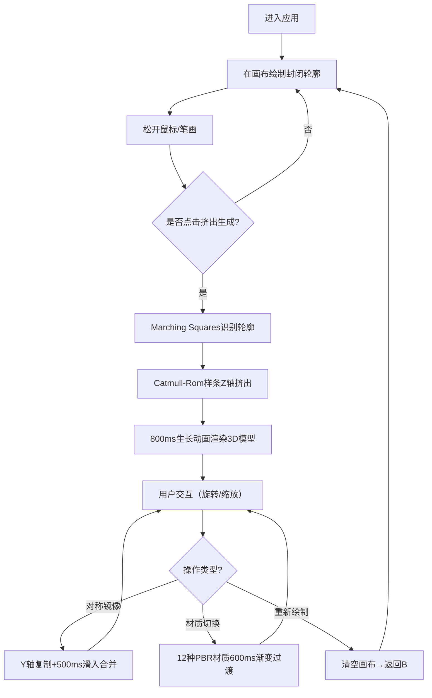

## 1. 产品概述

SketchTo3D 是一款面向创意设计师和概念艺术家的交互式可视化工具，解决在创意构思阶段无法快速将二维手绘草图转化为可旋转查看的三维形态的痛点。用户通过鼠标或触控笔绘制任意封闭轮廓，系统实时将草图转换为具有厚度和曲面变化的3D立体模型，支持多角度查看、材质切换和对称镜像操作。

- 核心目标：降低3D建模门槛，让非专业3D设计人员也能快速将创意从纸面转化为可交互的立体形态
- 目标用户：产品设计师、概念艺术家、游戏美术、建筑方案设计师、创意工作者
- 市场价值：填补"手绘草图→3D可预览模型"快速转换工具的空白，大幅缩短创意验证周期

## 2. 核心功能

### 2.1 用户角色

| 角色 | 注册方式 | 核心权限 |
|------|---------|---------|
| 普通用户 | 无需注册，直接使用 | 完整的画布绘制、3D生成、材质选择、对称镜像功能 |

### 2.2 功能模块

1. **绘制画布区**：自由绘制、网格背景、压力感应笔画、轮廓采集
2. **3D预览区**：实时渲染、鼠标拖拽旋转、滚轮缩放、光照计算、模型统计
3. **网格挤出模块**：Marching Squares轮廓识别、Catmull-Rom样条插值、800ms生长动画、顶点优化（≤2000顶点）
4. **材质系统**：12种预设PBR材质、600ms渐变过渡、投影圆盘颜色匹配
5. **对称镜像模块**：Y轴对称复制、500ms滑入动画
6. **UI交互系统**：底部工具栏、顶部导航栏、FPS监控、响应式布局

### 2.3 页面详情

| 页面名称 | 模块名称 | 功能描述 |
|---------|---------|---------|
| 主工作台 | 顶部导航栏 | 应用标题、实时FPS计数器（40+绿色/30-40黄色/＜30红色）、版本信息 |
| 主工作台 | 左侧绘制画布区 | 40%宽度、4:3比例、浅灰网格背景（20px间距）、蓝色轨迹笔画、压力感应宽度 |
| 主工作台 | 右侧3D预览区 | 60%宽度、暗色渐变背景、模型顶点/面数统计浮层、漫反射光照 |
| 主工作台 | 底部工具栏 | 毛玻璃圆形按钮（清空/挤出/镜像/材质下拉）、悬停上浮效果、涟漪点击动画 |

## 3. 核心流程

用户打开应用后，在左侧画布绘制封闭轮廓，点击"挤出生成"按钮后系统通过Marching Squares算法识别轮廓特征，使用Catmull-Rom样条沿Z轴挤出，带800ms逐层生长动画生成3D模型。模型生成后可拖拽旋转、滚轮缩放查看，点击"对称镜像"生成左右对称形态（500ms滑入动画）。通过"材质选择"切换12种PBR材质，带600ms渐变过渡，底部投影颜色自动匹配。

## 4. 用户界面设计

### 4.1 设计风格

- **主色调**：科技蓝 `#3B82F6`、深灰 `#1E293B`、中灰 `#475569`
- **辅助色**：高光蓝 `#60A5FA`、成功绿 `#10B981`、警告黄 `#F59E0B`、危险红 `#EF4444`
- **按钮风格**：毛玻璃效果（backdrop-filter: blur(12px)）、圆角8px、浅色玻璃反光、悬停上浮4px增强阴影、点击涟漪扩散
- **字体**：中文使用 "PingFang SC"，英文使用 "SF Pro Display"，等宽数据使用 "JetBrains Mono"
- **布局风格**：左右分栏（桌面端）、上下叠放（＜1024px）、卡片式浮层、统一阴影层级
- **图标风格**：线性简约图标、24px基础尺寸、统一圆角端点

### 4.2 页面设计概览

| 页面名称 | 模块名称 | UI元素 |
|---------|---------|--------|
| 主工作台 | 顶部导航栏 | 深色背景、左侧Logo+标题、右侧FPS计数、8px底部阴影 |
| 主工作台 | 左侧画布区 | 浅灰网格底、蓝色笔画`#3B82F6`、绘制时笔尖光标、边框8px圆角 |
| 主工作台 | 右侧预览区 | 径向渐变深灰背景`#0F172A→#1E293B`、右上角统计浮层、8px圆角 |
| 主工作台 | 底部工具栏 | 居中排布、4个毛玻璃圆形按钮+材质下拉、悬停上浮、点击涟漪 |

### 4.3 响应式设计

- **桌面端（≥1024px）**：左右布局，画布40%宽，预览60%宽，画布4:3比例居中于左栏
- **平板/移动端（＜1024px）**：上下叠放，画布在上50%高，预览在下50%高，工具栏按钮缩小
- **触控优化**：所有点击区域≥44×44px，画布支持多指触控旋转预览

### 4.4 3D场景指导

- **环境/HDRI氛围**：程序生成深色渐变环境，无外部HDRI依赖，使用AmbientLight + DirectionalLight组合
- **光照设置**：环境光0.4强度（冷白），主方向光0.8强度（45°右前上方），补光0.3强度（左后方）
- **相机设置**：PerspectiveCamera（fov=45, near=0.1, far=1000），初始位置(0, 2, 5)，OrbitControls禁用平移
- **构图与焦点**：模型居中于原点，底部投影圆盘半径为模型最大水平尺寸的1.2倍，相机始终朝向原点
- **交互与动画**：挤出生长动画沿Y轴逐层显示（clip从0→1），材质过渡使用uniform线性插值，镜像滑入沿X轴平移
- **后处理**：无后处理依赖，使用内置MeshStandardMaterial实现PBR效果，投影圆盘使用MeshBasicMaterial透明度0.3
- **资源与性能预算**：无外部纹理依赖，12种材质全部程序化参数，顶点≤2000，面≤4000，帧率≥50FPS
