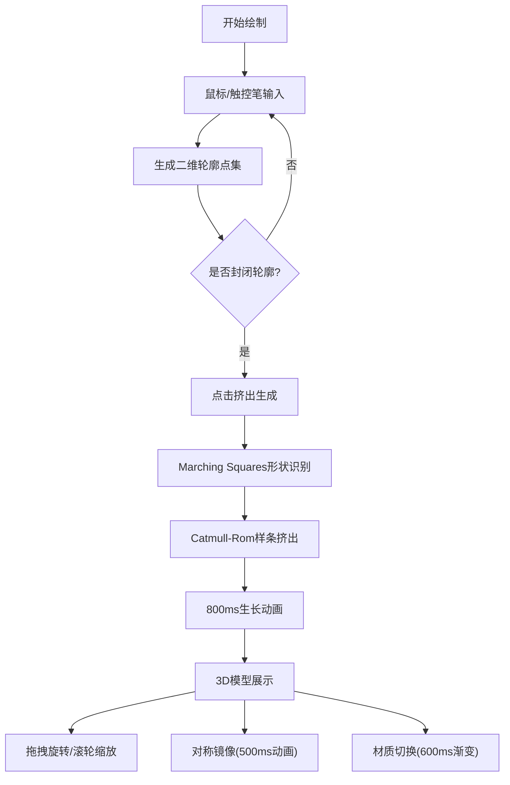

## 1. 产品概述
SketchTo3D是一款将用户手绘草图实时转换为3D立体模型的交互式可视化应用，解决创意构思阶段无法快速将二维草图转化为可旋转查看的三维形态的问题。
- 面向设计师、创意工作者和产品原型开发人员，提供从手绘到3D建模的无缝衔接
- 目标是降低3D建模门槛，将创意构思时间从小时级缩短到分钟级

## 2. 核心功能

### 2.1 用户角色
| 角色 | 注册方式 | 核心权限 |
|------|----------|----------|
| 普通用户 | 直接使用（本地应用） | 绘制草图、生成3D模型、应用材质、镜像对称 |

### 2.2 功能模块
1. **草图绘制区**：自由绘制封闭轮廓、网格背景、压力感应笔画
2. **3D预览区**：模型旋转/缩放、漫反射光照、平滑着色、实时统计
3. **工具栏**：清空画布、挤出生成、对称镜像、材质选择
4. **导航栏**：应用名称、FPS计数器（颜色指示性能状态）

### 2.3 页面详情
| 页面名称 | 模块名称 | 功能描述 |
|----------|----------|----------|
| 主页面 | 草图绘制区 | 40%屏幕占比，4:3宽高比，浅灰网格背景（20px间距），蓝色笔画轨迹，支持鼠标/触控笔输入 |
| 主页面 | 3D预览区 | 60%屏幕占比，暗色渐变背景，顶部浮层显示顶点/面数统计，支持拖拽旋转和滚轮缩放 |
| 主页面 | 底部工具栏 | 四个圆形毛玻璃按钮：清空画布、挤出生成、对称镜像、材质选择（下拉缩略图），带悬停/涟漪动画 |
| 主页面 | 顶部导航栏 | 应用名称+FPS计数器（>40FPS绿色，<30FPS红色） |

## 3. 核心流程
用户在左侧画布上绘制封闭轮廓 → 点击"挤出生成"按钮 → 系统通过Marching Squares识别轮廓 → Catmull-Rom样条在Z轴挤出 → 800ms生长动画生成3D网格 → 用户拖拽旋转查看 → 点击"对称镜像"生成左右对称形态（500ms滑入动画） → 选择12种预设材质之一（600ms渐变过渡）

## 4. 用户界面设计
### 4.1 设计风格
- **主色调**：科技蓝(#3B82F6) + 深灰(#1E293B) + 浅灰(#F1F5F9)
- **辅助色**：翡翠绿(#10B981, FPS正常)、石榴红(#EF4444, FPS告警)
- **按钮风格**：圆形毛玻璃效果，8px圆角，背景模糊12px，浅色玻璃反光
- **字体**：主要使用Inter或SF Pro，标题粗体600，正文400
- **布局**：桌面端左右分栏（40%/60%），移动端上下叠放（50%/50%）
- **动画**：悬停translateY(-4px)+阴影增强，点击涟漪扩散，材质/镜像平滑过渡

### 4.2 页面设计概述
| 页面名称 | 模块名称 | UI元素 |
|----------|----------|--------|
| 主页面 | 草图绘制区 | 浅灰网格背景(20px间距)、蓝色笔画(#3B82F6)、Canvas画布、压力感应宽度变化 |
| 主页面 | 3D预览区 | 深色渐变背景(#0F172A→#1E293B)、顶部统计浮层(毛玻璃)、Three.js渲染Canvas |
| 主页面 | 底部工具栏 | 毛玻璃容器(backdrop-blur)、4个圆形按钮、材质下拉缩略图(12格) |
| 主页面 | 顶部导航栏 | Logo+应用名称、FPS动态数字(绿色/红色切换) |

### 4.3 响应式设计
- 桌面优先（1920x1080）：左右布局40%/60%
- 平板（1024px-1919px）：保持左右布局，调整比例
- 移动（<1024px）：上下叠放，画布和预览各占50%高度
- 触控优化：增大按钮热区，支持触控笔绘制

### 4.4 3D场景指引
- **环境**：暗色渐变背景，无HDRI，营造科技感氛围
- **光照**：一盏主方向光(漫反射)+两盏补光，自动计算顶点法线，平滑着色
- **相机**：PerspectiveCamera，初始距离适配模型大小，OrbitControls控制旋转缩放
- **组成**：居中展示模型，底部半透明彩色投影圆盘（颜色随材质主色匹配）
- **交互**：鼠标拖拽绕Y/X轴旋转，滚轮缩放，材质切换PBR参数插值
- **后处理**：无后期处理，确保50FPS+性能
- **性能预算**：顶点数<2000，内存<200MB，挤出响应<200ms
