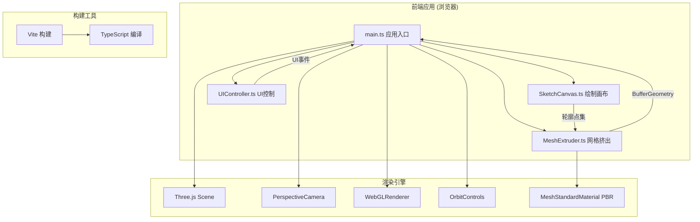

## 1. 架构设计



## 2. 技术说明
- **前端框架**：TypeScript + 原生DOM API（无React/Vue，直接操作Canvas和DOM以获得最佳性能）
- **3D引擎**：Three.js（r160+）+ @types/three，使用MeshStandardMaterial实现PBR材质
- **构建工具**：Vite 5.x + TypeScript（严格模式）
- **初始化方式**：手动创建package.json和配置文件，不使用脚手架
- **后端**：无（纯前端应用，所有计算在浏览器端完成）
- **数据库**：无（数据存储在浏览器内存中）

## 3. 路由定义
| 路由 | 用途 |
|------|------|
| / | 主应用页面（单页应用，无额外路由） |

## 4. 核心模块设计

### 4.1 类结构定义

```typescript
// SketchCanvas.ts
class SketchCanvas {
  private canvas: HTMLCanvasElement;
  private ctx: CanvasRenderingContext2D;
  private strokePoints: { x: number; y: number; pressure: number }[];
  private isDrawing: boolean;
  private gridSize: number = 20;
  
  constructor(container: HTMLElement, widthRatio?: number);
  public onStrokeComplete(callback: (points: Vector2[]) => void): void;
  public clear(): void;
  public getContourPoints(): Vector2[];
  private normalizePoints(points: {x:number;y:number}[]): Vector2[];
  private simplifyPoints(points: Vector2[], tolerance: number): Vector2[];
}

// MeshExtruder.ts
class MeshExtruder {
  private scene: THREE.Scene;
  private maxVertices: number = 2000;
  private currentMesh: THREE.Mesh | null;
  private mirroredMesh: THREE.Mesh | null;
  private growthAnimationId: number | null;
  
  constructor(scene: THREE.Scene);
  public extrude(contourPoints: Vector2[], height: number = 2): THREE.Mesh;
  public applyMaterialWithTransition(materialParams: MaterialConfig, duration: number = 600): void;
  public mirror(axis: 'y' = 'y', duration: number = 500): void;
  public clearMeshes(): void;
  private marchingSquares(points: Vector2[]): Vector2[]; // 改进的轮廓识别
  private catmullRomExtrude(silhouette: Vector2[], height: number, segments: number): BufferGeometry;
  private calculateNormals(geometry: BufferGeometry): void;
  private animateGrowth(geometry: BufferGeometry, duration: number = 800): void;
}

// UIController.ts
class UIController {
  private toolbarContainer: HTMLElement;
  private fpsElement: HTMLElement;
  private frameCount: number = 0;
  private lastFpsUpdate: number = 0;
  
  constructor();
  public onClearClick(callback: () => void): void;
  public onExtrudeClick(callback: () => void): void;
  public onMirrorClick(callback: () => void): void;
  public onMaterialSelect(callback: (material: MaterialConfig) => void): void;
  public updateFPS(): void;
  public getStatsPanel(): HTMLElement;
  public updateVertexStats(vertices: number, faces: number): void;
  public handleResponsiveLayout(width: number): void;
}
```

### 4.2 PBR材质配置

```typescript
interface MaterialConfig {
  name: string;
  color: string;
  roughness: number;
  metalness: number;
  emissive?: string;
  emissiveIntensity?: number;
  clearcoat?: number;
  transmission?: number;
  thickness?: number;
  projectionColor: string; // 投影圆盘匹配色
  thumbnail: string; // 缩略图CSS渐变
}

const MATERIALS: MaterialConfig[] = [
  { name: '抛光金属', color: '#C0C0C0', roughness: 0.1, metalness: 1.0, projectionColor: '#94A3B8', thumbnail: 'linear-gradient(135deg,#E5E7EB,#6B7280)' },
  { name: '拉丝金属', color: '#A8A8A8', roughness: 0.35, metalness: 0.9, projectionColor: '#9CA3AF', thumbnail: 'linear-gradient(135deg,#D1D5DB,#4B5563)' },
  { name: '黄金', color: '#FFD700', roughness: 0.2, metalness: 1.0, projectionColor: '#FBBF24', thumbnail: 'linear-gradient(135deg,#FEF3C7,#F59E0B)' },
  { name: '红铜', color: '#B87333', roughness: 0.25, metalness: 0.95, projectionColor: '#D97706', thumbnail: 'linear-gradient(135deg,#FCD34D,#B45309)' },
  { name: '陶土', color: '#C2956E', roughness: 0.85, metalness: 0.0, projectionColor: '#A78BFA', thumbnail: 'linear-gradient(135deg,#FDE68A,#92400E)' },
  { name: '磨砂玻璃', color: '#E0F2FE', roughness: 0.15, metalness: 0.0, transmission: 0.6, thickness: 0.5, projectionColor: '#38BDF8', thumbnail: 'linear-gradient(135deg,#DBEAFE,#60A5FA)' },
  { name: '透明水晶', color: '#FFFFFF', roughness: 0.05, metalness: 0.0, transmission: 0.9, thickness: 1.0, clearcoat: 1.0, projectionColor: '#818CF8', thumbnail: 'linear-gradient(135deg,#F0F9FF,#A78BFA)' },
  { name: '碳纤维', color: '#1F2937', roughness: 0.4, metalness: 0.6, projectionColor: '#374151', thumbnail: 'linear-gradient(13