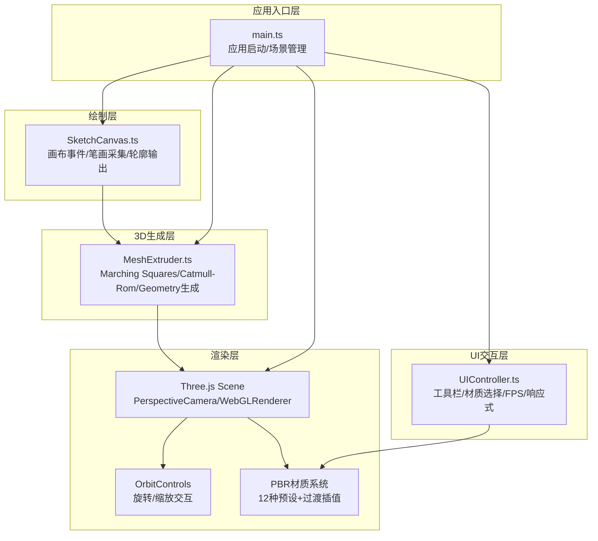

## 1. 架构设计



## 2. 技术说明

- **前端框架**：原生 TypeScript 5.0（无React，纯DOM操作，追求极致性能）
- **3D引擎**：Three.js r160 + @types/three
- **构建工具**：Vite 5.0（热更新、TypeScript原生支持、零配置）
- **样式方案**：原生CSS + CSS变量（无Tailwind依赖，减少构建体积）
- **无后端、无数据库**：纯前端运行，所有计算在浏览器端完成
- **算法依赖**：自研Marching Squares简化版 + Catmull-Rom样条插值

## 3. 模块划分与核心API

### 3.1 SketchCanvas 类（src/sketch/SketchCanvas.ts）

```typescript
class SketchCanvas {
  constructor(container: HTMLElement, options?: { gridSize?: number });
  getContourPoints(): Vector2[];  // 返回归一化的轮廓点集[-1, 1]
  clear(): void;
  onStrokeEnd(callback: (points: Vector2[]) => void): void;
}
```

职责：
- 监听鼠标/触控事件，采集绘制轨迹
- 网格背景渲染（20px间距）
- 压力感应笔画宽度（根据移动速度模拟）
- 绘制结束时输出封闭轮廓点集（自动闭合首尾）

### 3.2 MeshExtruder 类（src/extrude/MeshExtruder.ts）

```typescript
class MeshExtruder {
  constructor(scene: THREE.Scene);
  extrude(contourPoints: Vector2[], options?: { thickness?: number }): Promise<THREE.Mesh>;
  applySymmetry(mesh: THREE.Mesh): Promise<THREE.Group>;
  getStats(): { vertices: number; faces: number };
  dispose(): void;
}
```

职责：
- Marching Squares：将2D画布栅格化→提取等值线→生成优化轮廓
- Catmull-Rom样条：沿Z轴挤出，控制点插值产生曲面
- 顶点优化：合并共面点，确保顶点≤2000
- 800ms生长动画：morphTarget + clip动画
- 法线计算：computeVertexNormals() 平滑着色
- 500ms对称镜像：克隆+X轴翻转+滑入tween

### 3.3 UIController 类（src/ui/UIController.ts）

```typescript
class UIController {
  constructor(root: HTMLElement, handlers: {
    onClear: () => void;
    onExtrude: () => void;
    onSymmetry: () => void;
    onMaterialChange: (id: number) => void;
  });
  updateFPS(fps: number): void;
  updateStats(vertices: number, faces: number): void;
  setExtrudeEnabled(enabled: boolean): void;
}
```

职责：
- 底部工具栏4按钮渲染+毛玻璃样式
- 材质选择下拉（12种缩略图）
- FPS实时更新（每500ms采样）
- 模型统计浮层
- 响应式布局监听（＜1024px切换上下布局）
- 悬停上浮、涟漪点击动画

### 3.4 main.ts（src/main.ts）

```typescript
// 核心流程：
// 1. Three.js 初始化（Scene/Camera/Renderer/OrbitControls）
// 2. 光照系统（AmbientLight + 2 DirectionalLight）
// 3. 三大实例化：SketchCanvas / MeshExtruder / UIController
// 4. 事件绑定：绘制结束→生成→UI更新
// 5. 动画循环：requestAnimationFrame → renderer.render → FPS更新
// 6. 12种PBR材质预设 + 材质过渡uniform插值
// 7. 响应式resize处理
```

### 3.5 12种PBR材质预设（main.ts中定义）

| ID | 名称 | 颜色 | 粗糙度 | 金属度 | 投影色 |
|----|------|------|--------|--------|--------|
| 0 | 磨砂金属 | #8A9BA8 | 0.35 | 0.85 | #8A9BA8 |
| 1 | 抛光金属 | #C0D3DE | 0.08 | 1.0 | #C0D3DE |
| 2 | 陶土 | #C2956E | 0.92 | 0.0 | #C2956E |
| 3 | 磨砂玻璃 | #B8E0F0 | 0.1 | 0.0 | 透明半蓝 |
| 4 | 碳纤维 | #2D2D30 | 0.45 | 0.6 | #2D2D30 |
| 5 | 磨砂塑料 | #4A90D9 | 0.6 | 0.1 | #4A90D9 |
| 6 | 青铜 | #CD7F32 | 0.3 | 0.9 | #CD7F32 |
| 7 | 大理石 | #F0EBDA | 0.2 | 0.05 | #F0EBDA |
| 8 | 紫檀木 | #5C1E1E | 0.75 | 0.05 | #5C1E1E |
| 9 | 哑光橡胶 | #3B3B3C | 0.98 | 0.0 | #3B3B3C |
| 10 | 皮革 | #8B4513 | 0.85 | 0.02 | #8B4513 |
| 11 | 阳极氧化铝 | #D44D5C | 0.35 | 0.7 | #D44D5C |

## 4. 文件组织结构

```
auto70/
├── package.json
├── index.html
├── tsconfig.json
├── vite.config.js
└── src/
    ├── main.ts                    # 入口+Three.js初始化+动画循环
    ├── sketch/
    │   └── SketchCanvas.ts        # 画布绘制+轮廓采集
    ├── extrude/
    │   └── MeshExtruder.ts        # Marching Squares+样条挤出
    └── ui/
        └── UIController.ts        # UI控制+响应式
```

## 5. 关键算法说明

### 5.1 Marching Squares 简化实现
- 画布2D点集栅格化为64×64分辨率距离场
- 提取阈值0.5的等值线作为优化轮廓
- 输出≤100个轮廓采样点

### 5.2 Catmull-Rom 样条挤出
- 轮廓点沿Z轴方向分为N段（默认8段，保证顶点数可控）
- 相邻4点做Catmull-Rom插值，张力系数0.5
- Z轴每段厚度变化：0→峰值→平稳，产生自然曲面过渡

### 5.3 顶点优化策略
- 相邻共面三角形合并
- 距离＜ε的顶点焊接
- 目标：顶点≤2000，面≤4000

### 5.4 材质过渡实现
- 当前/目标材质参数存入uniforms
- shader中 `mix(current, target, t)`，t从0→1线性插值600ms
- 投影圆盘颜色使用相同t值过渡

### 5.5 FPS性能保障
- MeshExtruder计算在空闲帧切片执行（requestIdleCallback）
- Three.js使用BufferGeometry + DrawRange增量渲染
- 渲染循环中避免GC：复用临时Vector对象池
