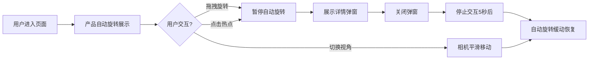

## 1. 产品概述

VividLens是一款沉浸式产品360度交互展示应用，通过3D渲染技术让用户自由旋转查看产品细节，配合热点标注系统深度探索产品部件信息，解决传统静态展示缺乏交互深度和沉浸感的问题。

- 目标用户：品牌营销团队、电商产品展示、产品发布页面
- 核心价值：提升用户对产品细节的探索意愿，增强品牌科技感形象

## 2. 核心功能

### 2.1 用户角色

| 角色 | 注册方式 | 核心权限 |
|------|----------|----------|
| 访客用户 | 无需注册 | 自由旋转查看产品、点击热点查看详情、切换视角预设 |

### 2.2 功能模块

1. **3D交互展示页**：产品360度旋转、热点标注、信息弹窗、视角预设、自动旋转
2. **响应式适配层**：桌面端弹窗、移动端底部滑出面板、触屏交互优化

### 2.3 页面详情

| 页面名称 | 模块名称 | 功能描述 |
|---------|----------|----------|
| 3D展示主页 | 3D场景渲染 | 加载产品GLB模型，支持鼠标/触屏拖拽旋转，阻尼系数0.1，帧率50FPS+ |
| 3D展示主页 | 热点交互系统 | 5-8个光晕热点，悬停放大变色，点击弹出详情卡片 |
| 3D展示主页 | 信息弹窗 | 玻璃态背景，显示部件名称、3-4行描述、特写图片，带开闭动画 |
| 3D展示主页 | 自动旋转控制 | 每10秒转一圈，交互时暂停，停止5秒后缓动恢复 |
| 3D展示主页 | 视角预设切换 | 4个预设视角（正面、背面、左侧、45度俯视），800ms平滑过渡 |
| 3D展示主页 | 响应式适配 | 320px-2560px全尺寸适配，移动端底部滑出面板 |

## 3. 核心流程

用户进入页面 → 产品模型自动缓慢旋转展示 → 用户可随时拖拽旋转查看任意角度 → 悬停热点查看放大效果 → 点击热点弹出部件详情弹窗 → 可切换预设视角快速定位 → 关闭弹窗后自动旋转恢复

## 4. 用户界面设计

### 4.1 设计风格

- **主色调**：深色背景 #0f0f15，热点光晕 #5b9aff 亮蓝色渐变
- **辅助色**：白色文字，玻璃态半透明背景 rgba(20,20,30,0.8)
- **字体**：无衬线现代字体，标题18px，正文14px
- **按钮样式**：圆形发光按钮，带脉冲动画，纯CSS绘制图标
- **布局风格**：全屏沉浸式，3D场景占满视口，UI元素浮动叠加
- **视觉特效**：backdrop-filter模糊、渐变光晕、呼吸动画、平滑过渡

### 4.2 页面设计概述

| 页面名称 | 模块名称 | UI元素 |
|---------|----------|--------|
| 3D展示主页 | 3D场景区域 | 全屏Canvas，产品居中，深色背景，环境光照 |
| 3D展示主页 | 热点标签 | 圆形光晕，边缘羽化，呼吸动画，悬停放大1.3倍 |
| 3D展示主页 | 信息弹窗 | 圆角12px，玻璃态背景，阴影投影，从热点向上展开动画 |
| 3D展示主页 | 视角预设按钮 | 右下角浮动圆形按钮组，脉冲发光动画，纯CSS图标 |
| 3D展示主页 | 放大镜区域 | 宽屏(>1200px)时弹窗左侧显示部件细节放大图 |
| 3D展示主页 | 移动端面板 | <768px时底部滑出，60%视口高度，内置滚动 |

### 4.3 响应式设计

- **桌面优先**：1200px+ 弹窗左侧放大镜区域，UI元素精致布局
- **平板适配**：768px-1200px 保持弹窗样式，适当调整尺寸
- **移动端**：<768px 取消自动旋转，弹窗改为底部滑出面板，优化触控区域
- **超宽屏**：>2560px 保持居中布局，最大内容宽度限制

### 4.4 3D场景设计

- **环境光**：半球光 + 方向光，突出产品轮廓和质感
- **相机设置**：PerspectiveCamera，fov 45，初始距离产品2.5倍
- **相机运动**：OrbitControls带阻尼，dampingFactor 0.1，启用阻尼
- **热点实现**：MeshBasicMaterial + 透明度动画，scale缩放过渡
- **后期处理**：轻微抗锯齿，保持产品边缘清晰
- **性能预算**：模型<2MB，帧率>45FPS，初始加载<5秒(4G)
