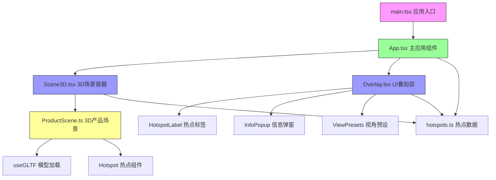

## 1. 架构设计



## 2. 技术描述

- **前端框架**：React@18 + TypeScript@5 + Vite@5
- **3D渲染**：three@0.160 + @react-three/fiber@8 + @react-three/drei@9
- **构建工具**：Vite@5 + @vitejs/plugin-react@4
- **状态管理**：React useState/useRef (轻量级局部状态)
- **样式方案**：CSS Modules + 内联样式动画
- **模型加载**：GLTF/GLB格式，使用@react-three/drei的useGLTF钩子

### 核心技术选型理由
1. **@react-three/fiber**：声明式Three.js React渲染器，完美契合React组件化思想
2. **@react-three/drei**：提供OrbitControls、useGLTF等常用Three.js工具组件
3. **Vite**：极速开发体验，HMR热更新，生产构建优化
4. **TypeScript严格模式**：类型安全，减少运行时错误

## 3. 目录结构

```
src/
├── main.tsx              # 应用入口
├── App.tsx               # 主应用组件（状态管理中心）
├── index.css             # 全局样式
├── components/
│   ├── Scene3D.tsx       # 3D场景容器
│   └── Overlay.tsx       # UI叠加层
├── scenes/
│   └── ProductScene.tsx  # 产品3D场景（模型+热点）
└── data/
    └── hotspots.ts       # 热点数据定义
```

## 4. 路由定义

| 路由 | 页面 | 用途 |
|------|------|------|
| / | 3D展示主页 | 产品360度交互展示主页面 |

## 5. 数据流向

### 5.1 数据流向图
```
App.tsx (全局状态)
├── 传出: productId, rotation, activeHotspotId, hotspots
└── 接收: onRotate(), onHotspotClick(), onHotspotHover()
    ↑
    ├── Scene3D.tsx
    │   ├── 传出: productId 给 ProductScene
    │   ├── 接收: rotation 从 OrbitControls
    │   └── 传出: onRotate() 回调给 App
    │
    └── Overlay.tsx
        ├── 接收: hotspots, activeHotspotId
        ├── 传出: onHotspotClick() 回调给 App
        └── 传出: onHotspotHover() 回调给 App
```

### 5.2 状态提升说明
- **App.tsx** 作为单一数据源，管理：
  - `rotation`: 当前旋转角度 { x, y }
  - `activeHotspotId`: 当前激活的热点ID
  - `isAutoRotating`: 自动旋转状态
  - `hoveredHotspotId`: 当前悬停的热点ID

### 5.3 热点数据模型
```typescript
interface Hotspot {
  id: string;
  position: [number, number, number];
  title: string;
  description: string;
  imageUrl: string;
}
```

## 6. 核心组件设计

### 6.1 Scene3D.tsx (3D场景容器)
- **职责**：创建Canvas，设置相机、光照，处理OrbitControls
- **Props**：`productId`, `onRotate`, `autoRotateSpeed`
- **内部状态**：OrbitControls ref
- **性能优化**：React.memo包裹，useMemo缓存光照配置

### 6.2 ProductScene.tsx (3D产品场景)
- **职责**：加载GLB模型，渲染热点Mesh
- **Props**：`hotspots`, `onHotspotClick`, `hoveredHotspotId`, `activeHotspotId`
- **动画**：热点呼吸动画（useFrame）、悬停放大动画
- **性能优化**：useGLTF预加载，模型实例复用

### 6.3 Overlay.tsx (UI叠加层)
- **职责**：渲染2D热点标签、信息弹窗、视角预设按钮
- **Props**：`hotspots`, `activeHotspotId`, `onHotspotClick`, `onViewPreset`
- **子组件**：HotspotLabel, InfoPopup, ViewPresetButton
- **动画**：弹窗开闭动画、按钮脉冲动画

### 6.4 App.tsx (主应用)
- **职责**：全局状态管理，自动旋转逻辑，交互暂停/恢复
- **核心逻辑**：
  - 5秒无交互后恢复自动旋转（setTimeout + clearTimeout）
  - 自动旋转缓动恢复（lerp插值）
  - 响应式媒体查询（useMediaQuery）

## 7. 性能优化策略

### 7.1 渲染优化
- 使用 `React.memo` 包裹所有子组件
- 使用 `useMemo` 缓存计算密集型数据
- 使用 `useCallback` 缓存回调函数
- 避免在render中创建新对象/数组

### 7.2 3D性能
- 模型面数控制：使用简化版GLB模型
- 材质优化：使用MeshStandardMaterial，减少贴图数量
- 动画优化：useFrame中只更新必要的状态
- 像素比限制：`dpr={[1, 2]}` 避免高DPI设备性能损耗

### 7.3 加载优化
- 模型压缩：使用Draco压缩GLB
- 预加载：关键资源预加载
- 懒加载：非关键资源按需加载

## 8. 动画实现方案

### 8.1 CSS动画（UI层）
- 热点脉冲：`@keyframes pulse` 透明度+缩放
- 弹窗展开：`transition: transform 300ms, opacity 300ms`
- 按钮悬停：`transition: all 200ms ease-out`

### 8.