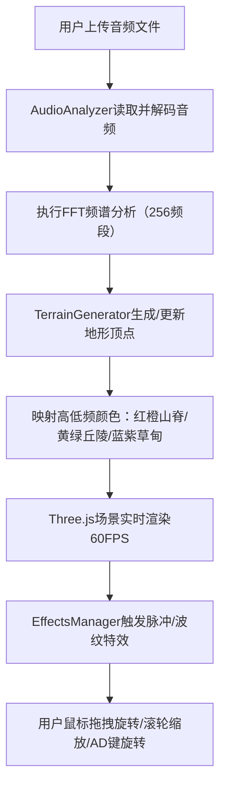

## 1. 产品概述

音频3D波形景观可视化应用，将用户上传的音乐文件通过实时FFT频谱分析转换为可交互的三维地形景观。解决普通音频可视化工具无法以可触摸、可缩放的三维地形方式呈现音乐情绪起伏和频谱细节的问题。

- 目标用户：音乐爱好者、视觉设计师、音频创作者
- 产品价值：提供沉浸式的音乐视觉化体验，让音乐的频率结构和情感波动以立体地形形式呈现

## 2. 核心功能

### 2.1 功能模块

1. **主界面**：3D渲染画布、半透明控制条、FPS调试标签

### 2.2 页面详情

| 页面名称 | 模块名称 | 功能描述 |
|-----------|-------------|---------------------|
| 主界面 | 3D渲染画布 | 全屏Three.js渲染器，展示动态波形地形景观 |
| 主界面 | 控制条（毛玻璃） | 文件上传、播放/暂停、流速滑块、当前时间显示 |
| 主界面 | FPS调试标签 | 实时显示帧率信息 |

## 3. 核心流程

用户上传MP3/WAV音频文件 → 系统读取并在前端执行FFT频谱分析 → 频谱数据映射为三维地形高度和颜色 → 实时渲染动态地形景观 → 用户通过鼠标/键盘交互探索地形 → 音频播放时触发脉冲和波纹特效

## 4. 用户界面设计

### 4.1 设计风格
- **主色调**：深空黑色背景 #0A0A1A
- **强调色**：紫色 #8B5CF6（交互悬停）
- **地形颜色映射**：
  - 低频（山脊）：红色 → 橙黄色渐变
  - 中频（丘陵）：黄绿色 → 青蓝色渐变
  - 高频（草甸）：浅蓝色 → 紫色渐变
- **按钮风格**：圆角矩形、白色边框、悬停紫色边框（200ms ease过渡）
- **控制条**：半透明毛玻璃效果（模糊背景10px）
- **字体**：现代等宽/无衬线字体，适配深空主题

### 4.2 页面设计概览

| 页面名称 | 模块名称 | UI元素 |
|-----------|-------------|-------------|
| 主界面 | 3D渲染画布 | 全屏WebGL画布、深空背景、三维地形、光照效果 |
| 主界面 | 顶部控制条 | 毛玻璃背景、上传按钮、播放/暂停按钮、流速滑块、时间标签、自动淡入淡出 |
| 主界面 | FPS调试 | 右下角白色文字显示帧率 |

### 4.3 响应式设计
- 桌面端优先设计
- 画布自适应窗口尺寸
- 控制条宽度自适应

### 4.4 3D场景指引
- **环境**：深空黑色背景，无HDRI，营造宇宙深空氛围
- **光照设置**：环境光 + 定向光 + 点光源，突出地形起伏
- **相机设置**：OrbitControls轨道控制，PerspectiveCamera，近裁剪面1单位
- **交互动画**：地形沿Z轴流动、鼓点脉冲放大、同心圆波纹扩散
- **性能预算**：地形顶点≤3000个，频谱更新≥30次/秒，渲染≥60FPS
