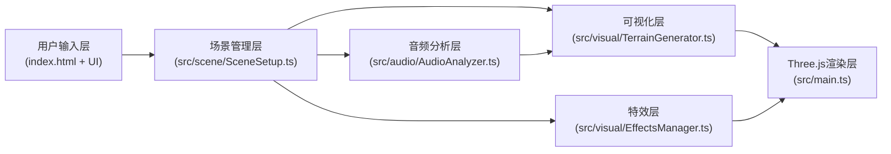

## 1. 架构设计



## 2. 技术说明

- **前端**：TypeScript + Vite + Three.js
- **初始化工具**：Vite vanilla-ts 模板
- **依赖库**：
  - three：3D渲染引擎
  - @types/three：Three.js TypeScript类型定义
  - gsap：动画库（用于脉冲、波纹等缓动动画）
  - vite：构建工具和开发服务器
  - typescript：类型系统

## 3. 路由定义

| 路由 | 用途 |
|-------|---------|
| / | 主应用入口，全屏3D渲染画布 |

## 4. 核心模块数据流

### 4.1 AudioAnalyzer (音频分析模块)
```typescript
interface IAudioAnalyzer {
  loadAudioFile(file: File): Promise<void>
  getFrequencyData(): Uint8Array  // size: 256
  getTimeData(): Uint8Array
  getCurrentTime(): number
  getDuration(): number
  play(): void
  pause(): void
  setPlaybackRate(rate: number): void
}
```
- 使用 Web Audio API (AudioContext, AnalyserNode, AudioBufferSourceNode)
- FFT窗口大小：512 → 输出256个频率点
- 频谱数据通过 getFrequencyData() 每帧轮询

### 4.2 TerrainGenerator (地形生成模块)
```typescript
interface ITerrainGenerator {
  buildTerrain(gridWidth: number, gridDepth: number): Mesh
  updateTerrain(frequencyData: Uint8Array, flowOffset: number): void
  setLowFreqPulse(intensity: number): void
}
```
- 网格尺寸：约 50×60 = 3000 顶点
- 高度映射：低频→山脊(高)、中频→丘陵(中)、高频→草甸(低)
- 颜色映射：根据频段使用渐变色计算顶点颜色

### 4.3 EffectsManager (特效管理模块)
```typescript
interface IEffectsManager {
  triggerPulse(position: Vector3, intensity: number): void
  addRipple(origin: Vector3): void
  update(delta: number): void
}
```
- 脉冲效果：鼓点时低频区域高度+0.3单位，150ms后恢复
- 波纹效果：从山脊顶部扩散的半透明同心圆，400ms生命周期
- 使用 gsap 管理缓动动画

### 4.4 SceneSetup (场景组装模块)
- 管理 Three.js Scene、Camera、Renderer、OrbitControls
- 组装灯光、地形网格、特效层
- 管理顶部控制条UI的显隐（闲置3秒淡出，鼠标进入淡入）
- 键盘事件监听（A/D键绕Y轴旋转地形，0.5弧度/秒）

## 5. 性能优化策略

1. 地形使用 BufferGeometry，更新顶点位置和颜色时仅修改属性数组
2. 频谱分析限制在 30+ FPS，与渲染循环解耦
3. 波纹和脉冲对象池复用，避免频繁GC
4. 使用 OrbitControls 的 enableDamping 平滑交互
5. 顶点数严格控制在 3000 以内

## 6. 文件结构

```
auto76/
├── .trae/documents/
│   ├── PRD.md
│   └── TECH_ARCHITECTURE.md
├── package.json
├── tsconfig.json
├── vite.config.js
├── index.html
└── src/
    ├── main.ts
    ├── audio/
    │   └── AudioAnalyzer.ts
    ├── visual/
    │   ├── TerrainGenerator.ts
    │   └── EffectsManager.ts
    └── scene/
        └── SceneSetup.ts
```
