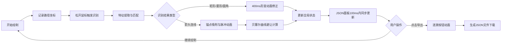

## 1. 产品概述

流程图手绘识别工具是一款面向设计师和产品经理的Web应用，解决用户在白板上手绘流程图草图后需要在专业工具中手动复现的效率痛点。用户通过鼠标或触控笔在Canvas画布上绘制草图，系统自动识别形状类型并修正为标准流程图符号，同时实时生成可编辑的JSON数据结构，支持一键导出。

- **目标用户**：UI/UX设计师、产品经理、业务分析师
- **核心价值**：将手绘草图到标准流程图的转换时间从分钟级压缩到秒级，提升工作效率80%以上

## 2. 核心功能

### 2.1 用户角色

| 角色 | 注册方式 | 核心权限 |
|------|----------|----------|
| 普通用户 | 无需注册，直接使用 | 绘制流程图、识别形状、导出JSON |

### 2.2 功能模块

1. **画布绘制模块**：手绘路径采集、实时绘制反馈、形状选中与拖拽
2. **形状识别引擎**：矩形/菱形/圆角矩形/箭头的特征提取与匹配、400ms平滑形变动画
3. **连线吸附系统**：锚点自动吸附、绿色脉冲动画、贝塞尔曲线自动避让
4. **JSON实时预览**：100ms内同步更新、新增节点淡入、删除节点高亮消失
5. **导出功能**：涟漪波纹按钮动画、按时间戳命名的JSON文件下载

### 2.3 页面详情

| 页面名称 | 模块名称 | 功能描述 |
|----------|----------|----------|
| 主工作台 | 顶部工具栏 | 工具选择（绘制/选择/删除）、导出JSON按钮 |
| 主工作台 | 左侧画布区 | 手绘输入、形状渲染、拖拽交互、吸附锚点 |
| 主工作台 | 右侧JSON面板 | 树形结构展示、实时同步、动画过渡 |
| 主工作台 | 分割条 | 可拖拽调整面板比例、拖拽高亮反馈 |

## 3. 核心流程

用户在画布上按下鼠标开始绘制，系统实时记录路径点坐标。松开鼠标后触发形状识别算法（20ms内完成），对路径进行特征提取（封闭性、角点数、宽高比、直线度等），输出匹配度最高的标准形状类型。形状以400ms平滑动画从手绘轮廓渐变到标准符号。若识别为箭头连线，自动计算最近的形状边界锚点，吸附时显示绿色脉冲动画，连线采用贝塞尔曲线自动避让重叠。每一次画布状态变更，右侧JSON面板在100ms内同步更新。用户点击导出按钮触发涟漪动画，生成带时间戳命名的JSON文件下载。

## 4. 用户界面设计

### 4.1 设计风格

- **主背景色**：#1e1e2e（深色基底，营造专业工具氛围）
- **副背景色**：#2b2b3c（面板分隔与层次区分）
- **矩形填充**：#89b4fa（蓝紫色，流程步骤）
- **菱形填充**：#a6e3a1（绿色，判断分支）
- **箭头连线**：#fab387（橙色，数据流方向）
- **选中边框**：#f38ba8（粉色，虚线闪烁周期1s）
- **字体**：JetBrains Mono（代码面板）+ Inter（界面文本）
- **按钮交互**：hover缩放1.02，点击缩放0.95，过渡200ms ease-out
- **图标风格**：Lucide图标库，线性风格

### 4.2 页面设计概述

| 页面名称 | 模块名称 | UI元素 |
|----------|----------|--------|
| 主工作台 | 顶部工具栏 | 深色背景、图标按钮组、导出按钮带悬浮放大效果 |
| 主工作台 | 画布区 | 网格点阵背景、形状填充色+白色边框、选中粉色虚线闪烁 |
| 主工作台 | JSON面板 | 代码字体、语法高亮、节点缩进树形、新增淡入/删除高亮消失 |
| 主工作台 | 分割条 | 默认2px灰色、拖拽时4px高亮色、cursor-col-resize |

### 4.3 响应式

采用Desktop-First设计策略：
- 桌面端（≥768px）：左右分栏布局，画布70% / JSON面板30%，可拖拽分割条调整比例
- 移动端（<768px）：上下堆叠布局，JSON面板折叠到底部，画布占满宽度，面板可展开/收起

### 4.4 性能指标

| 指标 | 要求 |
|------|------|
| 形状识别耗时 | ≤ 20ms |
| JSON预览更新延迟 | ≤ 100ms |
| 重叠检测帧率 | ≥ 60FPS |
| 画布操作帧率 | ≥ 55FPS |
| 形状匹配准确率 | ≥ 85% |
