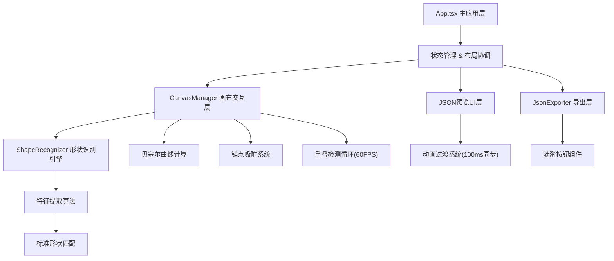
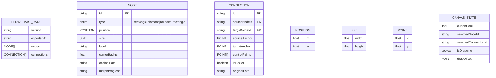

## 1. 架构设计

本项目为纯前端单页应用，采用分层架构设计，各模块职责清晰、耦合度低。



## 2. 技术描述

- **前端框架**：React@18 + TypeScript@5（严格模式）
- **构建工具**：Vite@5（默认端口3000，@vitejs/plugin-react）
- **状态管理**：React useState/useReducer（局部状态）+ useCallback/useMemo 性能优化
- **图形渲染**：HTML5 Canvas 2D API
- **动画实现**：requestAnimationFrame（形变/脉冲/重叠检测）+ CSS transitions（微交互/按钮）
- **无需后端**：纯前端应用，数据保存在内存，导出为本地JSON文件

## 3. 路由定义

| 路由 | 用途 |
|------|------|
| / | 主工作台页面，唯一页面 |

## 4. 核心数据模型

### 4.1 数据模型定义



### 4.2 核心数据结构

```typescript
// 形状类型枚举
export type NodeType = 'rectangle' | 'diamond' | 'rounded-rectangle';
export type ToolType = 'draw' | 'select' | 'delete';

// 二维坐标点
export interface Point {
  x: number;
  y: number;
}

// 节点位置
export interface Position {
  x: number;
  y: number;
}

// 尺寸
export interface Size {
  width: number;
  height: number;
}

// 矩形边界框
export interface BoundingBox {
  minX: number;
  minY: number;
  maxX: number;
  maxY: number;
  width: number;
  height: number;
  centerX: number;
  centerY: number;
}

// 流程图节点（形状）
export interface FlowNode {
  id: string;
  type: NodeType;
  position: Position;
  size: Size;
  label: string;
  cornerRadius?: number;
  originalPath: Point[];
  morphProgress: number;
  createdAt: number;
}

// 连线（箭头）
export interface Connection {
  id: string;
  sourceNodeId: string | null;
  targetNodeId: string | null;
  sourceAnchor: Point;
  targetAnchor: Point;
  controlPoints: Point[];
  isBezier: boolean;
  originalPath: Point[];
  createdAt: number;
}

// 识别结果
export interface RecognitionResult {
  type: 'node' | 'connection' | 'unknown';
  nodeType?: NodeType;
  confidence: number;
  position?: Position;
  size?: Size;
  cornerRadius?: number;
  sourceAnchor?: Point;
  targetAnchor?: Point;
}

// 画布状态
export interface CanvasState {
  currentTool: ToolType;
  selectedNodeId: string | null;
  selectedConnectionId: string | null;
  isDrawing: boolean;
  isDragging: boolean;
  dragOffset: Point | null;
  currentPath: Point[];
  animationFrame: number;
}

// 锚点吸附状态
export interface AnchorState {
  point: Point;
  nodeId: string;
  isAttached: boolean;
  pulseProgress: number;
}

// 全局流程图数据
export interface FlowchartData {
  version: string;
  exportedAt?: string;
  nodes: FlowNode[];
  connections: Connection[];
}
```

## 5. 文件组织结构

```
project-root/
├── package.json          # 项目依赖与脚本
├── index.html            # 入口HTML
├── tsconfig.json         # TS配置（严格模式）
├── vite.config.js        # Vite构建配置
├── .trae/
│   └── documents/        # 设计文档
└── src/
    ├── types.ts          # 共享类型定义（核心依赖）
    ├── App.tsx           # 主应用组件（布局/状态协调）
    ├── shapeRecognition/
    │   └── ShapeRecognizer.ts  # 形状识别算法
    ├── canvas/
    │   └── CanvasManager.ts    # 画布交互与渲染
    ├── jsonExport/
    │   └── JsonExporter.ts     # JSON导出与下载
    └── components/
        ├── Canvas.tsx          # Canvas画布组件
        ├── JsonPreview.tsx     # JSON预览面板
        ├── Toolbar.tsx         # 工具栏
        └── RippleButton.tsx    # 涟漪按钮
```

## 6. 关键算法说明

### 6.1 形状识别算法（ShapeRecognizer）

1. **路径预处理**：重采样（归一化点间距）、平滑（高斯滤波）、计算边界框
2. **特征提取**：
   - 封闭性检测（首末点距离/路径长度 < 0.05 判定为封闭图形）
   - 角点检测（方向变化 > 30° 且两点间距 > 边界框对角线5%）
   - 宽高比（width/height）
   - 直线度（相邻三点共线性检测）
   - 路径总长度与边界框周长比值
3. **形状分类决策树**（置信度加权评分）：
   - 非封闭 + 首末点距离大 → 箭头连线（85%置信度）
   - 封闭 + 4个角点 + 宽高比 0.3-3 + 直线度高 → 矩形
   - 封闭 + 4个角点 + 角点位于对角线端点 → 菱形
   - 封闭 + 4个圆角（8个方向突变点）→ 圆角矩形

### 6.2 形变动画算法

基于requestAnimationFrame的线性插值（LERP）：
- 进度 t = elapsed / 400ms，缓动函数 easeOutCubic
- 每帧将手绘路径点按比例向标准形状轮廓点插值
- morphProgress字段用于追踪动画进度

### 6.3 锚点吸附与贝塞尔避让

- 最近邻搜索：对每个端点遍历所有形状边界点（采样间隔10px），取距离<20px的最近点
- 脉冲动画：吸附后300ms内缩放从1.0→1.5→1.0，绿色透明度渐变
- 贝塞尔路径：三次贝塞尔曲线，控制点向连线法线方向偏移，每16ms检测与形状AABB重叠，逐步增大偏移量直至无重叠

## 7. 性能优化策略

1. **形状识别**：使用快速几何特征计算，避免DOM操作，单帧耗时<20ms
2. **JSON同步**：使用useMemo缓存JSON序列化，仅在nodes/connections引用变更时重新计算
3. **重叠检测**：requestAnimationFrame循环，AABB粗筛后仅对候选对做精确碰撞
4. **Canvas渲染**：脏区域重绘，每次仅绘制变更区域
5. **React渲染**：使用React.memo包裹Canvas和JsonPreview组件，避免无效重渲染
