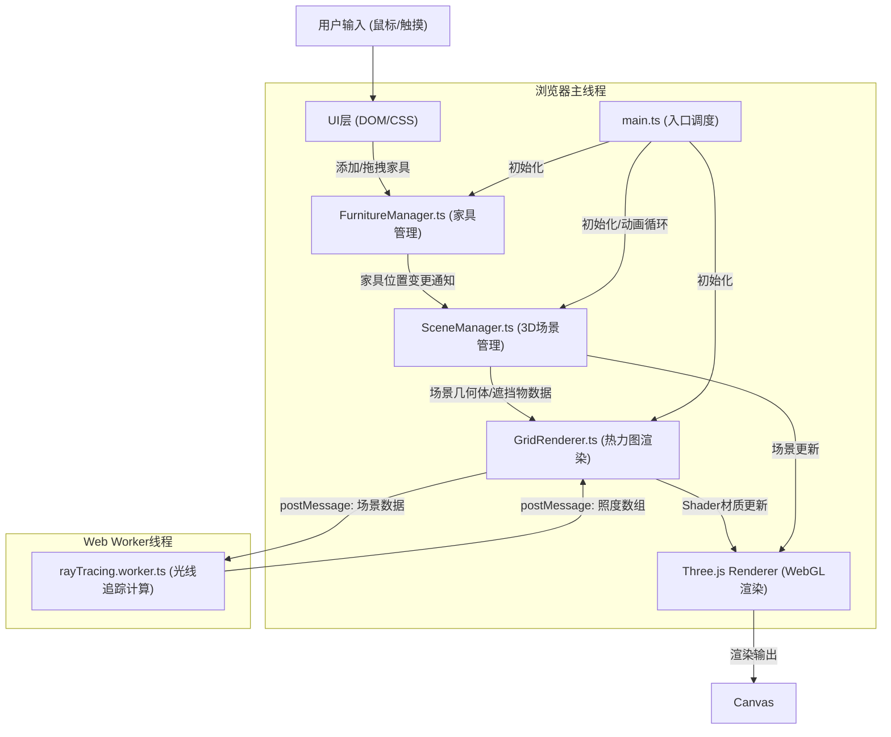
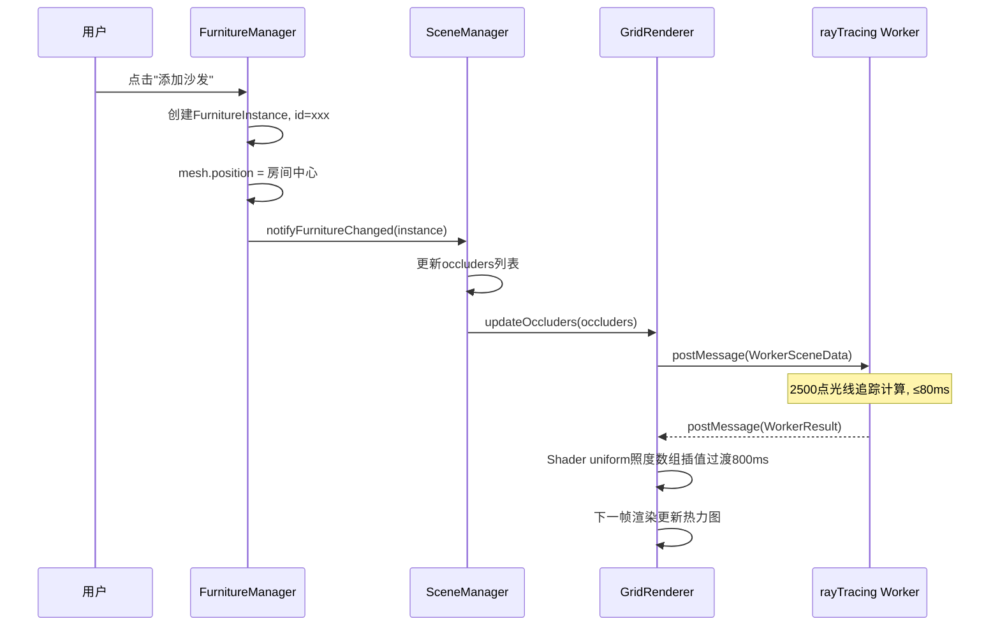

## 1. 架构设计



## 2. 技术描述

- **前端框架**: 原生TypeScript (无React/Vue，保持Three.js渲染性能最优)
- **构建工具**: Vite@5.x (原生ESM支持，内置Web Worker打包)
- **3D渲染**: three@0.160.x + @types/three
- **动画库**: gsap@3.x (弹性落定动画、热力图过渡)
- **并行计算**: Web Worker API (Vite原生?import worker支持)
- **语言**: TypeScript@5.x (严格模式 strict: true)
- **后端**: 无后端，纯前端应用
- **数据库**: 无持久化存储，所有状态在内存

### 核心技术选型说明
1. **原生TypeScript而非React**：3D渲染场景对性能敏感，避免React虚拟DOM重渲染开销
2. **Web Worker光线追踪**：将2500采样点的密集计算移出主线程，保证渲染帧率≥30FPS
3. **自定义ShaderMaterial热力图**：利用GPU并行插值实现平滑颜色过渡，避免CPU端逐像素计算

## 3. 路由定义
| 路由 | 用途 |
|------|------|
| / | 应用主页面，单页应用无额外路由 |

## 4. 数据结构定义

### 4.1 核心类型定义

```typescript
// 家具类型枚举
type FurnitureType = 'sofa' | 'coffeeTable' | 'bookshelf';

// 家具预设定义
interface FurniturePreset {
  type: FurnitureType;
  name: string;
  size: { width: number; depth: number; height: number }; // 米
  color: string; // 莫兰迪色
  thumbnail: string; // SVG缩略图dataURI
}

// 家具实例
interface FurnitureInstance {
  id: string;
  type: FurnitureType;
  position: { x: number; y: number; z: number };
  rotationY: number; // Y轴旋转弧度
  mesh: THREE.Group | null; // Three.js对象
  boundingBox: {
    minX: number; maxX: number;
    minZ: number; maxZ: number;
    minY: number; maxY: number;
  };
}

// 采样点计算结果
interface SampleResult {
  illuminance: number; // 照度 lux, 0-1000
  pathCount: number;   // 光线路径数量 0-20
  occlusionCount: number; // 被遮挡次数
}

// 传递给Worker的场景数据
interface WorkerSceneData {
  roomSize: { width: number; depth: number; height: number };
  windows: Array<{
    x: number; y: number; z: number; // 中心点
    width: number; height: number;
    normal: { x: number; y: number; z: number }; // 法线方向
  }>;
  sunDirection: { x: number; y: number; z: number }; // 归一化方向
  sunIntensity: number;
  occluders: Array<{
    minX: number; maxX: number;
    minZ: number; maxZ: number;
    minY: number; maxY: number;
  }>;
  gridResolution: { cols: number; rows: number }; // 20x20
}

// Worker返回结果
interface WorkerResult {
  samples: Float32Array; // 长度=cols*rows*2 (照度+路径数交替)
  computeTime: number;
}
```

### 4.2 数据流时序



## 5. 项目文件结构与调用关系

```
auto88/
├── package.json              # 依赖声明+启动脚本
├── vite.config.js            # Vite构建配置+worker支持
├── tsconfig.json             # TS严格模式配置
├── index.html                # 入口HTML+CSS样式
└── src/
    ├── main.ts               # [入口] 初始化→循环→调度
    │   └── 调用: SceneManager, FurnitureManager, GridRenderer
    ├── types/
    │   └── index.ts          # 共享类型定义 (FurnitureType, WorkerSceneData等)
    └── modules/
        ├── scene/
        │   └── SceneManager.ts       # [场景层] 房间/光源/相机/渲染循环
        │       └── 调用: Three.js, ←FurnitureManager→, →GridRenderer
        ├── furniture/
        │   └── FurnitureManager.ts   # [交互层] 家具拖拽/旋转/选中/动画
        │       └── 调用: gsap, Three.js Raycaster, →SceneManager
        ├── render/
        │   └── GridRenderer.ts       # [渲染层] 热力图Shader材质+Worker通信
        │       └── 调用: rayTracing.worker, Three.js ShaderMaterial
        └── worker/
            └── rayTracing.worker.ts  # [计算层] 光线追踪算法
                    └── 输入: WorkerSceneData, 输出: WorkerResult
```

### 模块间数据流向说明

| 方向 | 源模块 | 目标模块 | 数据内容 | 触发时机 |
|------|--------|----------|----------|----------|
| → | User | FurnitureManager | mousedown/mousemove/mouseup事件 | 用户交互 |
| → | FurnitureManager | SceneManager | FurnitureInstance位置/旋转变更 | 拖拽结束/添加/删除 |
| → | SceneManager | GridRenderer | 房间几何体+occluders数组 | 家具变更后 |
| → | GridRenderer | rayTracing.worker | WorkerSceneData (序列化) | 场景变化, 节流15FPS |
| ← | rayTracing.worker | GridRenderer | WorkerResult (Float32Array) | 计算完成(≤80ms) |
| → | GridRenderer | Three.js Renderer | ShaderMaterial uniforms更新 | Worker返回+GSAP插值 |

## 6. 性能优化策略

### 6.1 光线追踪计算优化
- 2500采样点分批处理 (50×50分组×10批)
- AABB包围盒快速剔除无遮挡光线
- 光线步进时沿轴对齐加速 (DDA算法)
- Worker线程池 (单Worker, 复用避免创建开销)

### 6.2 渲染性能优化
- 热力图Shader: uniform数组 + GPU插值, 非纹理上传
- 家具mesh: 共享Geometry, 实例化材质
- 光线追踪触发节流: 拖拽中每66ms(15FPS)一次
- 照度数组过渡: GSAP Tween驱动uniform插值, 非逐帧上传完整数组

### 6.3 内存管理
- Web Worker使用Transferable Objects传输Float32Array (零拷贝)
- 家具删除时dispose Geometry和Material
- 避免闭包引用导致的Three.js对象无法GC
