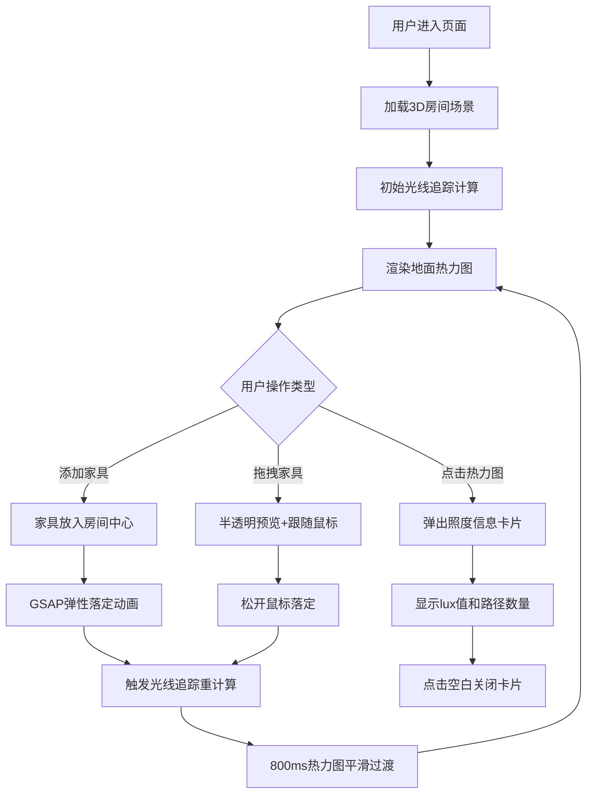

## 1. 产品概述

LightPathAnalyzer是一款面向室内设计师的交互式3D采光路径与家具布局影响分析工具，帮助设计师直观对比不同家具摆放方案对室内采光路径和视觉通透度的影响，无需反复渲染即可实时评估效果。

- 核心用户：室内设计师、空间规划师
- 核心价值：通过实时光线追踪可视化，降低方案评估成本，提升设计决策效率

## 2. 核心功能

### 2.1 用户角色
| 角色 | 注册方式 | 核心权限 |
|------|----------|----------|
| 设计师用户 | 无需注册，直接使用 | 完整的场景编辑、家具拖拽、采光分析功能 |

### 2.2 功能模块
1. **3D场景模块**：标准房间模型、窗户光源、平行光太阳光
2. **家具管理模块**：预设家具库、拖拽放置、旋转操作、选中高亮
3. **光线追踪模块**：Web Worker加速计算、2500采样点、照度热力图
4. **信息交互模块**：采样点详情卡片、照度数值显示、光线路径数量
5. **响应式UI模块**：右侧家具边栏、移动端顶部面板、过渡动画

### 2.3 页面详情
| 页面名称 | 模块名称 | 功能描述 |
|----------|----------|----------|
| 主页面 | 3D场景区 | 6m×5m×3m房间模型，左侧落地窗，实时热力图覆盖地面 |
| 主页面 | 家具侧边栏 | 3种预设家具（沙发/茶几/书架），点击添加到房间中心 |
| 主页面 | 交互控制层 | 拖拽移动、Y轴旋转、选中高亮、半透明拖拽预览 |
| 主页面 | 信息卡片 | 点击热力图网格显示照度值(lux)和光线路径数量 |

## 3. 核心流程

用户进入应用 → 查看默认房间采光热力图 → 点击添加家具 → 拖拽调整位置/旋转 → 实时观察热力图变化 → 点击网格查看详细采光数据

## 4. 用户界面设计

### 4.1 设计风格
- 主色调：深灰蓝背景 #1a1a2e，浅木色地面 #deb887，暖白墙面 #f5f5dc
- 家具色系：莫兰迪低饱和度（沙发#a8c0c0、茶几#c9b99a、书架#8b7d70）
- 热力图渐变色带：深蓝(#001a4d) → 蓝(#0055cc) → 青(#00cccc) → 黄(#ffff00) → 亮黄(#fffacd)，0-1000lux
- 选中高亮：#00ff88 荧光绿边框，2px线宽
- 按钮风格：圆角12px，半透明毛玻璃背景 rgba(30,30,30,0.7)
- 字体：无衬线字体族，现代简洁风格
- 布局：左侧3D场景占主要区域，右侧280px家具边栏
- 图标：SVG简约线条风格

### 4.2 页面设计概览
| 页面名称 | 模块名称 | UI元素 |
|----------|----------|--------|
| 主页面 | 3D场景区 | 全屏WebGL画布，透视相机，OrbitControls环绕观察 |
| 主页面 | 家具侧边栏 | 固定右侧280px，深色毛玻璃背景，垂直排列3个家具卡片 |
| 主页面 | 家具卡片 | 缩略图(60px×60px) + 名称 + 添加按钮，hover上浮2px阴影 |
| 主页面 | 信息卡片 | 底部滑入动画300ms，圆角12px，毛玻璃rgba(30,30,30,0.8)，白色文字 |
| 主页面 | 顶部折叠面板 | 移动端<768px显示，点击展开/折叠，高度过渡300ms |

### 4.3 响应式设计
- Desktop-first 设计，断点 768px
- ≥768px：右侧固定280px家具边栏，场景自适应剩余宽度
- <768px：家具边栏转为顶部可折叠面板，默认折叠，展开后高度自适应，全屏场景
- 触摸设备：拖拽操作支持触摸事件，旋转改用双击或长按触发

### 4.4 3D场景指导
- 环境氛围：室内设计预览场景，明亮自然采光
- 光照设置：主光源DirectionalLight(平行光)模拟太阳光，强度1.5，颜色#fff8e7；AmbientLight环境光强度0.3补充暗部
- 相机设置：PerspectiveCamera fov=50，初始位置(4, 4, 6)，lookAt房间中心，启用OrbitControls，限制pitch角度避免穿模
- 场景构成：
  - 房间：BoxGeometry构建墙体(厚度0.15m)、地板、天花板
  - 窗户：左墙两个1.2m×2.2m开口，附加半透明Plane模拟玻璃
  - 热力图：独立Plane叠加在地板上方0.01m，使用自定义ShaderMaterial实现UV映射的颜色渐变
- 交互动画：
  - 家具拖拽：opacity 0.6半透明，轮廓跟随鼠标
  - 落定动画：gsap elastic.out缓动，0.5s
  - 热力图更新：Shader uniform平滑过渡，800ms
- 后处理：轻微Bloom发光效果增强热力图亮度区域
- 性能预算：Web Worker光线追踪 ≤80ms/帧，渲染帧率≥30FPS，热力图更新≥15FPS
