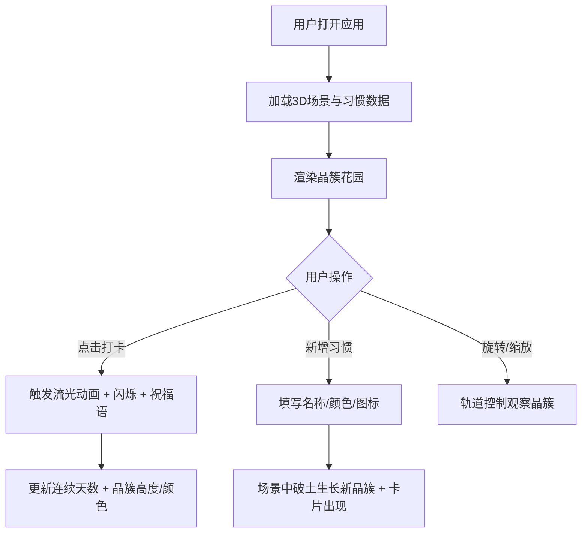

## 1. 产品概述

CrystalHabit 是一款将个人习惯打卡记录以 3D 晶簇生长方式可视化的 Web 应用。每个习惯对应一束水晶，坚持天数越多水晶越长越亮，整体形成一丛可旋转缩放观察的虚拟水晶花园，比枯燥的进度条更有仪式感和观赏性。

- 目标用户：希望以更具仪式感和视觉美感方式追踪日常习惯的人群
- 核心价值：将抽象的坚持量化为具象的水晶生长，赋予习惯坚持以观赏性和成就感

## 2. 核心功能

### 2.1 功能模块

1. **主界面**：3D 水晶花园场景 + 右侧习惯卡片列表
2. **打卡交互**：点击打卡按钮触发光流动画与祝福语

### 2.2 页面详情

| 页面名称 | 模块名称 | 功能描述 |
|---------|---------|---------|
| 主界面 | 3D 场景 | 深蓝渐变背景，悬浮粒子，可旋转缩放的晶簇花园，默认俯视45度视角 |
| 主界面 | 晶簇渲染 | 每束晶簇由1个主晶体（六棱柱顶锥）+ 3-5个小晶体（三棱锥）组成，高度/颜色随连续天数动态变化 |
| 主界面 | 习惯卡片 | 右侧边栏显示习惯卡片，含名称、连续天数、迷你进度条、圆形打卡按钮 |
| 主界面 | 打卡动画 | 流光沿棱边上升600ms → 晶体闪烁（透明度降至0.7再恢复）→ 祝福语标签淡入500ms后3秒淡出 |
| 主界面 | 新增习惯 | 输入名称、选择颜色主题和图标，场景中破土生长动画1.2秒 ease-out，卡片同步出现 |

## 3. 核心流程

## 4. 用户界面设计

### 4.1 设计风格

- 主题色：深色背景 #0f0f1a，卡片 #1e1e2e，强调色 #7c3aed（紫色）
- 水晶颜色：HSV 色相渐变（灰色→紫色→金色），随连续天数变化
- 按钮样式：圆形打卡按钮，56px 面积，涟漪扩散动画 400ms
- 字体：优雅的无衬线字体，大小层级分明
- 布局：左侧3D场景70% + 右侧卡片30%，卡片可纵向滚动

### 4.2 页面设计概览

| 页面名称 | 模块名称 | UI 元素 |
|---------|---------|---------|
| 主界面 | 3D 场景区 | 深蓝渐变背景、悬浮粒子、晶簇花园、轨道控制器 |
| 主界面 | 习惯卡片区 | 260px宽卡片、12px圆角、习惯名称、连续天数、迷你进度条、圆形+按钮 |
| 主界面 | 打卡按钮 | 56px 圆形按钮、涟漪扩散动画400ms、紫色强调 |
| 主界面 | 祝福语标签 | 圆角8px、半透明背景、淡入500ms、3秒后淡出 |
| 主界面 | 新增习惯弹窗 | 名称输入、颜色选择器、图标选择器 |

### 4.3 响应式适配

- 桌面端（≥768px）：左右分栏，3D场景70% + 卡片30%
- 移动端（<768px）：上下排列，3D场景60vh + 卡片区占剩余高度

### 4.4 3D 场景指引

- **环境**：深蓝色渐变背景，营造深邃矿洞氛围，点缀悬浮粒子增添灵气
- **光照**：环境光 + 方向光，使晶体呈现半透明折射质感
- **相机**：默认俯视45度，PerspectiveCamera，FOV 50-60
- **交互**：OrbitControls 实现旋转/缩放/平移
- **动画**：打卡流光（GSAP 动画沿棱边上升）、破土生长（GSAP scale/opacity）、闪烁（GSAP opacity）
- **性能**：晶体顶点总数不超过8000，稳定50fps+

## 5. 数据模型

### 5.1 习惯数据

| 字段 | 类型 | 说明 |
|------|------|------|
| id | string | 唯一标识 |
| name | string | 习惯名称 |
| colorTheme | string | 颜色主题（用于晶簇初始色调） |
| icon | string | 图标标识 |
| streak | number | 连续打卡天数 |
| todayDone | boolean | 今日是否已打卡 |
| position | {x:number, z:number} | 晶簇在场景中的位置 |
