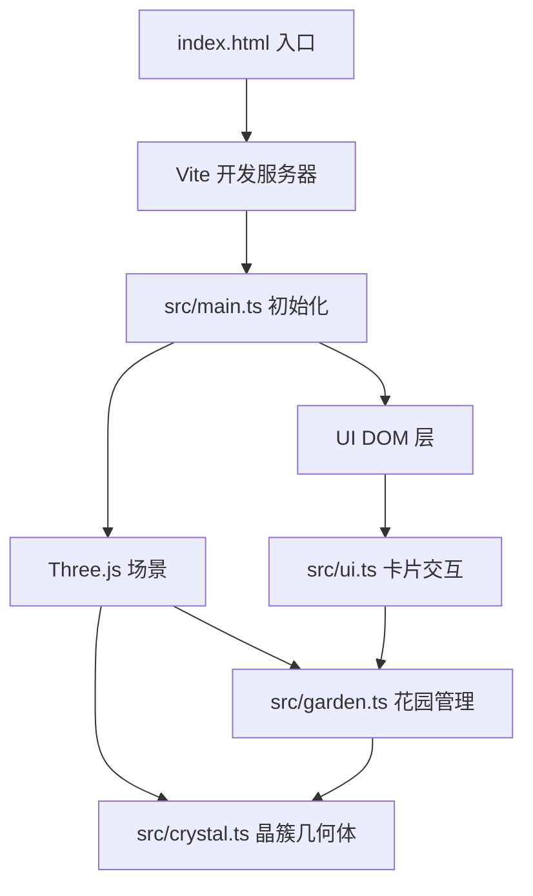

## 1. 架构设计



纯前端项目，无后端服务。数据使用 localStorage 持久化。

## 2. 技术说明

- 前端：TypeScript + Three.js + Vite + GSAP
- 初始化工具：Vite
- 后端：无
- 数据库：localStorage（浏览器本地存储）
- 3D 渲染：Three.js（场景、相机、几何体、材质、光照）
- 动画：GSAP（流光、生长、闪烁动画）
- 轨道控制：Three.js OrbitControls

## 3. 文件结构

```
├── package.json
├── index.html
├── tsconfig.json
├── vite.config.js
└── src/
    ├── main.ts        # 初始化场景、相机、轨道控制，引入各模块
    ├── crystal.ts     # 生成单束晶簇几何体、更新高度和颜色
    ├── garden.ts      # 管理所有晶束增删改查、动画触发和粒子背景
    └── ui.ts          # 操作卡片、打卡按钮和祝福语标签的DOM交互
```

## 4. 核心模块设计

### 4.1 crystal.ts — 晶簇几何体

- `createCrystalCluster(streak, colorTheme)`: 创建一束晶簇 Group
  - 主晶体：CylinderGeometry（6面棱柱）+ ConeGeometry（6面顶锥），初始高度0.5
  - 小晶体：3-5个 ConeGeometry（3面三棱锥），高度0.2-0.4，随机偏移
  - 材质：MeshPhysicalMaterial（半透明、折射感）
- `updateCrystalHeight(cluster, streak)`: 根据连续天数更新主晶体高度（每天+0.08，最大3.5）
- `updateCrystalColor(cluster, streak)`: HSV色相渐变（0天灰→7天紫→30天+金）

### 4.2 garden.ts — 花园管理

- `GardenManager` 类：
  - 管理所有晶簇的 Group 引用
  - `addHabit(habit)`: 添加新晶簇（破土生长动画 1.2s ease-out）
  - `removeHabit(id)`: 移除晶簇
  - `checkIn(id)`: 打卡触发流光+闪烁动画
  - `createParticles()`: 创建悬浮粒子背景
  - `update()`: 每帧更新粒子运动

### 4.3 ui.ts — DOM 交互

- `createHabitCard(habit)`: 创建习惯卡片 DOM
- `updateCard(card, habit)`: 更新卡片状态
- `onCheckIn(habitId, callback)`: 打卡按钮事件绑定（涟漪动画400ms）
- `showBlessing(text)`: 显示祝福语标签（淡入500ms→3秒淡出）
- `onAddHabit(callback)`: 新增习惯弹窗交互
- 响应式布局管理

### 4.4 main.ts — 入口

- 初始化 Three.js 场景、PerspectiveCamera、WebGLRenderer
- OrbitControls（俯视45度，限制缩放范围）
- 添加光照（AmbientLight + DirectionalLight）
- 创建粒子背景
- 从 localStorage 加载习惯数据
- 渲染循环 + resize 监听

## 5. 动画规格

| 动画名称 | 持续时间 | 缓动函数 | 描述 |
|---------|---------|---------|------|
| 涟漪扩散 | 400ms | ease-out | 打卡按钮按下时圆形波纹扩散 |
| 流光上升 | 600ms | linear | 光带沿晶体棱边自底向上 |
| 晶体闪烁 | 200ms | ease-in-out | 透明度降至0.7再恢复 |
| 祝福语淡入 | 500ms | ease-out | 半透明标签从0到1 |
| 祝福语淡出 | 500ms | ease-in | 3秒后从1到0 |
| 破土生长 | 1200ms | ease-out | 新晶簇从地面升起，透明→不透明 |

## 6. 性能约束

- 晶体顶点总数 ≤ 8000
- 渲染帧率 ≥ 50fps
- 单束晶簇约 200-400 顶点（支持约20个习惯）
- 粒子数量控制在 200-500 个
