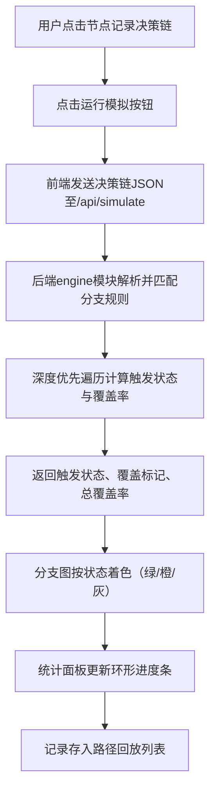

## 1. 产品概述
BranchVoyage是一款为游戏策划团队设计的剧情分支模拟与覆盖率测试工具，针对回合制战棋游戏的分支剧情调试场景。
- 解决手动执行分支剧情测试耗时且易遗漏的痛点，让设计者将玩家选择链可视化为交互式分支图并自动校验覆盖率
- 目标用户为游戏策划、QA测试人员，核心价值在于提升分支剧情测试的效率与完整性

## 2. 核心特性

### 2.1 功能模块
1. **分支树渲染**：可拖拽、缩放的交互式树状流程图，支持节点展开/收起动画
2. **模拟运行**：点击节点记录决策链，发送至后端模拟后以颜色标注触发状态
3. **覆盖率统计**：右侧固定面板展示分支统计数据，含环形进度条可视化覆盖率
4. **路径回放模式**：历史模拟记录列表，点击后自动回放决策路径

### 2.2 页面详情
| 页面名称 | 模块名称 | 功能描述 |
|-----------|-------------|---------------------|
| 主页面 | 分支图区域 | 中央展示可交互树状分支图（占宽75%），支持拖拽、缩放、节点展开收起 |
| 主页面 | 顶部工具栏 | "运行模拟"按钮，触发后端模拟计算 |
| 主页面 | 右侧统计面板 | 固定宽度280px，显示覆盖率统计、环形进度条、路径回放列表 |
| 主页面 | 响应式抽屉 | 屏宽<900px时，右侧面板折叠为浮动抽屉，底部悬浮展开按钮 |

## 3. 核心流程
用户在分支图上依次点击节点形成决策链 → 点击"运行模拟"按钮 → 前端将决策链JSON发送至后端/api/simulate → 后端引擎使用深度优先遍历匹配分支规则，计算各节点触发状态与覆盖率 → 返回结果至前端 → 分支图按状态着色，统计面板更新数据，记录存入回放列表。

## 4. 用户界面设计

### 4.1 设计风格
- **主色调**：深色主题，主背景#1E1E2E，卡片背景#2A2A3E，文字#E0E0E0
- **强调色**：蓝色#1976D2（按钮）、绿色#4CAF50（已触发）、橙色#FF9800（部分触发）、灰色#9E9E9E（未触发）、金色（节点高亮脉冲）
- **按钮风格**：圆角按钮，悬停亮度提升，scale(1.03)微放大，过渡200ms
- **字体**：节点内文字使用monospace等宽字体，字号12px；统计数字24px粗体
- **布局风格**：左右两栏布局，左侧分支图占75%，右侧统计面板固定280px
- **视觉效果**：节点卡片毛玻璃半透明模糊效果，圆角12px；连线触发后蓝色#42A5F5加粗

### 4.2 页面设计概述
| 页面名称 | 模块名称 | UI元素 |
|-----------|-------------|-------------|
| 主页面 | 分支图节点 | 圆角矩形卡片120x60px，monospace 12px文字，毛玻璃效果，悬停放大 |
| 主页面 | 节点连线 | 默认#555贝塞尔曲线，触发后#42A5F5蓝色加粗，带箭头 |
| 主页面 | 选中节点高亮 | 金色外边框 + 脉冲发光效果1s |
| 主页面 | 运行模拟按钮 | #1976D2蓝色圆角，悬停变亮，scale(1.03) |
| 主页面 | 环形进度条 | 蓝紫渐变色，厚度16px，数字居中，300ms数值滚动动画 |
| 主页面 | 节点展开动画 | 200ms ease-in-out，默认仅显示根节点与直接子节点 |

### 4.3 响应式
桌面端优先设计，屏幕宽度小于900px时右侧统计面板折叠为浮动抽屉，底部显示圆形悬浮展开按钮（半径32px）。分支图缩放范围限制在0.5x-3x之间。

### 4.4 性能约束
- 页面帧率稳定50FPS以上
- 200节点以内时拖拽/缩放响应延迟≤50ms
- 后端单次模拟（100节点）耗时≤200ms
