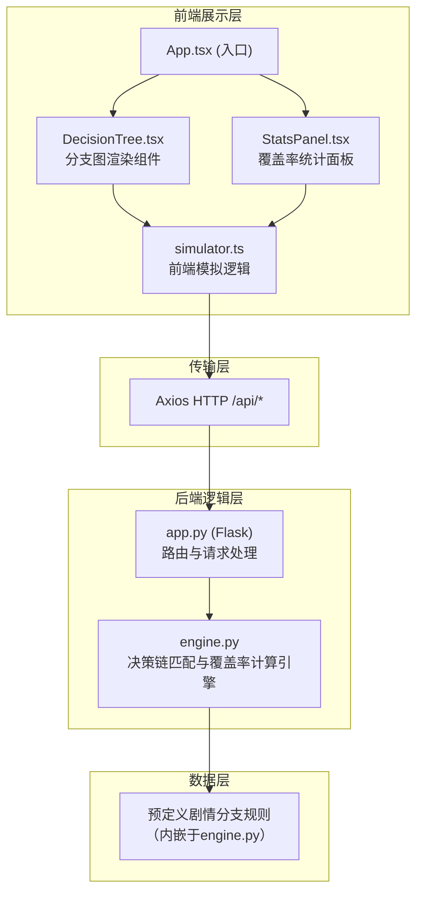
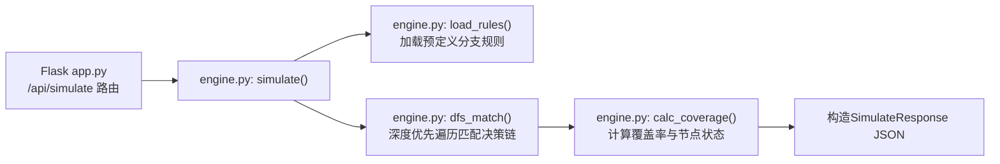

## 1. 架构设计



## 2. 技术说明
- **前端框架**：React@18 + TypeScript@5 + Vite@5
- **流程图渲染**：react-flow-renderer@10（reactflow）
- **HTTP客户端**：axios@1
- **构建配置**：@vitejs/plugin-react@4，代理/api路径至Flask后端
- **后端框架**：Python@3 + Flask@3
- **后端算法**：深度优先遍历（DFS）匹配决策链与分支规则
- **无数据库**：分支规则内嵌于engine.py，模拟记录存储于前端内存

## 3. 文件结构与调用关系

```
项目根目录
├── package.json                          # 前端依赖与启动脚本
├── vite.config.js                        # Vite构建配置 + /api代理
├── tsconfig.json                         # TypeScript严格模式配置
├── index.html                            # Vite入口HTML
├── src/
│   ├── App.tsx                           # 主应用组件（整合DecisionTree与StatsPanel）
│   ├── main.tsx                          # React入口
│   ├── index.css                         # 全局样式（深色主题、动画关键帧）
│   ├── components/
│   │   ├── DecisionTree.tsx              # 分支图渲染（调用react-flow-renderer）
│   │   └── StatsPanel.tsx                # 右侧统计面板（含环形进度条、回放列表）
│   └── utils/
│       ├── simulator.ts                  # 模拟逻辑（构造决策链JSON → POST /api/simulate）
│       └── types.ts                      # 共享TypeScript类型定义
└── backend/
    ├── app.py                            # Flask入口，/api/simulate路由
    ├── engine.py                         # 核心逻辑：分支规则定义 + DFS匹配算法
    └── requirements.txt                  # Python依赖
```

**数据流向**：
1. 用户点击`DecisionTree.tsx`中的节点 → 节点ID追加到本地决策链state
2. 用户点击"运行模拟"按钮 → `simulator.ts`将决策链序列化为JSON，通过axios POST至`/api/simulate`
3. `backend/app.py`接收请求 → 转发至`backend/engine.py`
4. `engine.py`解析决策链，用DFS遍历预定义规则树 → 计算每个分支节点的触发状态(triggered/partial/untriggered)、触发次数、总覆盖率百分比
5. `app.py`将结果返回前端 → `DecisionTree.tsx`按状态更新节点/连线样式，`StatsPanel.tsx`更新统计数字与环形进度条，回放列表追加记录

## 4. 路由定义
| 路由 | 目的 |
|-------|---------|
| / | 主页面，分支图与统计面板 |
| /api/simulate | POST接口，接收决策链JSON，返回触发状态与覆盖率 |

## 5. API定义

### POST /api/simulate

**请求体 TypeScript类型**：
```typescript
interface DecisionNode {
  id: string;
  name: string;
  depth: number;
}

interface SimulateRequest {
  decisionChain: DecisionNode[];
  timestamp: number;
}
```

**响应体 TypeScript类型**：
```typescript
interface NodeResult {
  id: string;
  name: string;
  status: 'triggered' | 'partial' | 'untriggered';
  triggerCount: number;
  path: string[];
}

interface SimulateResponse {
  nodes: NodeResult[];
  totalBranches: number;
  triggeredBranches: number;
  untriggeredBranches: number;
  coveragePercent: number;
  edges: { source: string; target: string; triggered: boolean }[];
}
```

## 6. 后端架构



## 7. 数据模型

### 7.1 分支规则数据结构（engine.py内部）
```python
{
    "id": "root",
    "name": "关卡开始",
    "children": [
        {
            "id": "c1",
            "name": "对话选项A",
            "children": [...]
        },
        {
            "id": "c2",
            "name": "对话选项B",
            "children": [...]
        }
    ]
}
```

### 7.2 前端状态模型
```typescript
interface AppState {
  decisionChain: DecisionNode[];     // 当前选中的决策链
  treeData: TreeNode[];              // 完整分支树结构
  simulateResult: SimulateResponse | null;  // 上次模拟结果
  replayHistory: ReplayRecord[];     // 最近5次模拟记录
  selectedNodeId: string | null;     // 当前选中节点（高亮）
  panelOpen: boolean;                // 响应式抽屉状态
}
```
