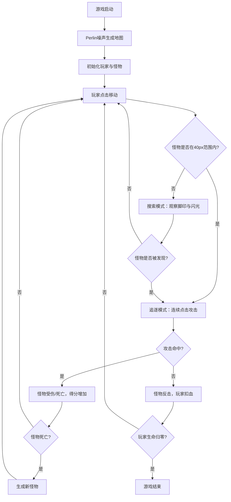

## 1. 产品概述

PixelHunt 是一款复古像素风格的2D赏金猎人追踪游戏，玩家在随机生成的像素地图上追踪并击败具有隐身能力的目标怪物，融合捉迷藏与轻度战斗玩法，考验玩家的反应速度与观察力。

- 核心玩法：搜索隐身怪物 → 追击目标 → 近距离挥刀攻击 → 获取分数
- 目标用户：喜爱复古像素游戏、轻度动作和策略搜索类游戏的玩家
- 产品价值：提供紧张刺激的搜索与战斗体验，通过程序化生成地图保证每次游玩的新鲜感

## 2. 核心功能

### 2.1 用户角色

| 角色 | 注册方式 | 核心权限 |
|------|----------|----------|
| 玩家 | 无需注册，直接进入游戏 | 控制角色移动、攻击，查看游戏状态 |

### 2.2 功能模块

1. **游戏主场景**：程序化生成的像素地图、玩家角色、怪物目标、动态光影效果
2. **玩家控制系统**：鼠标点击移动、奔跑动画、挥刀攻击、碰撞检测
3. **怪物AI系统**：随机移动、周期性隐身、脚印生成、闪光提示
4. **地图生成系统**：Perlin噪声地形生成（草地/泥沼/水域）、瓦片贴图、边界处理
5. **UI界面系统**：生命条、得分显示、技能冷却指示器、像素风格UI
6. **游戏管理系统**：主循环、碰撞判定、胜负判断、状态更新

### 2.3 页面详情

| 页面名称 | 模块名称 | 功能描述 |
|----------|----------|----------|
| 游戏主界面 | 地图渲染 | 500x500像素2D地图，16x16瓦片，Perlin噪声生成草地/泥沼/水域三种地形，深色渐变边界 |
| 游戏主界面 | 玩家角色 | 32x32像素精灵，鼠标点击移动（120px/s），奔跑两帧动画（每帧200ms），泥沼减速50%，水域不可通行，泥沼飞溅动画（0.3s） |
| 游戏主界面 | 怪物角色 | 24x24像素精灵，每2秒随机改变方向，每5秒隐身2秒（透明度100%→15%，400ms渐变），每秒生成脚印（持续3秒），隐身时每0.5秒闪烁白光30ms |
| 游戏主界面 | 战斗系统 | 玩家接近怪物40像素内自动进入追逐模式，左键连续点击攻击（挥刀动画150ms，前方45度扇形/40像素距离判定） |
| 游戏主界面 | 光影效果 | 鼠标位置为中心的手电筒光照（120像素圆形，柔和边缘），全局暗角遮罩 |
| 游戏主界面 | HUD界面 | 生命条、得分、技能冷却指示器，像素边框+轻微抖动动画 |

## 3. 核心流程

游戏启动后加载程序化地图，玩家通过鼠标点击控制角色在地图上搜索怪物。怪物会随机移动并周期性隐身，玩家需通过脚印和闪光定位目标。接近怪物40像素内进入战斗模式，连续点击左键进行扇形范围攻击。击败怪物获得分数，玩家被怪物攻击则减少生命值，生命归零则游戏结束。

## 4. 用户界面设计

### 4.1 设计风格

- **主色调**：墨绿色（#2d5016）、深褐色（#4a3728）、淡黄色（#f0e68c）
- **配色方案**：
  - 草地：#3a7d2a（亮绿）/ #2d5c1f（暗绿）
  - 泥沼：#5c4033 / #3d2b1f
  - 水域：#3d5c6e / #2a4050
  - UI背景：#1a1a1a，UI边框：#f0e68c
- **按钮风格**：像素风格边框，2px实线，点击有像素级位移反馈
- **字体**：像素风格等宽字体，所有文字为8x8像素点阵渲染
- **布局风格**：复古游戏HUD布局，生命条左上，得分右上，技能冷却底部居中
- **图标风格**：纯像素绘制，无渐变无抗锯齿

### 4.2 页面设计概述

| 页面名称 | 模块名称 | UI元素 |
|----------|----------|--------|
| 游戏主界面 | 地图区域 | 500x500像素游戏画布，瓦片纹理，暗角遮罩，手电筒光圈跟随鼠标 |
| 游戏主界面 | 生命条 | 左上角，像素边框，红色填充，淡黄色边框，轻微呼吸抖动动画 |
| 游戏主界面 | 得分显示 | 右上角，淡黄色像素文字，像素边框背景，数值变化时有放大闪烁动画 |
| 游戏主界面 | 技能指示器 | 底部居中，攻击冷却进度条，像素风格，冷却中灰色，就绪后淡黄色高亮 |
| 游戏主界面 | 玩家/怪物 | 像素精灵，帧动画，攻击/隐身/移动状态可视化反馈 |

### 4.3 响应式

- 桌面端优先设计，游戏画布固定500x500像素居中显示
- 外层容器自适应屏幕尺寸，背景纯黑
- 鼠标操作优化，不支持触控设备

### 4.4 性能要求

- 渲染帧率：稳定50FPS以上
- 地图加载时间：不超过1.5秒
- 瓦片尺寸：16x16像素，总瓦片数约31x31
