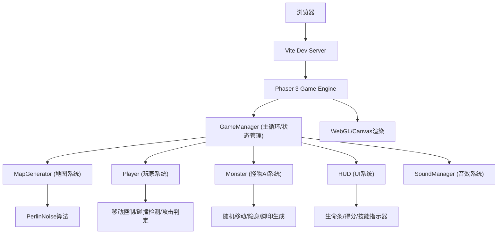

## 1. 架构设计



## 2. 技术说明

- **前端框架**: Phaser 3.70.x + TypeScript 5.x
- **构建工具**: Vite 5.x
- **渲染方式**: Phaser 3 WebGL渲染器（Canvas回退）
- **地图生成**: 内置Perlin噪声算法实现
- **无后端、无数据库**：纯前端游戏，状态全部内存管理

## 3. 文件结构

```
PixelHunt/
├── package.json
├── index.html
├── tsconfig.json
├── vite.config.js
└── src/
    ├── main.ts (游戏入口)
    ├── scenes/
    │   └── GameScene.ts (游戏主场景)
    ├── config/
    │   └── Constants.ts (游戏常量配置)
    ├── sprites/
    │   ├── Player.ts (玩家类)
    │   └── Monster.ts (怪物类)
    ├── systems/
    │   ├── MapGenerator.ts (地图生成器)
    │   └── PerlinNoise.ts (Perlin噪声实现)
    ├── managers/
    │   ├── GameManager.ts (游戏主管理器)
    │   └── SoundManager.ts (音效管理器)
    └── ui/
        └── HUD.ts (HUD界面组件)
```

## 4. 模块说明

### 4.1 Constants.ts
所有游戏常量集中管理，包括：
- 地图尺寸（500x500）、瓦片尺寸（16x16）
- 移动速度（玩家120px/s，泥沼减速50%）
- 攻击参数（范围40px，扇形45度，冷却150ms）
- 怪物参数（方向改变2s，隐身周期5s/持续2s，脚印周期1s/持续3s）
- 颜色配置（草地/泥沼/水域/UI主色）
- 光影参数（光照半径120px）

### 4.2 MapGenerator.ts
- 基于PerlinNoise生成二维高度图
- 根据阈值划分三种地形：草地（0-0.5）、泥沼（0.5-0.7）、水域（0.7-1.0）
- 生成Tilemap数据，提供瓦片碰撞查询接口
- 边界渐变遮罩处理

### 4.3 Player.ts
- 继承Phaser.GameObjects.Container
- 鼠标点击移动：等速直线插值
- 奔跑帧动画：两帧纹理交替（200ms/帧）
- 攻击系统：扇形碰撞检测，挥刀动画
- 地形交互：泥沼减速，水域阻挡，泥沼飞溅粒子效果

### 4.4 Monster.ts
- 继承Phaser.GameObjects.Container
- AI状态机：巡逻/隐身/被攻击
- 随机方向移动：每2秒重新选择方向向量
- 隐身系统：透明度Tween动画（100%→15%，400ms）
- 脚印生成：TimerEvent每秒创建脚印Sprite，3秒后销毁
- 闪光提示：隐身期间每0.5秒闪烁30ms白光

### 4.5 HUD.ts
- 生命条：Graphics绘制，像素边框，红色填充，抖动动画
- 得分显示：BitmapText/Text，数值变化Tween动画
- 技能冷却：Graphics进度条，冷却完成高亮提示
- 所有UI元素采用像素渲染模式

### 4.6 GameManager.ts
- 单例模式，管理全局游戏状态
- 玩家与怪物距离检测（40px追逐阈值）
- 攻击命中判定（扇形范围+距离检测）
- 胜负判断（怪物击杀得分/玩家生命归零）
- 事件分发：状态变更通知HUD更新
- 手电筒光照效果：RenderTexture + Circle mask

### 4.7 SoundManager.ts
- 使用Web Audio API合成简单音效（可选）
- 攻击音效、命中音效、脚步音效
- 音量控制接口

## 5. 性能优化

- **瓦片渲染**: 使用Phaser Tilemap进行批量渲染，减少Draw Call
- **对象池**: 脚印和粒子效果使用对象池复用
- **光照优化**: 预渲染光照蒙版，每帧只更新位置
- **碰撞优化**: 简单距离检测替代物理引擎，减少计算量
- **帧率控制**: Phaser自动帧率管理，目标60FPS
