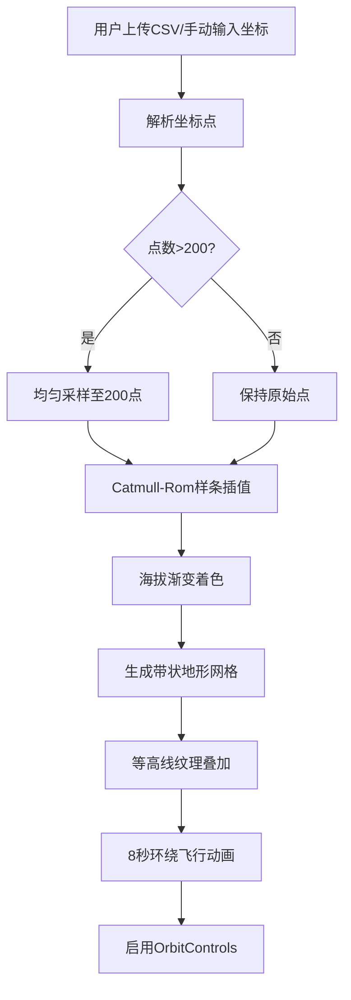

## 1. 产品概述

GPS轨迹3D路径重建与地形可视化应用，面向户外运动爱好者，将上传的GPS轨迹点动态重建为3D路径并叠加地形高度，直观预览和比较不同路线海拔起伏与坡度分布。

- 解决户外运动爱好者无法直观预览路线海拔起伏与坡度分布的痛点
- 提供沉浸式3D可视化体验，辅助路线规划与回顾

## 2. 核心功能

### 2.1 用户角色
| 角色 | 注册方式 | 核心权限 |
|------|----------|----------|
| 普通用户 | 无需注册 | 上传轨迹、查看3D路径、浏览海拔剖面 |

### 2.2 功能模块
1. **3D路径场景页**：3D路径渲染、地形曲面、环绕飞行动画、自由视角交互
2. **侧边栏面板**：文件上传/拖拽、手动输入坐标、距离与爬升统计、海拔剖面图

### 2.3 页面详情
| 页面名称 | 模块名称 | 功能描述 |
|----------|----------|----------|
| 3D路径场景页 | 3D路径渲染 | Catmull-Rom样条插值生成平滑路径，海拔渐变着色 |
| 3D路径场景页 | 地形曲面 | 路径下方带状地形网格，等高线纹理，缓坡过渡 |
| 3D路径场景页 | 相机动画 | 8秒环绕飞行后切换自由视角 |
| 侧边栏面板 | 文件上传 | CSV文件拖拽/点击上传，解析lat,lng,ele |
| 侧边栏面板 | 手动输入 | 支持至少5个坐标点手动输入 |
| 侧边栏面板 | 统计信息 | 路径总距离(km)和累计爬升(m) |
| 侧边栏面板 | 海拔剖面 | Chart.js折线图，距离百分比vs海拔 |

## 3. 核心流程

用户上传CSV文件或手动输入坐标点 → 系统解析坐标并采样至200点上限 → Catmull-Rom样条插值生成平滑路径 → 海拔渐变着色 → 生成带状地形网格与等高线 → 触发8秒环绕飞行动画 → 动画结束后启用OrbitControls自由视角

## 4. 用户界面设计

### 4.1 设计风格
- 主色：#1a1a2e（深蓝黑），侧边栏：#16213e（深蓝）
- 强调色：#e2b714（金色），#0f3460（深蓝边框）
- 按钮：圆角6px，边框1px solid #0f3460，悬停背景#0f3460加粗边框
- 字体：等宽字体用于坐标输入，无衬线字体用于标签
- 布局：左侧20%侧边栏 + 右侧80% 3D画布

### 4.2 页面设计概览
| 页面名称 | 模块名称 | UI元素 |
|----------|----------|--------|
| 3D路径场景页 | 3D画布 | 全屏Three.js渲染，深色背景，路径渐变色线条 |
| 侧边栏面板 | 上传区 | 虚线边框拖拽框，拖入时实线金色边框+箭头旋转动画 |
| 侧边栏面板 | 统计区 | 距离和爬升数值显示 |
| 侧边栏面板 | 海拔图 | Chart.js折线图，渐变色折线+半透明蓝色填充 |

### 4.3 响应式
- 桌面优先设计，侧边栏固定20%宽度
- 3D画布自适应窗口尺寸

### 4.4 3D场景指引
- 环境：深色背景，无HDRI，氛围光+方向光
- 灯光：环境光0.4 + 方向光0.8
- 相机：透视相机，45度俯视初始角度，环绕飞行动画后切换OrbitControls
- 构图：路径居中，地形曲面在路径下方
- 交互：OrbitControls阻尼0.1，鼠标拖拽旋转
- 性能：帧率≥50fps，路径点≤200
