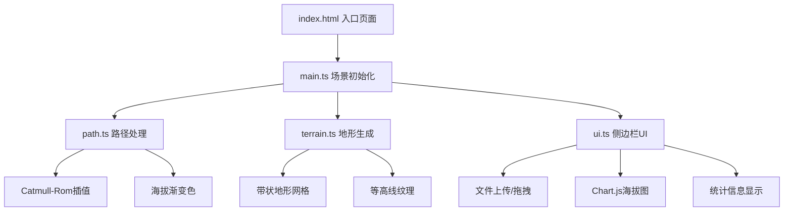

## 1. 架构设计



## 2. 技术说明
- 前端：TypeScript + Three.js + Chart.js + Vite
- 初始化工具：Vite
- 后端：无
- 数据库：无，纯前端应用

## 3. 路由定义
| 路由 | 用途 |
|------|------|
| / | 单页应用，3D路径可视化主界面 |

## 4. API定义
无后端API，所有数据处理在前端完成。

## 5. 数据模型

### 5.1 核心数据结构

```typescript
interface TrackPoint {
  lat: number;
  lng: number;
  ele: number;
}

interface PathData {
  points: THREE.Vector3[];
  colors: Float32Array;
  distances: number[];
  totalDistance: number;
  totalAscent: number;
  elevations: number[];
}

interface TerrainData {
  geometry: THREE.BufferGeometry;
  contourLines: THREE.LineSegments[];
}
```

### 5.2 文件组织
| 文件 | 职责 |
|------|------|
| package.json | 依赖管理：three, @types/three, chart.js, @types/chart.js, typescript, vite, @vitejs/plugin-react |
| index.html | 入口页面，基础样式和渲染容器，深色主题#1a1a2e |
| tsconfig.json | TypeScript严格模式，target ES2020 |
| vite.config.js | 构建配置，resolve.alias '@' 指向src，@vitejs/plugin-react |
| src/main.ts | Three.js场景/相机/渲染器初始化，模块整合，8秒环绕动画，20%高度浮动，OrbitControls阻尼0.1 |
| src/path.ts | 坐标解析，Catmull-Rom插值(步长0.5)，海拔渐变色生成，200点上限采样 |
| src/terrain.ts | 带状地形网格生成(分辨率0.1)，等高线纹理(每0.2一条)，边缘线性缓坡过渡到0 |
| src/ui.ts | 侧边栏DOM构建，上传拖拽(箭头10度旋转300ms，虚线变实线金色)，Chart.js海拔图，统计显示 |

### 5.3 关键技术参数
| 参数 | 值 | 位置 |
|------|----|------|
| 插值步长 | 0.5单位 | path.ts INTERPOLATION_STEP |
| 路径线宽 | 0.15单位 | main.ts PATH_LINE_WIDTH |
| 地形半宽 | 0.5单位 | terrain.ts TERRAIN_HALF_WIDTH |
| 网格分辨率 | 0.1单位 | terrain.ts MESH_RESOLUTION |
| 等高线间隔 | 0.2单位 | terrain.ts CONTOUR_INTERVAL |
| 等高线宽 | 0.005单位 | terrain.ts CONTOUR_LINE_WIDTH |
| 地形透明度 | 0.4 | terrain.ts TERRAIN_OPACITY |
| 环绕动画时长 | 8000ms | main.ts ANIMATION_DURATION |
| 高度浮动比例 | 20% | main.ts CAMERA_HEIGHT_FLOAT_RATIO |
| Orbit阻尼系数 | 0.1 | main.ts controls.dampingFactor |
| 最低帧率 | 50fps | main.ts MIN_FPS |
| 最大路径点 | 200 | path.ts MAX_POINTS |
| 海拔渐变范围 | 青→绿→黄→红 | path.ts altitudeColor() |
