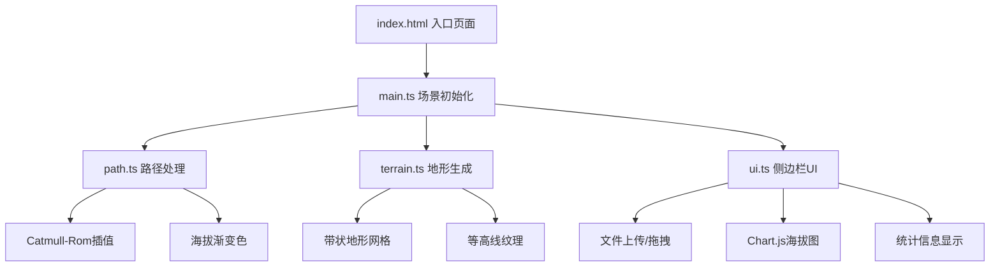

## 1. 架构设计



## 2. 技术说明
- 前端：TypeScript + Three.js + Chart.js + Vite
- 初始化工具：Vite
- 后端：无
- 数据库：无，纯前端应用

## 3. 路由定义
| 路由 | 用途 |
|------|------|
| / | 单页应用，3D路径可视化主界面 |

## 4. API定义
无后端API，所有数据处理在前端完成。

## 5. 数据模型

### 5.1 核心数据结构

```typescript
interface TrackPoint {
  lat: number;
  lng: number;
  ele: number;
}

interface PathData {
  points: THREE.Vector3[];
  colors: Float32Array;
  distances: number[];
  totalDistance: number;
  totalAscent: number;
  elevations: number[];
}

interface TerrainData {
  geometry: THREE.BufferGeometry;
  contourLines: THREE.LineSegments[];
}
```

### 5.2 文件组织
| 文件 | 职责 |
|------|------|
| package.json | 依赖管理：three, @types/three, chart.js, typescript, vite |
| index.html | 入口页面，基础样式和渲染容器 |
| tsconfig.json | TypeScript严格模式，target ES2020 |
| vite.config.js | 构建配置，alias @指向src |
| src/main.ts | Three.js场景/相机/渲染器初始化，模块整合，相机动画 |
| src/path.ts | 坐标解析，Catmull-Rom插值，海拔渐变色生成 |
| src/terrain.ts | 带状地形网格生成，等高线纹理，缓坡过渡 |
| src/ui.ts | 侧边栏DOM构建，上传拖拽，Chart.js海拔图，统计显示 |
