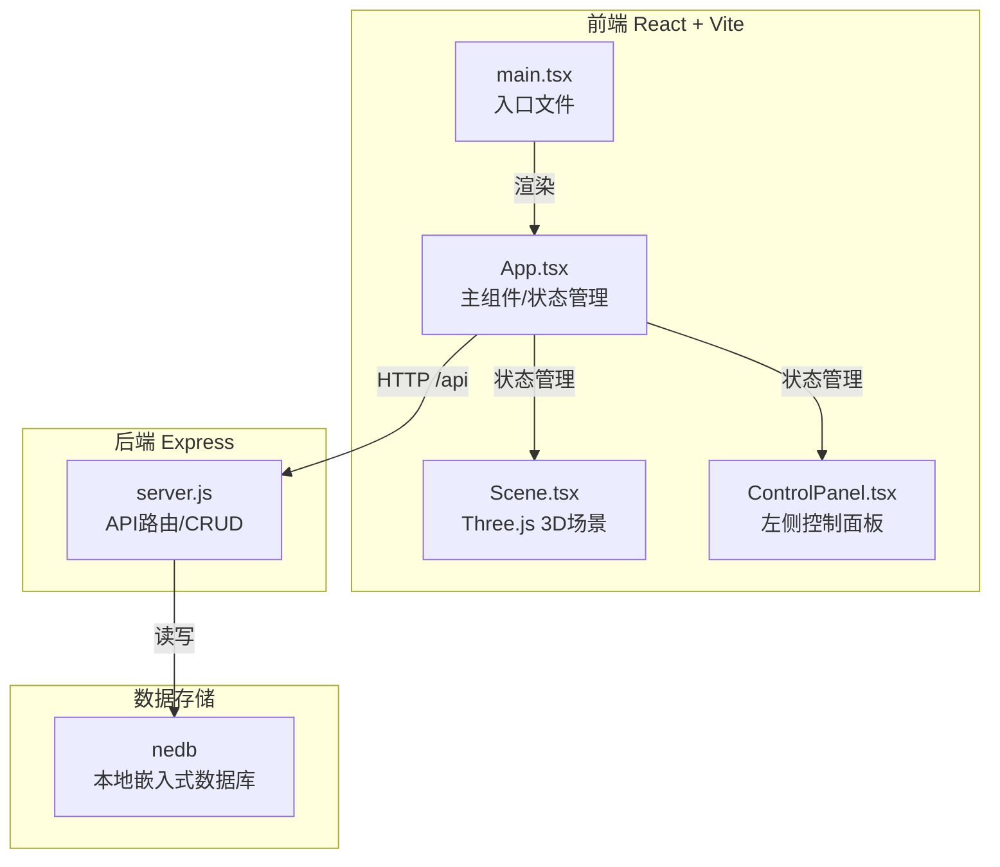
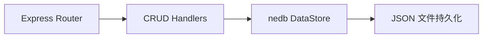
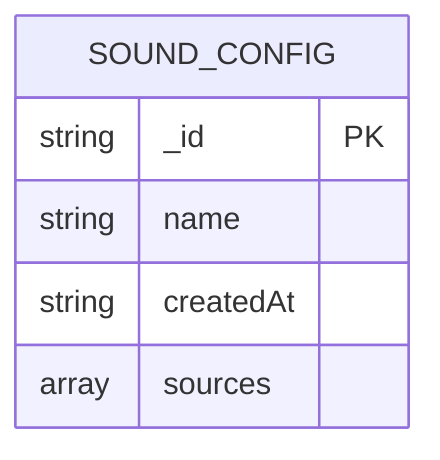

## 1. 架构设计



## 2. 技术说明
- **前端**：React 18 + TypeScript + Vite + Three.js + @react-three/fiber + @react-three/drei + Axios
- **初始化工具**：Vite (react-ts 模板)
- **后端**：Express 4 + nedb-promises + uuid
- **数据库**：nedb（嵌入式本地JSON文件数据库）

## 3. 项目结构

```
/
├── index.html
├── package.json
├── vite.config.js
├── tsconfig.json
├── src/
│   ├── main.tsx
│   ├── App.tsx
│   └── components/
│       ├── Scene.tsx
│       └── ControlPanel.tsx
└── server/
    ├── server.js
    └── data/ (nedb自动创建)
```

## 4. API 定义

### 类型定义

```typescript
interface SoundSource {
  id: string;
  position: { x: number; y: number; z: number };
  color: string;
  volume: number;
}

interface SoundConfig {
  _id?: string;
  name: string;
  createdAt: string;
  sources: SoundSource[];
}
```

### REST API

| 方法 | 路径 | 描述 | 请求 | 响应 |
|------|------|------|------|------|
| GET | /api/configs | 获取所有配置列表 | - | SoundConfig[] |
| POST | /api/configs | 保存新配置 | { name, sources } | SoundConfig |
| GET | /api/configs/:id | 获取单个配置 | - | SoundConfig |
| DELETE | /api/configs/:id | 删除配置 | - | { success: true } |

## 5. 服务端架构



- **入口**：server/server.js，Express 应用监听 3001 端口
- **CORS**：允许来自 Vite 开发服务器(5173)的请求
- **nedb**：使用 nedb-promises，数据文件存储在 server/data/configs.db

## 6. 数据模型

### 6.1 ER 图



### 6.2 数据说明

nedb 为文档型数据库，每个配置文档格式：

```json
{
  "_id": "uuid-string",
  "name": "My Studio Setup",
  "createdAt": "2026-06-13T15:30:00.000Z",
  "sources": [
    {
      "id": "source-uuid-1",
      "position": { "x": 3, "y": 0.2, "z": -2 },
      "color": "#f59e0b",
      "volume": 0.8
    }
  ]
}
```

## 7. 性能优化策略

1. **Three.js 层**：使用 InstancedMesh 处理大量音源（如果超过20个），但初期使用单独 Mesh 保证开发效率
2. **React 层**：使用 memo 包装 Scene 子组件，避免不必要重渲染
3. **拖拽优化**：使用 @react-three/drei 的 DragControls，或手动使用 raycaster + pointer events，节流到 60FPS
4. **状态管理**：音源位置变化仅更新必要的 state，避免整个列表重渲染
5. **动画**：使用 useRef + useFrame 直接操作 three 对象，不走 React state 更新路径
