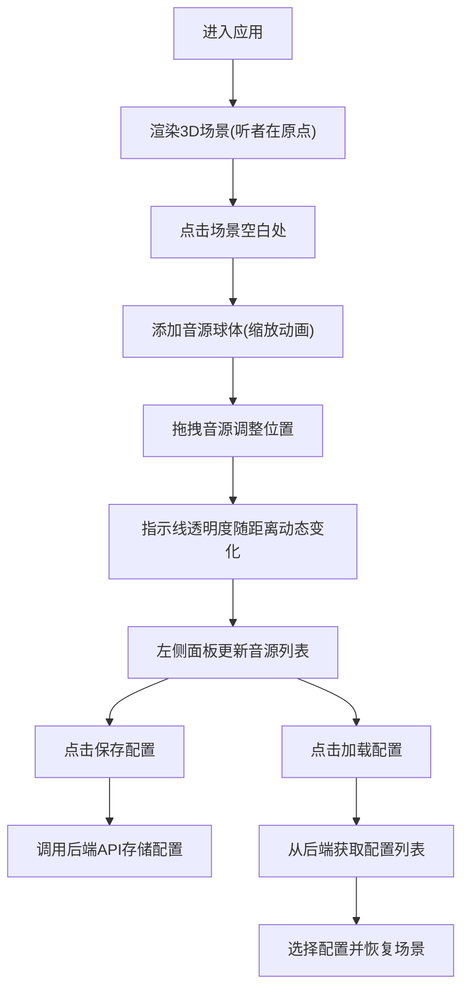

## 1. 产品概述

SoundScape 是一款面向音乐制作人和声音设计师的 3D 音频空间化工具，让用户能够在三维空间中直观地摆放和混合音源，像操作用音箱阵列一样调整每个声源的方位、距离和音量衰减，提供比纯数字调音台更直观的创作体验。

## 2. 核心功能

### 2.1 功能模块
1. **3D 场景主视图**：Three.js 渲染的三维空间，包含听者位置、音源球体、指示线
2. **音源管理**：添加、拖拽移动、删除音源球体
3. **左侧控制面板**：音源列表、混音指示器
4. **配置管理**：保存当前音源配置、加载历史配置

### 2.2 功能详情

| 页面名称 | 模块名称 | 功能描述 |
|----------|----------|----------|
| 主页面 | 3D 场景 | 默认相机视角(10,8,10)注视原点，鼠标拖拽旋转视角，滚轮缩放，≥45FPS |
| 主页面 | 听者球体 | 场景中心半透明球体(半径0.5, #6366f1, 透明度0.4) |
| 主页面 | 音源添加 | 点击场景任意位置添加音源球(半径0.2, #f59e0b, 0.3秒缩放动画+光晕闪烁) |
| 主页面 | 音源指示线 | 每条音源到听者的虚线(#a78bfa, 透明度随距离0.3→0.1线性变化, 间距3单位) |
| 主页面 | 音源拖拽 | 拖拽音源球体改变位置 |
| 主页面 | 音源删除动画 | 删除时缩小到0消失(0.2秒) |
| 主页面 | 控制面板 | 宽280px, 背景#1e293b 0.9不透明, 圆角12px, 左20px上80px固定悬浮 |
| 主页面 | 音源列表项 | 序号、颜色方块(12x12px)、距离(精确0.1)、删除按钮(#ef4444, hover#dc2626) |
| 主页面 | 混音指示器 | 宽60px高200px竖条, 背景#334155, 填充色底部#22c55e到顶部#fbbf24渐变 |
| 主页面 | 配置卡片 | 宽220px高80px, 背景#2d3748, 圆角8px, 阴影0 2px 4px rgba(0,0,0,0.3) |

## 3. 核心流程

用户进入应用后，首先看到三维场景和听者位置。通过点击场景添加音源，拖拽调整音源位置，左侧面板实时显示所有音源信息和整体混音状态。用户可以保存当前配置到后端，或从历史配置列表中加载已保存的配置。

## 4. 用户界面设计

### 4.1 设计风格
- **主题**：深色科技风（沉浸式音频工作室氛围）
- **主色**：#0f172a（背景）、#1e293b（控件背景）、#6366f1（强调色/听者）
- **辅助色**：#f59e0b（音源）、#a78bfa（指示线）、#ef4444（删除按钮）
- **音量渐变**：底部 #22c55e → 顶部 #fbbf24
- **文字**：#e2e8f0
- **交互**：所有过渡 200ms ease-in-out

### 4.2 页面设计

| 页面名称 | 模块名称 | UI 元素 |
|----------|----------|---------|
| 主页面 | 3D 画布 | 全屏Three.js渲染，网格地面，柔和环境光+方向光 |
| 主页面 | 听者球体 | 紫色半透明发光球体，固定在原点 |
| 主页面 | 音源球体 | 橙色发光球体，可拖拽，有添加/删除动画 |
| 主页面 | 指示虚线 | 紫色虚线连接音源和听者，透明度随距离变化 |
| 主页面 | 左侧面板 | 固定悬浮，圆角卡片，音源列表可滚动，底部混音指示 |
| 主页面 | 配置区 | 保存按钮、配置卡片列表（名称/日期/加载按钮） |
| 主页面 | 混音指示器 | 竖直渐变条，顶部显示峰值 |

### 4.3 响应式
- 桌面优先设计，适配 1440x900 到 1920x1080
- 3D 场景占满剩余空间
- 控制面板固定位置，不随滚动变化

### 4.4 3D 场景指南
- **环境**：深色背景 #0f172a，无HDRI，保持简洁
- **光照**：AmbientLight(强度0.6) + DirectionalLight(位置(10,20,10), 强度0.8)
- **相机**：PerspectiveCamera，fov 50，near 0.1，far 1000，初始位置 (10, 8, 10)
- **地面**：半透明网格 GridHelper(尺寸40, 分段40, 颜色#334155)
- **拖拽**：@react-three/drei OrbitControls (enablePan=false, enableDamping=true)
- **动画**：使用 @react-three/fiber useFrame 驱动缩放动画，GSAP 或原生 lerp
- **性能目标**：场景更新 ≥30FPS，50个音源时拖拽延迟 ≤100ms
