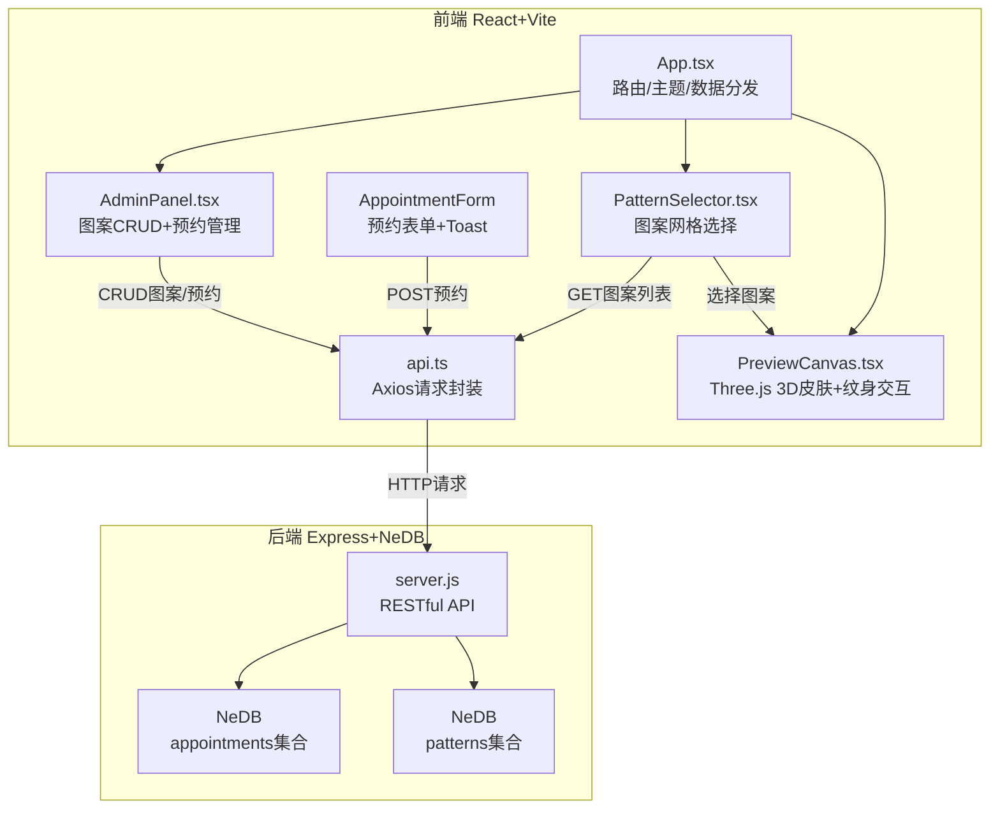
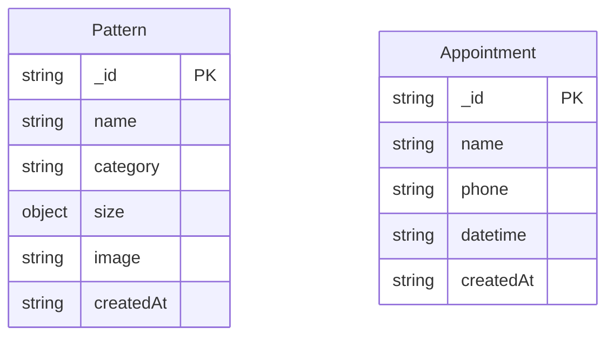

## 1. 架构设计



## 2. 技术说明
- 前端：React 18 + TypeScript + Vite + Tailwind CSS
- 3D渲染：Three.js + @react-three/fiber + @react-three/drei
- 状态管理：Zustand
- HTTP客户端：Axios
- 初始化工具：vite-init（react-express-ts模板）
- 后端：Express 4 + nedb-promises
- 数据存储：NeDB（嵌入式，文件存储）

## 3. 路由定义
| 路由 | 用途 |
|------|------|
| / | 预览页面：3D纹身预览 + 图案选择 + 预约表单 |
| /admin | 管理后台：图案管理 + 预约管理 |

## 4. API定义

### 4.1 图案接口
| 方法 | 路径 | 请求体 | 响应 |
|------|------|--------|------|
| GET | /api/patterns | - | `{ patterns: Pattern[] }` |
| POST | /api/patterns | `{ name, category, size, image(base64) }` | `{ pattern: Pattern }` |
| PUT | /api/patterns/:id | `{ name?, category?, size? }` | `{ pattern: Pattern }` |
| DELETE | /api/patterns/:id | - | `{ success: true }` |

### 4.2 预约接口
| 方法 | 路径 | 请求体 | 响应 |
|------|------|--------|------|
| GET | /api/appointments | - | `{ appointments: Appointment[] }` |
| POST | /api/appointments | `{ name, phone, datetime }` | `{ appointment: Appointment }` |
| DELETE | /api/appointments/:id | - | `{ success: true }` |

### 4.3 TypeScript类型定义
```typescript
interface Pattern {
  _id: string;
  name: string;
  category: string;
  size: { width: number; height: number };
  image: string; // base64
  createdAt: string;
}

interface Appointment {
  _id: string;
  name: string;
  phone: string;
  datetime: string;
  createdAt: string;
}

interface PatternState {
  position: { x: number; y: number };
  scale: number;
  rotation: number;
}
```

## 5. 服务器架构图

```mermaid
graph LR
    "Express Router" --> "PatternController"
    "Express Router" --> "AppointmentController"
    "PatternController" --> "NeDB patterns"
    "AppointmentController" --> "NeDB appointments"
```

## 6. 数据模型

### 6.1 数据模型定义



### 6.2 数据存储
- NeDB嵌入式数据库，数据文件存储在`server/data/`目录
- `patterns.db`：存储纹身图案数据（含base64图片）
- `appointments.db`：存储预约记录
- 启动时自动创建数据目录和集合

## 7. 文件结构与调用关系

```
tattootry/
├── package.json
├── vite.config.js
├── tsconfig.json
├── index.html
├── src/
│   ├── App.tsx              ← 主组件，路由+主题+数据分发
│   ├── api.ts               ← Axios封装，所有组件import此文件
│   ├── store.ts             ← Zustand状态管理
│   ├── components/
│   │   ├── PreviewCanvas.tsx  ← Three.js场景，接收pattern纹理+用户交互
│   │   ├── PatternSelector.tsx ← GET图案列表，点击传递纹理给PreviewCanvas
│   │   ├── AppointmentForm.tsx ← 预约表单，POST到/api/appointments
│   │   ├── AdminPanel.tsx     ← 后台CRUD，调用/api/patterns和/api/appointments
│   │   └── Toast.tsx          ← 成功/错误提示组件
│   └── pages/
│       ├── PreviewPage.tsx    ← 预览页面组合PreviewCanvas+PatternSelector+AppointmentForm
│       └── AdminPage.tsx      ← 管理后台组合AdminPanel
├── server/
│   ├── server.js            ← Express主入口，RESTful API
│   └── data/                ← NeDB数据文件目录
│       ├── patterns.db
│       └── appointments.db
```

数据流向：
1. **图案选择**：PatternSelector挂载时GET /api/patterns → 列表渲染 → 点击事件 → 传递纹理给PreviewCanvas → 3D映射渲染
2. **纹身交互**：用户拖拽/缩放/旋转 → Zustand状态更新 → PreviewCanvas重新渲染
3. **预约提交**：表单填写 → POST /api/appointments → 成功Toast
4. **后台管理**：表单提交 → POST/PUT/DELETE → 刷新列表
