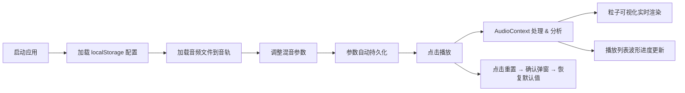

## 1. 产品概述
WavStudio 是一款多轨音频混音与可视化 Web 应用，面向音乐创作者、音频工程师和音频爱好者。支持最多 4 轨独立音频的加载、实时混音处理与 3D 粒子频谱可视化，提供专业级的参数控制与沉浸式视觉体验。

- 核心价值：在浏览器中实现接近 DAW 级别的音轨控制与可视化体验，无需安装任何桌面软件
- 目标用户：独立音乐人、播客制作人、音频学习教育者

## 2. 核心功能

### 2.1 用户角色
| 角色 | 注册方式 | 核心权限 |
|------|----------|----------|
| 普通用户 | 无需注册，直接使用 | 加载本地音频、调整混音参数、可视化欣赏、配置持久化 |

### 2.2 功能模块
1. **音频混音控制台**：4 音轨独立控制、全局混响效果、参数持久化与重置
2. **3D 粒子可视化**：700 粒子系统、多频带联动控制、粒子连线效果
3. **播放列表**：音轨卡片展示、波形缩略图、播放进度标记、自动滚动

### 2.3 页面详情
| 页面名称 | 模块名称 | 功能描述 |
|----------|----------|----------|
| 主工作台 | 混音控制台 | 4 音轨音量/声像/滤波器控制、全局混响、重置确认弹窗 |
| 主工作台 | 3D 粒子可视化 | WebGL 粒子渲染、低频扩散/中频染色/高频旋转、连线透明度随距离变化 |
| 主工作台 | 播放列表 | 440×160 卡片、Canvas 波形缩略图、红色进度线、悬停/选中状态动效 |

## 3. 核心流程

用户打开应用 → 为 1~4 个音轨加载本地音频文件（.mp3/.wav/.ogg）→ 在混音控制台调整各轨音量、声像、低通/高通滤波器 → 开启全局混响并调节干湿比与房间大小 → 点击播放 → 右侧实时呈现 3D 粒子频谱可视化 → 左侧播放列表同步进度标记与自动滚动 → 所有参数自动写入 localStorage → 点击重置按钮触发确认弹窗后恢复默认值。

## 4. 用户界面设计

### 4.1 设计风格
- **主题色**：深色主题，主色 `#0f172a`（Slate-900），表面色 `#1e293b`（Slate-800）
- **强调色**：紫色 `#a855f7`（Purple-500），用于选中状态、混响光晕、按钮高光
- **按钮样式**：圆角 12px，按下 `scale(0.95)` + 涟漪扩散效果（ripple），transition 0.15s ease
- **字体**：JetBrains Mono 用于数字参数显示（音量/频率旋钮数值），Inter 用于界面文字
- **布局风格**：左右分屏（左 480px 固定控制区，右 60% 可视化区），混音控制台固定高度 120px，顶部 backdrop-blur 分割线
- **图标风格**：Lucide React 线性图标，stroke-width 2，尺寸 18px

### 4.2 页面设计概览
| 页面名称 | 模块名称 | UI 元素 |
|----------|----------|---------|
| 主工作台 | 混音控制台 | 4 音轨垂直排列控件、混响开关带紫色光晕脉冲、重置按钮带确认弹窗（白/圆角16px/阴影 0 8px 32px rgba(0,0,0,0.15)） |
| 主工作台 | 3D 粒子可视化 | 扁平圆盘初始粒子、Z 轴深度感、低/中/高频独立联动、半透明连线网格 |
| 主工作台 | 播放列表 | 440×160 卡片，悬停 `translateY(-3px)`，选中左侧 4px 紫色边，底部波形 Canvas，进度线 + 圆点 |

### 4.3 响应式设计
- **桌面端优先**（≥1024px）：左右分屏，左固定 480px，右自适应 60%+
- **平板/移动端**（&lt;1024px）：上下布局，可视化区在上（100% 宽，高 50vh），控制区+播放列表在下
- **触控优化**：滑块触控热区扩展到 44px 高度，旋钮支持角度拖拽，按钮最小 44×44 点击区域

### 4.4 性能指标
- 交互延迟 ≤ 50ms（参数调整 → 音频生效 → 视觉反馈）
- 4 音轨同时播放 CPU 占用率 ≤ 20%
- 粒子可视化帧率 ≥ 30 FPS
