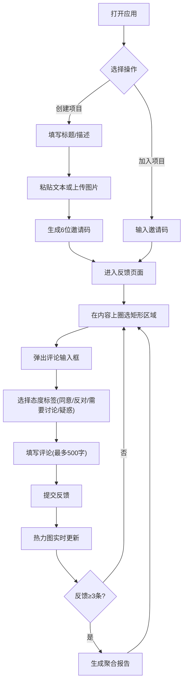

## 1. 产品概述

团队反馈热力图应用，帮助5-10人小团队快速收集同事对设计方案、文章或代码的反馈意见，并以热力图形式直观展示不同观点分布。主要解决会议讨论效率低、意见收集零散、无法快速聚焦分歧点的问题。

## 2. 核心功能

### 2.1 功能模块

1. **创建项目页面**：填写标题、描述，上传讨论载体（文本粘贴或图片上传），生成6位邀请码
2. **加入项目页面**：通过邀请码加入已有项目
3. **项目详情反馈页**：圈选区域、提交评论、查看热力图、浏览聚合报告

### 2.2 页面详情

| 页面名称 | 模块名称 | 功能描述 |
|-----------|-------------|---------------------|
| 创建项目 | 表单输入 | 项目标题、描述、文本/图片上传 |
| 创建项目 | 邀请码生成 | 项目创建后自动生成6位邀请码，展示分享信息 |
| 加入项目 | 邀请码输入 | 输入6位邀请码校验并跳转 |
| 反馈详情 | 内容展示区 | 左侧显示原文或图片，支持矩形圈选 |
| 反馈详情 | 热力图区 | 右侧显示热力图覆盖层，支持切换叠加/独立显示 |
| 反馈详情 | 评论弹窗 | 圈选后弹出输入框，填写评论（≤500字）和选择态度标签 |
| 反馈详情 | 聚合报告 | ≥3条反馈后自动生成：区域统计、评论摘要、扇形图 |
| 反馈详情 | 分割线 | 拖拽调整左右/上下区域比例 |

## 3. 核心流程

用户打开应用 → 选择创建项目或加入项目
- 创建项目：填写表单 → 上传内容 → 生成邀请码 → 进入反馈页 → 分享邀请码
- 加入项目：输入邀请码 → 进入反馈页 → 在内容上圈选区域 → 选择态度标签并填写评论 → 查看热力图和聚合报告

## 4. 用户界面设计

### 4.1 设计风格

- **主色调**：柔和蓝灰基调
  - 主背景：#f1f5f9
  - 卡片背景：#ffffff，圆角16px，阴影0 4px 12px rgba(0,0,0,0.06)
  - 分割线：#cbd5e1，拖拽时变为#3b82f6
- **态度标签颜色**：
  - 同意：绿色#22c55e
  - 反对：红色#ef4444
  - 需要讨论：橙色#f97316
  - 疑惑：紫色#a855f7
- **选区样式**：半透明白色#ffffff带0.5透明度，2px蓝色#3b82f6边框
- **热力图**：10x10像素采样格，透明度0到0.6，高斯核标准差30像素
- **按钮**：默认背景#e2e8f0，悬停#cbd5e1，圆角8px，0.2s渐变过渡，点击缩放0.95倍100ms
- **布局**：内容区域最大宽度1280px居中，左右内边距24px
- **扇形图**：圆角12px，背景白色#ffffff，阴影0 2px 8px rgba(0,0,0,0.08)，图例位于下方

### 4.2 页面设计概述

| 页面名称 | 模块名称 | UI Elements |
|-----------|-------------|-------------|
| 创建项目 | 表单卡片 | 居中卡片布局，输入框带标签，上传区域支持拖拽，提交按钮主色调 |
| 加入项目 | 输入卡片 | 居中卡片，邀请码输入框带分隔符样式，加入按钮 |
| 反馈详情 | 双栏布局 | 左右均分，中间4px宽可拖拽分割线，整体卡片包裹 |
| 反馈详情 | 圈选交互 | 鼠标按下-拖拽-松开绘制矩形选区，释放后弹出评论弹窗 |
| 反馈详情 | 热力图叠加 | Canvas覆盖层，可切换显示模式 |
| 反馈详情 | 聚合报告 | 卡片位于底部或侧边，扇形图+统计列表 |

### 4.3 响应式

- **桌面端**（≥768px）：左右布局，内容展示区和热力图区均分，纵向可拖拽分割线
- **移动端**（<768px）：上下布局，上方展示原文，下方展示热力图，横向可拖拽分割线
- 触控优化：移动端圈选支持触摸事件

## 5. 性能要求

- 500条圈选反馈下热力图渲染延迟 ≤ 200ms
- 界面交互帧率 ≥ 30FPS
