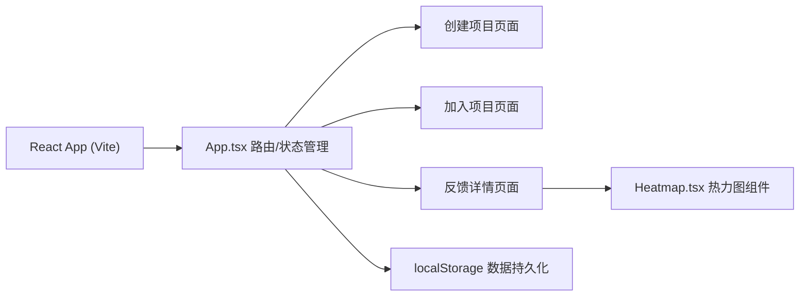

## 1. 架构设计



## 2. 技术描述

- **前端框架**：React@18 + TypeScript
- **构建工具**：Vite + @vitejs/plugin-react
- **数据存储**：localStorage 模拟持久化
- **热力图渲染**：Canvas 2D API，高斯模糊密度网格
- **扇形图渲染**：Canvas 2D API
- **状态管理**：React useState/useReducer，组件内状态

## 3. 路由定义

采用前端状态切换模拟路由（无 react-router），通过 App 组件内的 view 状态管理：

| View | Purpose |
|-------|---------|
| create | 创建项目页面 |
| join | 加入项目页面 |
| feedback | 项目详情反馈页 |

## 4. 数据模型

### 4.1 类型定义

```typescript
type Attitude = 'agree' | 'disagree' | 'discuss' | 'confuse';

interface Feedback {
  id: string;
  x: number;
  y: number;
  width: number;
  height: number;
  attitude: Attitude;
  comment: string;
  createdAt: number;
}

interface Project {
  id: string;
  code: string;
  title: string;
  description: string;
  contentType: 'text' | 'image';
  content: string;
  feedbacks: Feedback[];
  createdAt: number;
}
```

### 4.2 localStorage Key

- `feedback_projects`: 存储所有项目的 Map（项目code → Project）

## 5. 文件结构

```
.
├── package.json
├── vite.config.js
├── tsconfig.json
├── index.html
└── src/
    ├── App.tsx
    └── Heatmap.tsx
```

## 6. 核心算法

### 6.1 热力图生成算法

1. 对每个态度标签类别分别处理
2. 创建与内容区域等尺寸的密度网格（10x10像素一格）
3. 将每条反馈的矩形区域映射到网格，中心点权重最高
4. 对每个类别应用高斯模糊（标准差30像素）
5. 将4个类别按颜色通道叠加渲染到Canvas
6. 透明度映射：密度值 → 0 ~ 0.6

### 6.2 邀请码生成

- 生成6位大写字母和数字组合（排除易混淆字符）
- 校验在localStorage中唯一性

### 6.3 拖拽分割线

- 鼠标/触摸按下分割线记录起始位置
- 移动时实时更新容器 flex 比例
- 松开时保存最终比例
