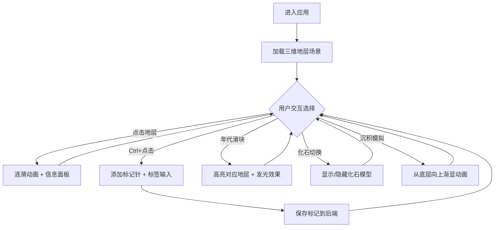

## 1. 产品概述

虚拟地层剖面三维重建与交互式探索应用，旨在帮助地质学家和古生物爱好者在三维空间中直观重建和探索虚拟地层剖面，解决传统二维地质剖面图无法直观展现地层空间结构、化石分布与岩性变化，以及无法动态模拟沉积过程的问题。

- 目标用户：地质学家、古生物爱好者、地质教育工作者
- 核心价值：将平面地质剖面图升级为可交互的三维空间体验，支持地层信息查询、化石可视化、沉积过程动态模拟与标记注释

## 2. 核心功能

### 2.1 用户角色

| 角色 | 注册方式 | 核心权限 |
|------|----------|----------|
| 普通用户 | 无需注册 | 浏览地层剖面、查询地层信息、添加标记针、模拟沉积过程 |

### 2.2 功能模块

1. **三维地层剖面场景页**：3D地层渲染、视角旋转缩放、点击地层查看信息、涟漪动画反馈
2. **工具面板**：年代滑块筛选、化石显示切换、沉积过程模拟、标记列表管理

### 2.3 页面详情

| 页面名称 | 模块名称 | 功能描述 |
|----------|----------|----------|
| 三维地层剖面场景 | 地层渲染 | 多层不同厚度水平带状体堆叠，颜色按岩性区分，层间半透明细线分割 |
| 三维地层剖面场景 | 视角控制 | 鼠标拖拽旋转、滚轮缩放，默认视角(12,6,12)注视原点 |
| 三维地层剖面场景 | 点击交互 | 点击地层表面触发涟漪动画，弹出信息面板显示地质年代/岩性/厚度/化石 |
| 三维地层剖面场景 | 标记针 | Ctrl+点击添加标记针（圆柱+红色圆球），弹出标签输入框，3D文本悬浮 |
| 工具面板 | 年代滑块 | 拖动滑块高亮对应年代地层，发光动画平滑过渡0.3秒 |
| 工具面板 | 化石切换 | 开启后显示化石几何模型（螺旋线/椭圆体），缓慢自转0.2rad/s |
| 工具面板 | 沉积模拟 | 从底层向上渐显，0.5秒间隔，透明到不透明淡入动画 |
| 工具面板 | 标记列表 | 显示所有已添加标记，支持查看和删除 |

## 3. 核心流程

用户进入应用后看到三维地层剖面场景，默认视角从(12,6,12)注视原点。用户可自由旋转缩放浏览，点击任意地层查看详细信息，使用右侧工具面板进行年代筛选、化石可视化、沉积模拟等操作。需要注释时，按住Ctrl键点击场景表面添加标记针并输入注释文字，标记数据通过API持久化存储。

## 4. 用户界面设计

### 4.1 设计风格

- 主题色：暗色主题，主背景 #0f0f0f
- 面板色：深色半透明 #0f172a（0.85不透明度），磨砂半透明 #1e293b
- 强调色：地质岩性色系（砂岩#d4a373、页岩#6b705c、石灰岩#a8dadc、泥岩#cb997e、花岗岩#b5838d），化石#fbbf24，标记红#ef4444
- 按钮风格：圆角半透明暗色按钮，hover高亮
- 字体：系统UI字体，标题16px，正文13px，标注11px
- 布局：左侧3D场景（flex:1）+ 右侧固定工具面板（280px）

### 4.2 页面设计概览

| 页面名称 | 模块名称 | UI元素 |
|----------|----------|--------|
| 主场景 | 3D地层渲染 | Three.js Canvas，多色层叠带状体，半透明分割线，化石几何体 |
| 主场景 | 信息面板 | 磨砂半透明深色卡片，圆角8px，宽240px，显示年代/岩性/厚度/化石 |
| 主场景 | 涟漪动画 | 白色#ffffff扩散环，0.5秒，半径0→1，透明度0.6→0 |
| 主场景 | 标记针 | 圆柱体+红色圆球，标签输入框白色#ffffff圆角4px宽200px |
| 工具面板 | 年代滑块 | 深色面板内滑块控件，拖动时地层发光 |
| 工具面板 | 化石切换 | Toggle开关，开启显示金色几何体 |
| 工具面板 | 沉积模拟 | 按钮触发从底层向上渐显 |
| 工具面板 | 标记列表 | 列表展示标记名称和位置 |

### 4.3 响应式适配

- 桌面端（≥768px）：左侧3D场景 + 右侧固定工具面板280px
- 移动端（<768px）：3D场景全屏，工具面板收起为底部横向可滚动工具栏（高度80px），地层信息面板改为从屏幕底部滑出的抽屉式面板

### 4.4 3D场景指引

- 环境与氛围：暗色空间背景，地层自带颜色形成视觉层次
- 灯光设置：环境光 + 方向光，确保地层颜色真实还原
- 相机设置：透视相机，初始位置(12,6,12)，注视原点，支持轨道控制
- 构图与焦点：多层地层剖面居中展示
- 交互与动画：点击涟漪、地层发光、化石自转、沉积渐显、标记针弹性插入
- 后处理效果：地层高亮发光效果
- 性能预算：渲染帧率≥45FPS，动画过渡≤0.5秒
