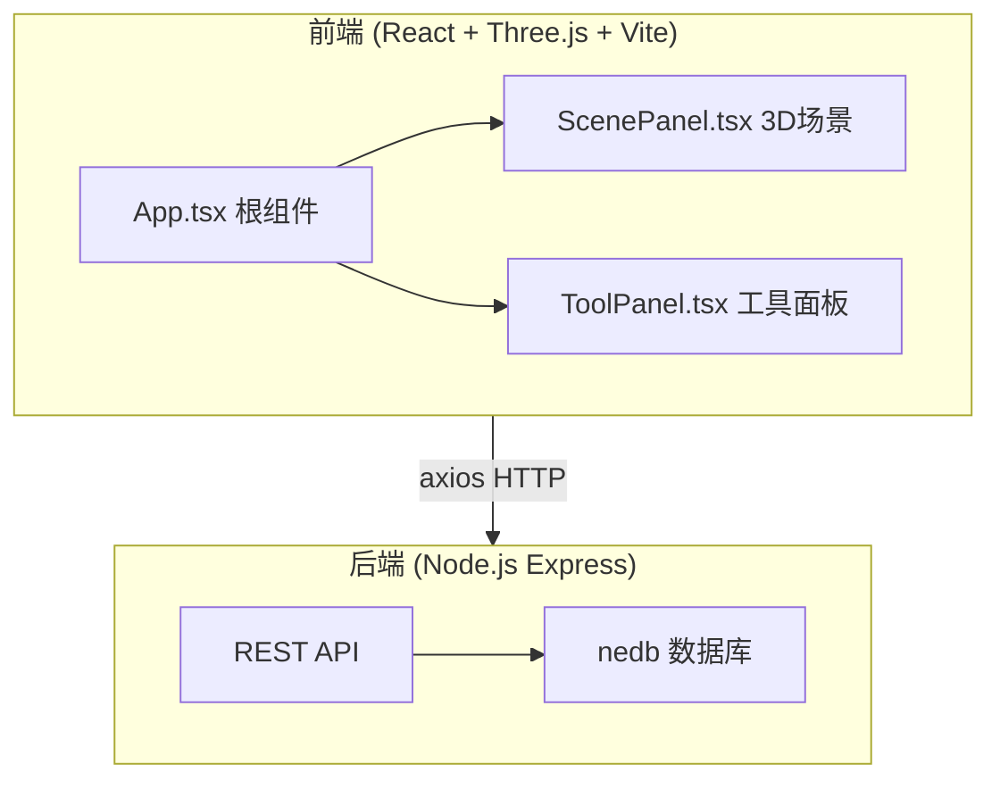
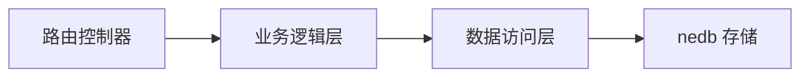
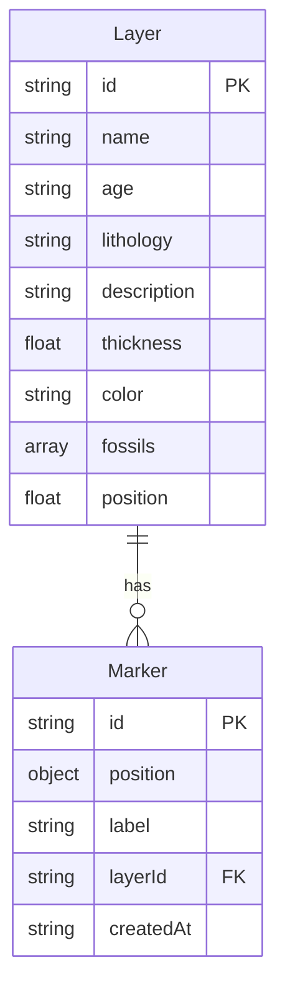

## 1. 架构设计



## 2. 技术说明

- 前端：React@18 + TypeScript + Three.js + @react-three/fiber + @react-three/drei + Vite
- 3D渲染：Three.js 负责地层几何体生成、化石实例渲染、标记针管理
- 状态管理：Zustand 管理全局状态（地层数据、选中层、标记列表、滑块值等）
- 后端：Express@4 + TypeScript（ESM格式）
- 数据库：nedb-promises 文件持久化存储
- 样式：Tailwind CSS + CSS变量

## 3. 路由定义

| 路由 | 用途 |
|------|------|
| / | 主页面，包含3D地层场景和工具面板 |

## 4. API定义

### 4.1 数据类型

```typescript
interface Layer {
  id: string;
  name: string;
  age: string;
  lithology: string;
  description: string;
  thickness: number;
  color: string;
  fossils: string[];
  position: number;
}

interface Marker {
  id: string;
  position: { x: number; y: number; z: number };
  label: string;
  layerId: string;
  createdAt: string;
}
```

### 4.2 API端点

| 方法 | 路径 | 请求体 | 响应 | 用途 |
|------|------|--------|------|------|
| GET | /api/layers | - | Layer[] | 获取地层数据 |
| GET | /api/markers | - | Marker[] | 获取所有标记 |
| POST | /api/markers | Marker | Marker | 保存标记 |

## 5. 服务器架构图



## 6. 数据模型

### 6.1 数据模型定义



### 6.2 初始数据

地层数据在服务启动时自动生成（若数据库为空），包含8-12层随机厚度的地层，岩性从砂岩、页岩、石灰岩、泥岩、花岗岩中随机选取，每层配有对应的地质年代、描述和化石列表。
