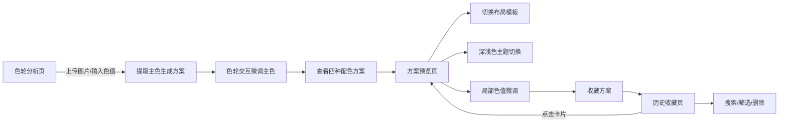

## 1. 产品概述

ColorHarmony是一款面向设计师和前端开发者的在线配色方案分析与辅助选择应用，解决手动配色效率低、色彩和谐度难以把控的痛点。用户可通过上传图片或输入主题色，自动提取主色调并生成多组专业和谐配色方案，同时支持网页布局实时预览与历史收藏管理。

- 目标用户：UI设计师、前端开发者、创意设计从业者
- 产品价值：降低配色门槛，提升设计效率，建立个人配色资产库

## 2. 核心功能

### 2.1 用户角色

| 角色 | 注册方式 | 核心权限 |
|------|---------|----------|
| 普通用户 | 本地userId生成 | 上传图片/输入色值、生成配色方案、预览布局、保存历史记录、收藏方案 |

### 2.2 功能模块

1. **色轮分析页**：文件上传、手动色值输入、Canvas色轮绘制与交互、四种配色方案生成与展示
2. **方案预览页**：三种网页布局模板（博客首页/商务登录页/仪表盘）、深浅色主题切换、局部色值微调、收藏操作
3. **历史收藏页**：时间倒序历史记录、收藏网格展示、名称搜索、时间筛选、删除确认弹窗

### 2.3 页面详情

| 页面名称 | 模块名称 | 功能描述 |
|---------|---------|---------|
| 色轮分析页 | 上传区域 | 支持拖拽上传jpg/png/webp（最大5MB），显示进度条和缩略图；手动输入十六进制色值，实时校验并回显色块 |
| 色轮分析页 | Canvas色轮 | HSV彩色渐变色轮（直径340px），白色圆点标记主色（半径6px，1px边框+drop-shadow），拖拽/点击实时调整主色 |
| 色轮分析页 | 配色方案Tab | 互补（色相偏移180°）、类似（±30°）、三色（±120°）、分裂互补（150°/210°）四种模式，每组5个色块 |
| 色轮分析页 | 色块交互 | 64x64px圆角8px色块，下方色值文本12px#64748b；点击复制色值，浮动提示"已复制"2秒（#1e293b背景#f8fafc文字） |
| 方案预览页 | 布局模板切换 | 博客首页/商务登录页/仪表盘三种模板切换 |
| 方案预览页 | 主题切换 | 深色/浅色主题按钮，自动计算4.5:1对比度文字色 |
| 方案预览页 | 局部微调 | 各元素色值手动调整，实时预览；心形图标收藏（#94a3b8→#ef4444，0.3s缩放动画） |
| 历史收藏页 | 卡片网格 | 卡片260x200px，白色背景圆角12px阴影0 4px 12px rgba(0,0,0,0.06)，悬停上浮4px加深阴影 |
| 历史收藏页 | 搜索筛选 | 名称关键词搜索、最近一周/一个月/全部时间筛选 |
| 历史收藏页 | 删除确认 | 半透明黑色遮罩（#000000 0.5不透明度），居中弹窗圆角12px，确认#ef4444取消#64748b |

## 3. 核心流程

用户启动应用 → 进入色轮分析页 → 上传图片或手动输入色值 → 自动提取主色并生成四种配色方案 → 在色轮上拖拽/点击微调主色 → 切换配色方案Tab查看 → 进入预览页选择布局模板 → 切换深浅色主题、局部微调色值 → 收藏心仪方案 → 在历史页查看/搜索/筛选/删除记录

## 4. 用户界面设计

### 4.1 设计风格

- **整体风格**：深色现代风格，专业工具类产品调性
- **主背景色**：#0f172a（深蓝近黑），卡片背景#1e293b
- **文字色阶**：主文字#f8fafc，次要文字#94a3b8，辅助文字#64748b
- **强调色系**：品牌渐变#6366f1→#4f46e5，危险色#ef4444，链接高亮#3b82f6
- **按钮样式**：圆角过渡，悬停0.2s ease背景渐变，点击0.97倍缩放
- **布局结构**：固定顶部导航栏56px高（#1e2939），左侧Logo"ColorHarmony"16px字重600，右侧导航"分析/预览/历史"选中项下渐变线
- **响应式**：桌面端>1024px三列，平板768-1024px两列，手机<768px单列堆叠
- **动效**：页面切换渐隐渐显0.3s ease，色轮区域留白≥40px

### 4.2 页面设计概览

| 页面名称 | 模块名称 | UI元素 |
|---------|---------|--------|
| 色轮分析页 | 上传区 | #475569 2px dashed边框圆角16px，拖拽时实线+#3b82f6高亮 |
| 色轮分析页 | 色轮区 | HSV径向渐变，居中展示，主色标记点drop-shadow |
| 色轮分析页 | 方案区 | Tab切换+#e2e8f0 1px分隔线，横向色块卡片组 |
| 方案预览页 | 布局模板 | 顶部切换Tab，居中渲染模拟网页布局（导航栏/侧边栏/内容区/页脚） |
| 方案预览页 | 主题切换 | 右上太阳/月亮图标按钮，整体配色反向切换 |
| 历史收藏页 | 卡片网格 | 主色色块+5色缩略图横排，创建时间、名称标签 |

### 4.3 响应式设计

桌面优先布局，色轮与方案区采用Grid响应式栅格；移动端色轮直径自适应缩减至300px，方案Tab切换为垂直滚动列表；上传区拖拽交互在移动端降级为点击选择文件。

### 4.4 性能交互指标

- 图片上传后Web Worker后台执行k-means聚类，主线程≥30FPS
- 色轮拖拽/点击响应≤50ms，配色方案同步更新延迟≤200ms
- 历史记录首次加载≤1.5秒，搜索筛选响应≤500ms
