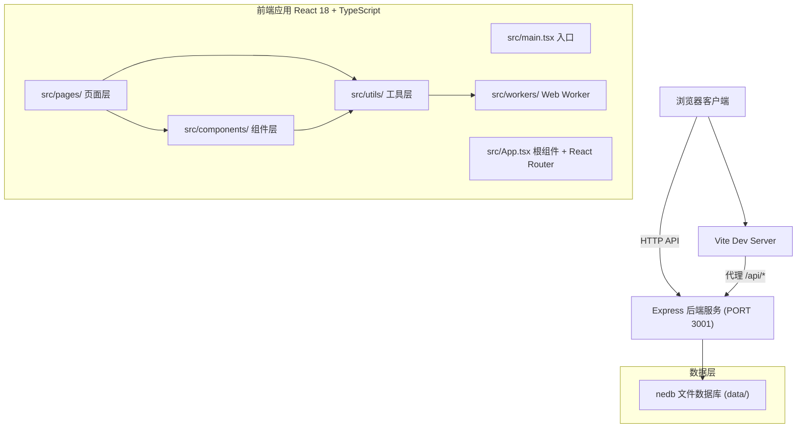
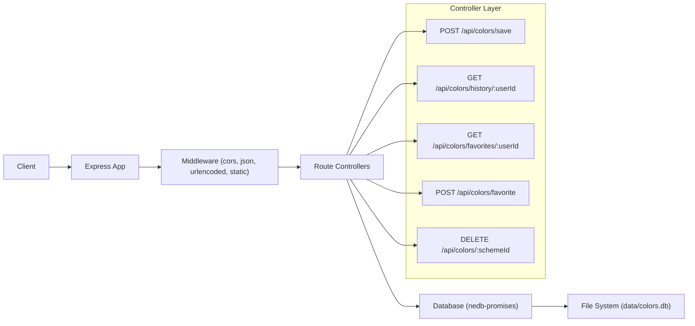
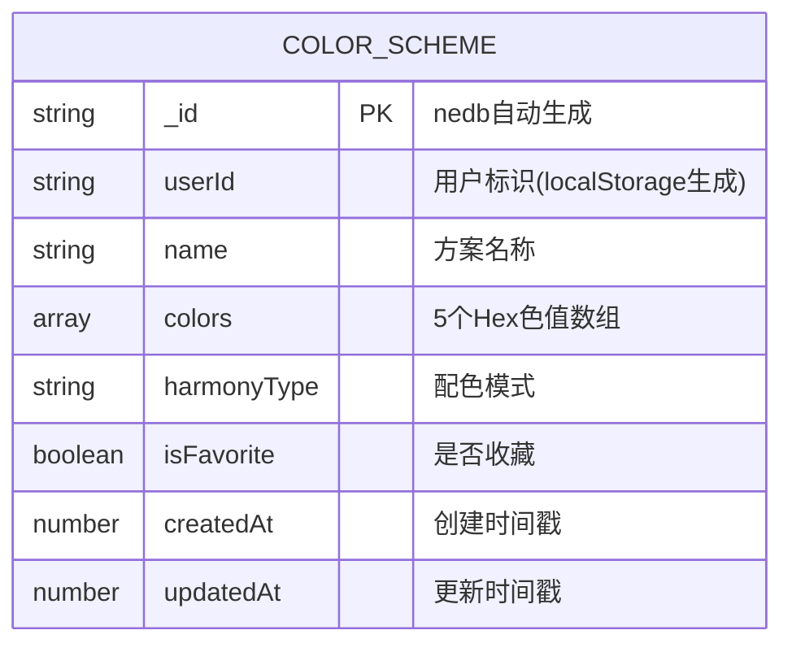

## 1. 架构设计



## 2. 技术栈说明

- **前端框架**：React@18 + React DOM + TypeScript@5（strict模式，ESNext模块）
- **构建工具**：Vite@5 + @vitejs/plugin-react
- **路由管理**：react-router-dom@6
- **HTTP客户端**：axios@1
- **画布渲染**：Canvas API（原生2D上下文）
- **多线程**：Web Worker（执行k-means聚类算法）
- **后端框架**：Express@4 + @types/express
- **本地数据库**：nedb-promises@6（轻量级嵌入式文档数据库）
- **唯一ID**：uuid@9
- **后端运行时**：Node.js 18+（使用tsx直接运行TypeScript）
- **进程管理**：concurrently（同时启动前端Vite和后端Express）

## 3. 路由定义

| 前端路由 | 页面组件 | 说明 |
|---------|---------|------|
| `/` | AnalyzePage | 色轮分析页（首页） |
| `/analyze` | AnalyzePage | 色轮分析页 |
| `/preview` | PreviewPage | 方案预览页 |
| `/history` | HistoryPage | 历史收藏页 |
| * | AnalyzePage | 404 fallback到分析页 |

## 4. API接口定义

### 4.1 TypeScript 类型定义

```typescript
interface ColorScheme {
  _id?: string;
  userId: string;
  name: string;
  colors: string[];
  harmonyType: 'complementary' | 'analogous' | 'triadic' | 'split-complementary';
  isFavorite: boolean;
  createdAt: number;
  updatedAt: number;
}

interface SaveColorRequest {
  name: string;
  colors: string[];
  userId: string;
  harmonyType?: string;
}

interface ToggleFavoriteRequest {
  userId: string;
  schemeId: string;
  isFavorite: boolean;
}
```

### 4.2 接口列表

| 方法 | 路径 | 请求体 | 响应 | 说明 |
|-----|------|-------|------|------|
| POST | `/api/colors/save` | `{ name, colors, userId, harmonyType }` | `{ success: true, data: ColorScheme }` | 保存配色方案 |
| GET | `/api/colors/history/:userId` | - | `{ success: true, data: ColorScheme[] }` | 获取用户历史记录（按createdAt倒序） |
| GET | `/api/colors/favorites/:userId` | - | `{ success: true, data: ColorScheme[] }` | 获取用户收藏方案 |
| POST | `/api/colors/favorite` | `{ userId, schemeId, isFavorite }` | `{ success: true, data: ColorScheme }` | 切换收藏状态 |
| DELETE | `/api/colors/:schemeId` | `{ userId }` | `{ success: true }` | 删除指定配色方案 |

## 5. 服务器架构图



## 6. 数据模型

### 6.1 ER图



### 6.2 nedb 数据操作说明

- **数据文件位置**：`server/data/colors.db`（nedb自动创建目录和文件）
- **索引**：对 `userId`、`createdAt` 字段建立索引加速查询
- **写入策略**：nedb原生append-only文件持久化，自动压缩
- **查询示例**：
  - 历史记录：`find({ userId }).sort({ createdAt: -1 })`
  - 收藏筛选：`find({ userId, isFavorite: true })`
  - 关键词搜索：使用正则 `{ name: new RegExp(keyword, 'i') }`

## 7. 文件结构

```
auto117/
├── package.json
├── index.html
├── tsconfig.json
├── tsconfig.node.json
├── vite.config.ts
├── server/
│   ├── index.ts              # Express入口，API路由
│   └── tsconfig.json
├── src/
│   ├── main.tsx              # 应用入口
│   ├── App.tsx               # 根组件+路由
│   ├── styles/
│   │   └── index.css         # 全局样式（深色主题、响应式）
│   ├── components/
│   │   ├── Navbar.tsx        # 顶部导航栏
│   │   ├── ColorWheel.tsx    # Canvas色轮组件
│   │   ├── ColorPalette.tsx  # 调色板展示组件
│   │   └── Modal.tsx         # 通用确认弹窗
│   ├── pages/
│   │   ├── AnalyzePage.tsx   # 色轮分析页
│   │   ├── PreviewPage.tsx   # 方案预览页
│   │   └── HistoryPage.tsx   # 历史收藏页
│   ├── utils/
│   │   ├── colorExtractor.ts # 图片颜色提取(k-means)
│   │   ├── harmonyGenerator.ts # 配色方案生成
│   │   ├── colorUtils.ts     # HSL/RGB/Hex转换工具
│   │   └── api.ts            # axios封装
│   ├── workers/
│   │   └── kmeans.worker.ts  # k-means聚类Web Worker
│   └── types/
│       └── index.ts          # 全局类型定义
```

## 8. 性能关键实现

1. **k-means Web Worker**：颜色提取算法分离至独立线程，使用 `new Worker(new URL(...))` Vite特有语法
2. **图片取样**：Canvas像素取样步长4px，降低计算量至原图的1/16
3. **色轮渲染**：离屏Canvas缓存色轮渐变背景，仅重绘主色标记点
4. **状态防抖**：主色拖拽更新使用 `useDeferredValue` 或 200ms 防抖
5. **后端nedb**：内存缓存+异步写入，查询操作<10ms
