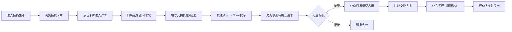

# SkillSwap 产品需求文档（PRD）

## 1. 产品概述
SkillSwap 是一款社区技能交换平台，让技能拥有者（吉他手、画师、程序员等）发布可教学的时间块，其他用户用自己的技能时间块进行对等交换，通过双向日历预约系统确认交易并互相评价。
- 解决痛点：微信群凑时间效率低、日程手动对齐不可靠、缺乏评价体系和信任机制
- 目标用户：社区内有一技之长、希望低成本学习新技能并拓展社交圈的活跃用户
- 产品价值：以时间为货币的对等交换，降低技能学习门槛，激活社区知识分享氛围

## 2. 核心功能

### 2.1 用户角色
| 角色 | 注册方式 | 核心权限 |
|------|----------|----------|
| 普通用户 | 默认内置（演示用户） | 浏览集市、发布技能、发起交换、确认预约、评价对方 |

### 2.2 功能模块
1. **技能集市页**：瀑布流卡片展示全部可交换技能、头像、简介、可用时段指示
2. **技能详情页**：左侧技能信息，右侧日历预约面板，30分钟时间槽选择与交换请求提交
3. **个人中心页**：我发布的技能、待确认交换请求（带红色角标）、已预约日历周视图、评价历史（五星展示）
4. **评价流程**：交换完成后双方互评，支持匿名，弹性动画评分栏

### 2.3 页面详情
| 页面名称 | 模块名称 | 功能描述 |
|----------|----------|----------|
| 技能集市页 | 瀑布流卡片列表 | 宽320px白色卡片，16px圆角，悬停上浮8px加深阴影，0.3s ease-out过渡；卡片展示头像、技能名、简介、绿色小圆点标记可用时段 |
| 技能集市页 | 顶部导航栏 | Logo + 跳转到个人中心按钮 |
| 技能详情页 | 左侧信息区（60%） | 发布者头像、技能名称、详细介绍、历史评价平均星级 |
| 技能详情页 | 右侧日历面板（40%） | 浅色主题日历，表头#f8fafc，日期格白#ffffff，选中#6366f1圆角8px，已预约灰色#d1d5db删除线；可选30分钟时间槽 |
| 技能详情页 | 交换请求表单 | 选择自己的技能、填写50字以内描述，提交发送交换请求 |
| 技能详情页 | Toast通知 | 右上角深色#1e293b背景白色文字，3秒自动消失 |
| 个人中心页 | 我的技能列表 | 展示已发布技能卡片 |
| 个人中心页 | 待确认交换 | 红色#ef4444 pill形角标数字，列出待处理请求 |
| 个人中心页 | 周视图日历 | 紫色#8b5cf6表示自己教学时间，橙色#f97316表示交换来的学习时间 |
| 个人中心页 | 评价历史 | 五星系统，平均分半透明金色#fbbf24星星 |
| 评价表单 | 评分栏 | 0.2s弹性动画点击反馈 |
| 评价表单 | 匿名选项 | 勾选后对方看不到评价者身份 |

## 3. 核心流程
用户打开应用进入技能集市，浏览瀑布流中的技能卡片，点击卡片进入详情页，在右侧日历选择空闲30分钟时段，填写自己要交换的技能和描述后发送请求；对方在个人中心看到带红色角标的待确认请求，接受后双方日历同步占用该时段并收到Toast通知；交换完成后双方进入评价流程，互相打分（支持匿名），评分结果在个人中心的评价历史和技能详情页展示。

## 4. 用户界面设计

### 4.1 设计风格
- 主色调：紫色 #6366f1，辅助色：橙色 #f97316
- 背景色：暖灰 #f8fafc，卡片色：白色 #ffffff
- 成功指示：绿色 #22c55e；告警角标：红色 #ef4444；评分金色：#fbbf24；禁用灰：#d1d5db；Toast深色：#1e293b
- 按钮：圆角 8px，悬停时颜色加深
- 卡片：圆角 16px，阴影 0 4px 12px rgba(0,0,0,0.06)，悬停 0 8px 24px rgba(0,0,0,0.12)，过渡 0.3s ease-out，上浮 8px
- 字体：中文使用现代无衬线，标题加粗，正文常规
- 动画：所有跳转与弹窗 0.3s ease 过渡，评分点击 0.2s 弹性动画

### 4.2 页面设计概览
| 页面名称 | 模块名称 | UI元素 |
|----------|----------|--------|
| 技能集市 | 导航栏 | Logo「SkillSwap」紫色文字，右侧个人中心按钮 |
| 技能集市 | 瀑布流 | 响应式多列网格，768px以下单列；卡片悬停上浮+加深阴影 |
| 技能详情 | 双栏布局 | 左60%信息展示，右40%日历面板；移动端单列堆叠 |
| 技能详情 | 日历 | 周表头浅灰，每格白色；选中紫色圆角8px；已预约灰色删除线；30分钟时间槽列表 |
| 个人中心 | 分区布局 | 我的技能 / 待确认（红pill角标）/ 周日历（紫橙双色）/ 评价历史 四块 |
| 评价卡片 | 卡片样式 | 300px 宽 #f8fafc 圆角12px，头像+文字+日期，底部五星评分栏点击弹性动画 |

### 4.3 响应式
- 桌面优先，断点 768px 以下切换为单列布局
- 日历面板在移动端堆叠到信息区下方
- 卡片间距在移动端适当缩小，保证可用点击区域
- 触控设备按钮与交互元素最小 44×44px

### 4.4 性能要求
- 页面切换加载时间 ≤ 1 秒
- 所有动画使用 CSS transform/opacity，避免重排
- 数据使用本地 nedb，无需远程网络请求
