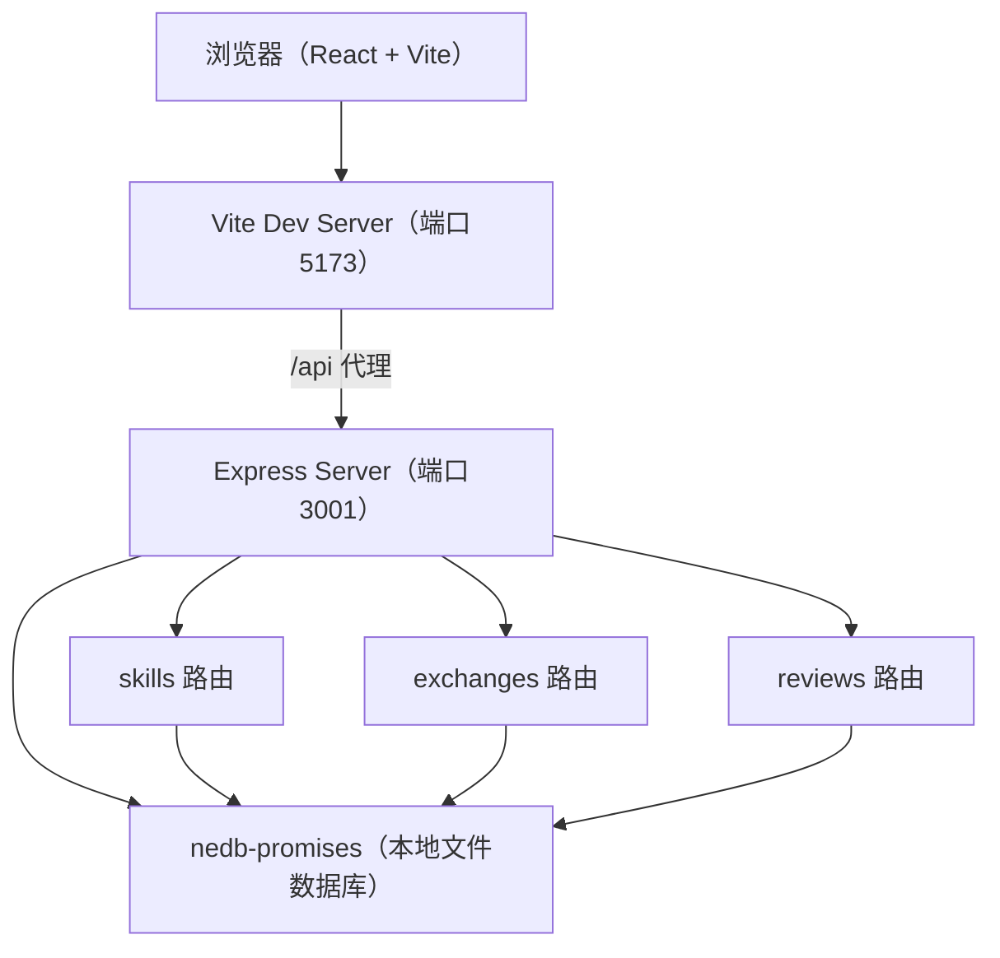
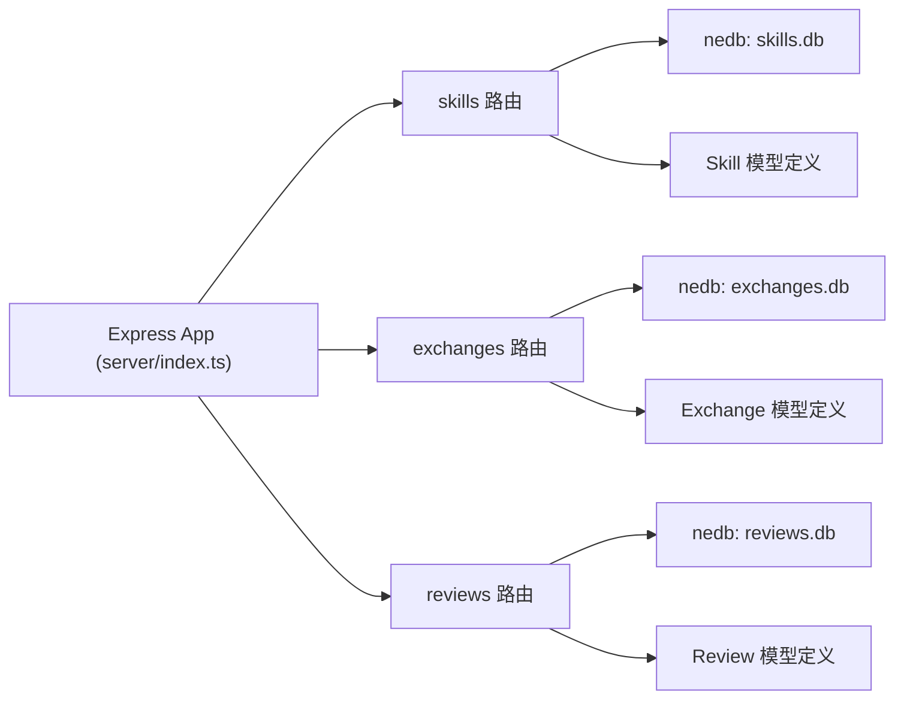
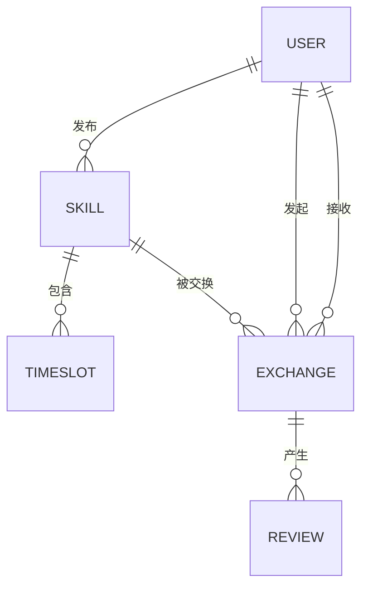

# SkillSwap 技术架构文档

## 1. 架构设计


## 2. 技术说明
- 前端：React 18 + TypeScript + Vite + React Router DOM v6
- 状态管理：组件内 useState/useEffect + axios 封装 API 层
- HTTP 客户端：axios
- 后端：Express 4 + TypeScript + ts-node
- 数据库：nedb-promises（嵌入式、零配置，适合演示）
- ID 生成：uuid
- 代理：Vite 将 /api 请求转发至 http://localhost:3001
- 启动：concurrently 同时启动前端 Vite 与后端 Express

## 3. 路由定义
| 前端路由 | 页面组件 | 用途 |
|----------|----------|------|
| / | Market | 技能集市（瀑布流） |
| /skill/:id | Detail | 技能详情 + 日历预约 |
| /profile | Profile | 个人中心（我的技能 / 待确认 / 周日历 / 评价历史） |

| 后端 API | 方法 | 用途 |
|----------|------|------|
| /api/skills | GET | 获取全部技能列表 |
| /api/skills/:id | GET | 获取单个技能详情（含可用时段、已预约时段） |
| /api/skills | POST | 发布新技能 |
| /api/skills/user/:userId | GET | 获取指定用户发布的技能 |
| /api/exchanges | GET | 获取当前用户相关交换请求 |
| /api/exchanges | POST | 发起新的交换请求 |
| /api/exchanges/:id/confirm | POST | 确认接受交换请求 |
| /api/exchanges/:id/reject | POST | 拒绝交换请求 |
| /api/reviews | GET | 获取指定技能或用户的评价 |
| /api/reviews | POST | 提交新评价 |

## 4. API 定义

### 4.1 TypeScript 类型
```ts
interface User {
  id: string;
  name: string;
  avatar: string;
}

interface Skill {
  _id: string;
  userId: string;
  userName: string;
  userAvatar: string;
  title: string;
  description: string;
  availableSlots: TimeSlot[];
  createdAt: number;
}

interface TimeSlot {
  id: string;
  date: string;      // YYYY-MM-DD
  start: string;     // HH:mm
  end: string;       // HH:mm (默认30分钟)
  booked: boolean;
}

interface Exchange {
  _id: string;
  fromUserId: string;
  fromUserName: string;
  fromUserAvatar: string;
  toUserId: string;
  toUserName: string;
  skillId: string;
  skillTitle: string;
  offeredSkillTitle: string;
  description: string;
  slotId: string;
  slotDate: string;
  slotStart: string;
  slotEnd: string;
  status: 'pending' | 'confirmed' | 'rejected' | 'completed';
  createdAt: number;
}

interface Review {
  _id: string;
  exchangeId: string;
  skillId: string;
  fromUserId: string;
  toUserId: string;
  rating: number;  // 1-5
  comment: string;
  anonymous: boolean;
  createdAt: number;
}
```

## 5. 服务端架构


## 6. 数据模型

### 6.1 ER 图


### 6.2 初始种子数据
启动时自动注入演示数据：
- 3 位用户：吉他手小林、画师阿May、程序员老王
- 每位用户发布 2-3 个技能，附带未来 2 周的可用 30 分钟时段
- 预置 2-3 条已完成交换及评价，用于展示评分星级效果

## 7. 项目结构
```
auto121/
├── package.json            # 根：前端+后端依赖与 concurrently 脚本
├── server/package.json     # 服务端独立依赖
├── index.html              # Vite 入口
├── vite.config.js          # Vite + /api 代理
├── tsconfig.json           # strict 模式，jsx
├── src/
│   ├── App.tsx             # 根组件 + React Router
│   ├── services/api.ts     # axios 封装
│   ├── pages/
│   │   ├── Market.tsx
│   │   ├── Detail.tsx
│   │   └── Profile.tsx
│   └── components/
│       ├── SkillCard.tsx
│       ├── CalendarPicker.tsx
│       ├── Toast.tsx
│       └── ReviewForm.tsx
└── server/
    ├── index.ts
    ├── models/
    │   ├── skill.ts
    │   ├── exchange.ts
    │   └── review.ts
    └── routes/
        ├── skills.ts
        ├── exchanges.ts
        └── reviews.ts
```
