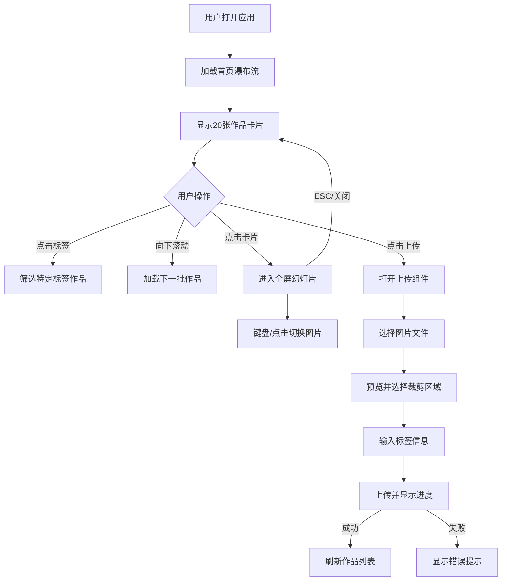

## 1. 产品概述

LensGallery是一个面向自由摄影师的轻量级、可自托管的在线摄影作品集展示应用。它解决了市面上画廊模板价格昂贵且定制灵活性不足的问题，为摄影师提供完全自主的作品展示解决方案。

- 核心目标：提供一套简洁高效的摄影作品管理与展示工具
- 目标用户：自由摄影师、独立创作者、视觉艺术家
- 市场价值：降低作品展示门槛，支持完全自主托管，数据完全可控

## 2. 核心功能

### 2.1 用户角色
| 角色 | 注册方式 | 核心权限 |
|------|----------|----------|
| 摄影师用户 | 自托管部署即拥有完全权限 | 图片上传、标签管理、作品浏览、删除管理 |

### 2.2 功能模块
1. **首页展示**：瀑布流作品展示、标签筛选导航、无限滚动加载
2. **图片上传**：拖拽/点击上传、图片预览、裁剪区域选择、标签输入、进度反馈
3. **全屏浏览**：幻灯片模式、淡入淡出切换、键盘导航、作品元信息展示

### 2.3 页面详情
| 页面名称 | 模块名称 | 功能描述 |
|---------|----------|----------|
| 首页 | 导航栏 | 固定顶部64px，磨砂玻璃效果，居中Logo |
| 首页 | 标签筛选区 | 胶囊按钮形式，支持多选组合筛选，靛蓝色选中态 |
| 首页 | 瀑布流展示区 | 动态列布局，280px固定卡片宽度，悬停动效，无限滚动加载 |
| 首页 | 上传入口 | 桌面端固定组件，移动端折叠为弹出按钮 |
| 全屏幻灯片 | 大图展示 | 80vw/80vh居中，半透明背景，0.5s淡入淡出切换 |
| 全屏幻灯片 | 导航控制 | 左右箭头、键盘方向键、ESC退出、关闭按钮 |
| 全屏幻灯片 | 信息面板 | 图片标题、标签列表、拍摄日期展示 |
| 上传组件 | 文件选择 | 拖拽/点击选择.jpg/.png，单文件50MB限制 |
| 上传组件 | 预览裁剪 | 图片预览、可拖拽裁剪框选择缩略图焦点 |
| 上传组件 | 标签输入 | 关键词标签输入，支持多标签 |
| 上传组件 | 进度反馈 | 百分比进度条、成功绿色脉冲、失败红色提示 |

## 3. 核心流程

用户打开应用 → 首页加载瀑布流展示20张作品 → 可通过顶部标签筛选特定类型作品 → 向下滚动自动加载更多 → 点击任意图片进入全屏幻灯片模式 → 左右切换浏览作品 → 退出后返回瀑布流 → 点击上传按钮选择图片 → 预览并选择裁剪区域 → 输入标签信息 → 开始上传查看进度 → 上传成功自动刷新作品列表

## 4. 用户界面设计

### 4.1 设计风格
- 整体风格：极简主义，干净克制，突出作品本身
- 主色调：靛蓝 #6366f1，用于强调交互元素
- 背景色：浅灰 #f8fafc，创造舒适浏览环境
- 文字主色：深灰 #1e293b，确保可读性
- 卡片样式：纯白 #ffffff 背景，12px圆角，柔和阴影
- 按钮样式：圆角胶囊按钮，点击0.1s缩放反馈
- 字体选择：标题使用Playfair Display（优雅衬线），正文使用Inter（清晰易读）
- 布局风格：顶部导航 + 标签区 + 瀑布流主体
- 动画风格：0.3s ease-out过渡，卡片渐入，悬停放大加深阴影

### 4.2 页面设计概述
| 页面名称 | 模块名称 | UI元素 |
|---------|----------|--------|
| 首页 | 导航栏 | 磨砂玻璃背景rgba(255,255,255,0.7)，blur(12px)，粗体20px Logo |
| 首页 | 标签筛选区 | 胶囊按钮，未选中#e2e8f0，选中#6366f1，0.2s过渡 |
| 首页 | 瀑布流卡片 | 宽280px，高自适应，12px圆角，阴影0 2px 8px rgba(0,0,0,0.06)，悬停放大1.02倍 |
| 全屏幻灯片 | 遮罩层 | 半透明黑色#000000b3，全屏覆盖 |
| 全屏幻灯片 | 大图容器 | 80vw/80vh最大尺寸，居中显示 |
| 全屏幻灯片 | 信息区 | 底部白色文字，标签#6366f1 |
| 上传组件 | 进度条 | 动态百分比，成功#22c55e脉冲，失败#ef4444 |

### 4.3 响应式设计
- 设计原则：Desktop-first，移动端自适应
- 断点：768px为移动端断点
- 桌面端：卡片宽280px，间距16px，上传组件固定展示
- 移动端：卡片宽160px，间距8px，上传组件折叠为浮动按钮
- 触控优化：所有可点击元素最小44px触控区域，滑动手势支持

### 4.4 性能要求
- 首屏加载：<3秒完成首屏图片渲染（网络延迟100ms以内）
- 滚动加载：<1.5秒完成新卡片渲染
- 动画帧率：≥50FPS
- 幻灯片切换：0.5s内完成淡入淡出，无卡顿
