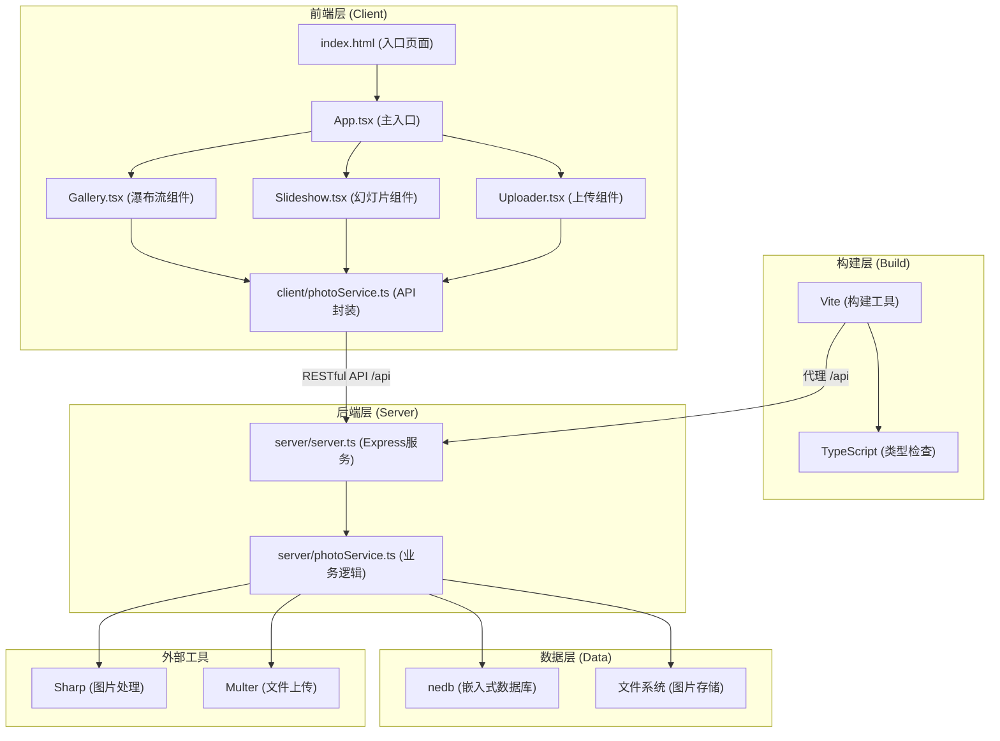
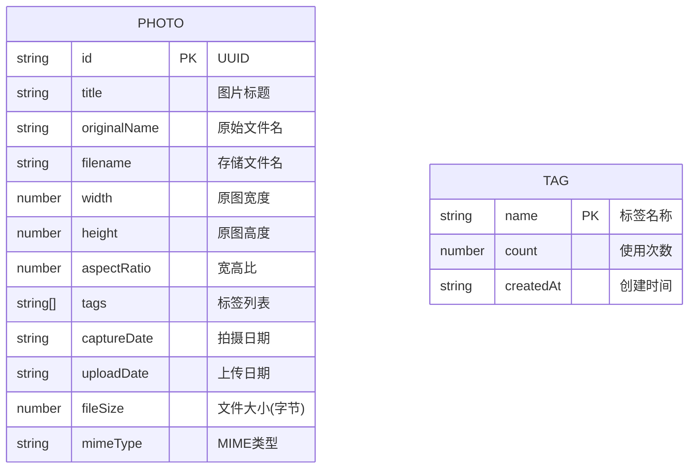
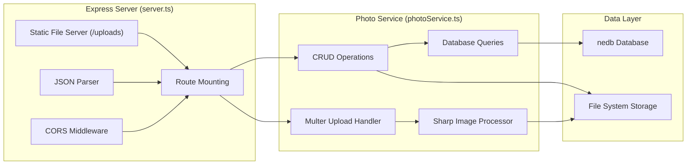

## 1. 架构设计



## 2. 技术描述

### 2.1 前端技术栈
- **框架**: React@18 + React-DOM@18
- **构建工具**: Vite@5
- **语言**: TypeScript@5 (严格模式)
- **HTTP客户端**: Axios@1
- **样式方案**: CSS Modules + 内联样式 (按需求选择)

### 2.2 后端技术栈
- **Web框架**: Express@4
- **数据库**: nedb-promises@6 (嵌入式文档数据库)
- **文件上传**: Multer@1
- **图片处理**: Sharp@0.33
- **唯一ID**: uuid@9
- **语言**: TypeScript@5

### 2.3 初始化方式
- 项目根目录手动创建配置文件
- 使用 `npm install` 安装依赖
- 使用 `npm run dev` 同时启动前后端服务
- 前端开发服务器端口: 5173
- 后端API服务端口: 3001

### 2.4 开发工具配置
- **Vite代理**: 将 `/api` 请求转发到 `http://localhost:3001`
- **TypeScript**: 严格模式 `strict: true`, `esModuleInterop: true`, `jsx: "react-jsx"`
- **CORS**: 后端配置允许 `http://localhost:5173` 跨域访问

## 3. 目录结构

```
lensgallery/
├── package.json              # 项目依赖和启动脚本
├── vite.config.js            # Vite构建配置
├── tsconfig.json             # TypeScript配置
├── index.html                # HTML入口
├── client/                   # 前端源码
│   ├── App.tsx               # React根组件
│   ├── main.tsx              # React入口
│   ├── photoService.ts       # 前端API服务封装
│   ├── Gallery.tsx           # 瀑布流展示组件
│   ├── Slideshow.tsx         # 全屏幻灯片组件
│   ├── Uploader.tsx          # 图片上传组件
│   └── types.ts              # 前端类型定义
├── server/                   # 后端源码
│   ├── server.ts             # Express服务入口
│   ├── photoService.ts       # 图片业务逻辑
│   └── types.ts              # 后端类型定义
├── uploads/                  # 图片存储目录 (运行时创建)
│   ├── originals/            # 原图
│   ├── thumbs/               # 缩略图
│   │   ├── 200/
│   │   ├── 600/
│   │   └── 1200/
│   └── data/                 # nedb数据库文件
└── .trae/
    └── documents/
        ├── PRD-LensGallery.md
        └── TECH-ARCHITECTURE-LensGallery.md
```

## 4. 数据模型

### 4.1 数据实体关系



### 4.2 TypeScript 类型定义

```typescript
// client/types.ts
export interface Photo {
  id: string;
  title: string;
  originalName: string;
  filename: string;
  width: number;
  height: number;
  aspectRatio: number;
  tags: string[];
  captureDate: string;
  uploadDate: string;
  fileSize: number;
  mimeType: string;
  thumbnails: {
    w200: string;
    w600: string;
    w1200: string;
  };
}

export interface Tag {
  name: string;
  count: number;
  createdAt: string;
}

export interface PhotoListResponse {
  photos: Photo[];
  total: number;
  hasMore: boolean;
}

export interface UploadProgress {
  percent: number;
  status: 'idle' | 'uploading' | 'success' | 'error';
  error?: string;
}
```

## 5. API 定义

### 5.1 作品管理接口

| 方法 | 路径 | 描述 | 请求参数 | 响应格式 |
|------|------|------|----------|----------|
| GET | `/api/photos` | 获取作品列表（分页） | `?limit=20&offset=0&tags=tag1,tag2` | `{ photos: Photo[], total: number, hasMore: boolean }` |
| GET | `/api/photos/:id` | 获取单个作品详情 | 路径参数: `id` | `Photo` |
| POST | `/api/photos` | 上传新作品 | `multipart/form-data`: `file`(图片), `title`(标题), `tags`(JSON数组), `captureDate`(日期), `cropArea`(裁剪区域) | `Photo` |
| DELETE | `/api/photos/:id` | 删除作品 | 路径参数: `id` | `{ success: boolean }` |

### 5.2 标签管理接口

| 方法 | 路径 | 描述 | 请求参数 | 响应格式 |
|------|------|------|----------|----------|
| GET | `/api/tags` | 获取所有标签 | 无 | `Tag[]` |
| POST | `/api/tags` | 创建新标签 | `{ name: string }` | `Tag` |
| DELETE | `/api/tags/:name` | 删除标签 | 路径参数: `name` | `{ success: boolean }` |

### 5.3 图片访问

| 方法 | 路径 | 描述 |
|------|------|------|
| GET | `/uploads/originals/:filename` | 访问原图 |
| GET | `/uploads/thumbs/200/:filename` | 200px宽缩略图 |
| GET | `/uploads/thumbs/600/:filename` | 600px宽缩略图 |
| GET | `/uploads/thumbs/1200/:filename` | 1200px宽缩略图 |

### 5.4 请求/响应示例

**获取作品列表响应**:
```json
{
  "photos": [
    {
      "id": "550e8400-e29b-41d4-a716-446655440000",
      "title": "日落山脉",
      "originalName": "sunset-mountain.jpg",
      "filename": "550e8400-e29b-41d4-a716-446655440000.jpg",
      "width": 4032,
      "height": 3024,
      "aspectRatio": 1.333,
      "tags": ["风景", "日落", "山脉"],
      "captureDate": "2024-01-15",
      "uploadDate": "2024-06-13T10:30:00Z",
      "fileSize": 4523000,
      "mimeType": "image/jpeg",
      "thumbnails": {
        "w200": "/uploads/thumbs/200/550e8400-e29b-41d4-a716-446655440000.jpg",
        "w600": "/uploads/thumbs/600/550e8400-e29b-41d4-a716-446655440000.jpg",
        "w1200": "/uploads/thumbs/1200/550e8400-e29b-41d4-a716-446655440000.jpg"
      }
    }
  ],
  "total": 156,
  "hasMore": true
}
```

**上传请求** (multipart/form-data):
```
------WebKitFormBoundary
Content-Disposition: form-data; name="file"; filename="photo.jpg"
Content-Type: image/jpeg

[二进制数据]
------WebKitFormBoundary
Content-Disposition: form-data; name="title"

日落山脉
------WebKitFormBoundary
Content-Disposition: form-data; name="tags"

["风景","日落"]
------WebKitFormBoundary
Content-Disposition: form-data; name="captureDate"

2024-01-15
------WebKitFormBoundary--
```

## 6. 服务器架构

### 6.1 后端分层架构



### 6.2 数据处理流程

**图片上传流程**:
1. 客户端选择图片 → 前端Canvas预览和裁剪区域选择
2. 构造FormData发送 `POST /api/photos`
3. 后端Multer中间件接收文件到临时目录
4. Sharp读取图片信息（宽度、高度、EXIF拍摄日期）
5. 生成三种尺寸缩略图（200px、600px、1200px宽）
6. 原图移动到 `uploads/originals/`，缩略图保存到对应目录
7. 生成UUID作为文件名，元数据存入nedb
8. 标签计数更新
9. 返回完整Photo对象给前端

**分页查询流程**:
1. 前端发送 `GET /api/photos?limit=20&offset=0&tags=风景,日落`
2. 后端解析查询参数，构建nedb查询条件
3. 标签筛选：使用 `$all` 操作符匹配所有指定标签
4. 按上传日期倒序排序，应用limit和offset
5. 同时查询总数用于分页判断
6. 返回 `{ photos, total, hasMore }`

## 7. 前端数据流向

### 7.1 模块调用关系

```
App.tsx
├── 状态管理: photos[], tags[], selectedTags[], currentPhoto, isSlideshowOpen
├── 生命周期:
│   ├── componentDidMount → loadTags(), loadPhotos()
│   └── useEffect([selectedTags]) → resetAndLoadPhotos()
├── 事件处理:
│   ├── handleTagClick(tag) → 更新selectedTags
│   ├── handlePhotoClick(photo, index) → 打开Slideshow
│   ├── handleCloseSlideshow() → 关闭Slideshow
│   ├── handleUploadComplete() → 刷新photos列表
│   └── handleScroll() → 触发loadMore()
├── 子组件:
    ├── <Gallery />
    │   ├── props: photos, isLoading, hasMore, onPhotoClick, onLoadMore
    │   └── 调用: photoService.getPhotos()
    ├── <Slideshow />
    │   ├── props: photos, currentIndex, isOpen, onClose, onNext, onPrev
    │   └── 事件: 键盘监听、点击切换
    └── <Uploader />
        ├── props: onUploadComplete, tags
        └── 调用: photoService.uploadPhoto(formData, onProgress)
```

### 7.2 关键性能优化点

1. **图片懒加载**: 使用 `loading="lazy"` 和 `IntersectionObserver` 预加载视口附近图片
2. **瀑布流布局**: CSS Columns 或 CSS Grid 实现，避免JS重排
3. **无限滚动**: 节流滚动事件（throttle 100ms），距底部200px触发加载
4. **缩略图策略**: 瀑布流使用200px缩略图，幻灯片使用1200px缩略图
5. **动画性能**: 使用 `transform` 和 `opacity` 属性触发GPU加速
6. **请求优化**: 标签筛选变化时取消未完成请求，使用AbortController
7. **内存管理**: 幻灯片模式下仅预加载前后各1张图片

## 8. 启动脚本配置

**package.json scripts**:
```json
{
  "scripts": {
    "dev": "concurrently \"npm run dev:server\" \"npm run dev:client\"",
    "dev:client": "vite",
    "dev:server": "ts-node server/server.ts",
    "build": "tsc && vite build",
    "preview": "vite preview"
  }
}
```

**开发依赖**: `concurrently` 用于同时启动前后端服务，`ts-node` 用于运行TypeScript后端代码。
