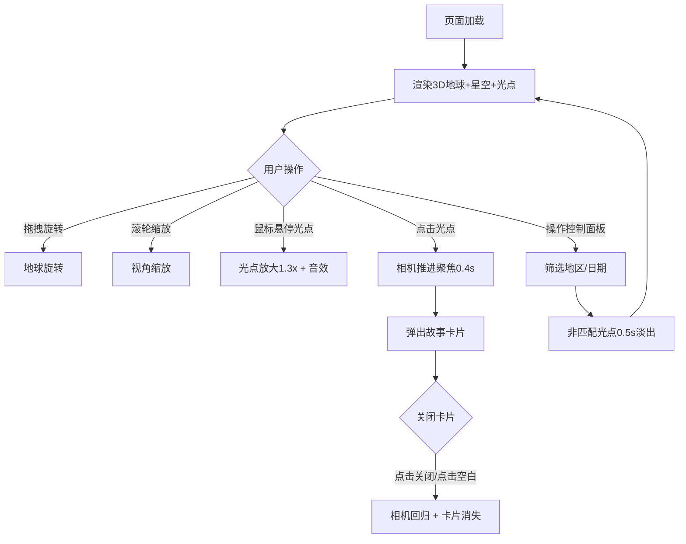

## 1. 产品概述

GlobeStories 是一个基于 3D 地球仪的旅行故事展示平台，用户可以在可交互的三维地球上探索世界各地旅行者分享的故事。每篇故事以彩色光点标记在地球对应经纬度位置，点击光点后弹出精美卡片展示故事详情。

- 目标用户：旅行爱好者、故事阅读者、地理文化探索者
- 核心价值：以沉浸式 3D 交互方式将地理与叙事结合，创造探索世界故事的全新体验

## 2. 核心功能

### 2.1 用户角色

| 角色 | 注册方式 | 核心权限 |
|------|----------|----------|
| 访客 | 无需注册 | 浏览和探索所有故事光点、使用筛选功能 |

### 2.2 功能模块

1. **地球场景页**：3D 地球仪渲染、云层动画、星空背景、故事光点标记与脉冲动画、相机旋转缩放控制
2. **故事交互**：光点点击聚焦动画、故事卡片弹出、卡片关闭交互
3. **筛选控制**：地区筛选（亚洲/欧洲/北美洲/南美洲/非洲/大洋洲）、日期筛选（最近一周/一月/全部）、非匹配光点淡出动画
4. **底部状态栏**：可见光点总数、加载进度条

### 2.3 页面详情

| 页面名称 | 模块名称 | 功能描述 |
|----------|----------|----------|
| 地球场景页 | 3D 地球仪 | Three.js 渲染高分辨率纹理地球，云层以 0.005 速度缓慢旋转，背景深蓝渐变 #0b1120→#1a2a40 |
| 地球场景页 | 星空粒子系统 | 2000 个随机分布在半径 200 球体内的白色粒子，大小 1-3px |
| 地球场景页 | 故事光点 | 球体(0.08) + 发光光晕，5 种预设色随机分配，脉冲动画(0.1→0.6 半径，0.8→0 透明度，1s 循环) |
| 地球场景页 | 光点点击交互 | 0.4s 相机推进到距地球表面 2 单位处，弹出故事卡片 |
| 地球场景页 | 鼠标十字准星 | 白色细线+中心点 24px，碰触光点放大 1.3 倍 + Web Audio 高频音效 |
| 地球场景页 | 故事卡片 | 320px 宽，rgba(15,23,42,0.9) 背景，16px 圆角，8px 白色内阴影，0.3s 弹性缩放动画 |
| 地球场景页 | 控制面板 | 左侧悬浮 240px 宽，地区+日期筛选，0.5s 淡出非匹配光点 |
| 地球场景页 | 底部状态栏 | 光点总数 + 8px 高度进度条(#6366f1→#8b5cf6 渐变，0.5s 宽度动画) |

## 3. 核心流程

用户打开页面后看到旋转的 3D 地球仪，星空背景中散布着彩色脉冲光点。用户可通过鼠标拖拽旋转地球、滚轮缩放视角，划动时显示十字准星光标。点击光点时相机平滑推进聚焦，弹出半透明故事卡片展示标题、摘要和图片。用户可通过左侧控制面板按地区和日期筛选光点，底部显示当前可见光点数量和加载进度。移动端控制面板折叠为底部抽屉。

## 4. 用户界面设计

### 4.1 设计风格

- 主色调：深蓝(#0b1120, #1a2a40) + 紫色(#6366f1, #8b5cf6)
- 辅助暖色：暖橙 #f97316、琥珀 #f59e0b、翠绿 #22c55e、玫红 #ec4899
- 按钮风格：半透明深色背景 + 悬停亮色过渡，0.2s hover 过渡
- 字体：标题使用发光效果（text-shadow 紫色辉光），正文使用清晰无衬线字体
- 布局：地球占满全屏，左侧悬浮控制面板，故事卡片覆盖在 3D 场景上方
- 所有交互元素统一 0.3s ease-out 过渡动画

### 4.2 页面设计概览

| 页面名称 | 模块名称 | UI 元素 |
|----------|----------|---------|
| 地球场景页 | 地球仪 | Three.js 渲染，默认相机位置(0,0,12)，深蓝渐变背景 |
| 地球场景页 | 星空 | 2000 个白色粒子，1-3px 大小 |
| 地球场景页 | 光点 | 球体+光晕，5 色随机，脉冲环动画 |
| 地球场景页 | 控制面板 | 240px 宽，rgba(15,23,42,0.75)，12px 圆角，发光标题，下拉菜单 |
| 地球场景页 | 故事卡片 | 320px 宽，rgba(15,23,42,0.9)，16px 圆角，8px 内阴影 |
| 地球场景页 | 底部状态栏 | 光点计数 + 8px 渐变进度条 |

### 4.3 响应式设计

- 桌面端（≥768px）：左侧悬浮控制面板，全屏地球
- 移动端（<768px）：控制面板折叠为底部弹出式抽屉，40px 拖动条，20px 顶部圆角
- 触摸优化：支持手势旋转缩放地球

### 4.4 3D 场景指导

- 环境：深空背景，深蓝渐变（#0b1120→#1a2a40）
- 灯光：环境光 + 方向光模拟太阳
- 相机：PerspectiveCamera，默认位置(0,0,12)，支持 OrbitControls 旋转缩放
- 构图：地球居中，光点分布在地球表面
- 交互：OrbitControls 拖拽旋转、滚轮缩放，点击光点 Raycaster 检测
- 动画：云层旋转(0.005)、光点脉冲(1s循环)、相机推进(0.4s)、卡片弹出(0.3s ease-out-back)
- 性能：虚拟化渲染(仅渲染视野内光点)，最多 500 光点，目标 50FPS+
