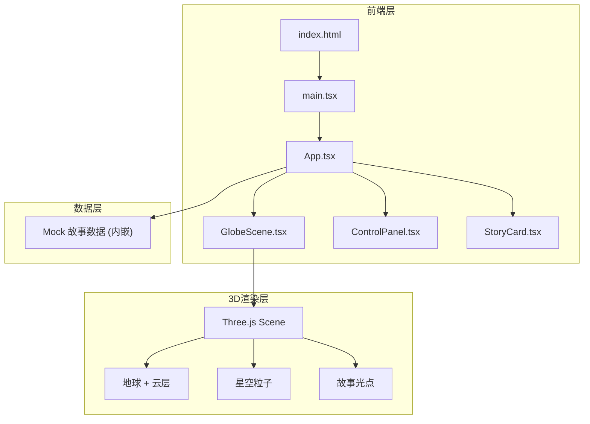
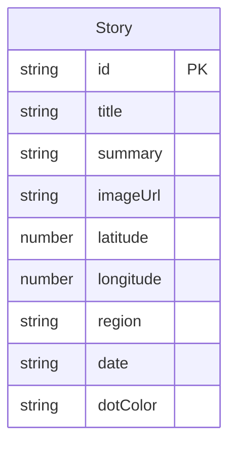

## 1. 架构设计



## 2. 技术说明

- 前端框架：React@18 + TypeScript
- 3D 渲染：Three.js + @react-three/fiber + @react-three/drei
- 构建工具：Vite + @vitejs/plugin-react
- 样式方案：CSS-in-JS（内联样式 + CSS 模块），无 Tailwind
- 状态管理：React useState/useCallback（组件内状态），props 下发
- 后端：无，使用内嵌 Mock 数据
- 数据库：无

## 3. 路由定义

| 路由 | 用途 |
|------|------|
| / | 单页应用，包含地球场景、控制面板、故事卡片 |

## 4. 数据模型

### 4.1 数据模型定义



### 4.2 数据定义

```typescript
interface Story {
  id: string;
  title: string;
  summary: string;
  imageUrl: string;
  latitude: number;
  longitude: number;
  region: 'asia' | 'europe' | 'northAmerica' | 'southAmerica' | 'africa' | 'oceania';
  date: string;
  dotColor: string;
}

interface FilterState {
  region: string;
  dateRange: 'week' | 'month' | 'all';
}
```

## 5. 组件职责划分

| 组件 | 职责 |
|------|------|
| main.tsx | React 应用入口，渲染 App 挂载到 #root |
| App.tsx | 状态管理中心，管理故事列表、筛选条件、选中故事 ID，协调 GlobeScene 与 UI |
| GlobeScene.tsx | 所有 3D 渲染和交互逻辑，接收筛选后数据生成光点，点击触发选中回调 |
| ControlPanel.tsx | 悬浮控制面板，地区/日期筛选，回调通知父组件状态变更 |
| StoryCard.tsx | 故事卡片弹出组件，接收故事数据渲染标题/摘要/图片/关闭按钮 |

## 6. 文件结构

```
├── package.json
├── vite.config.js
├── tsconfig.json
├── index.html
└── src/
    ├── main.tsx
    ├── App.tsx
    ├── GlobeScene.tsx
    ├── ControlPanel.tsx
    └── StoryCard.tsx
```
