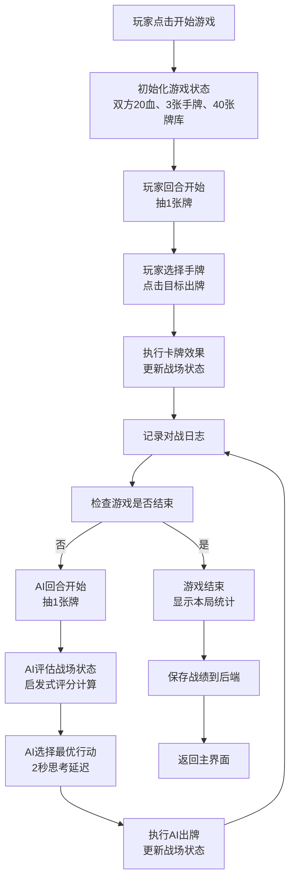
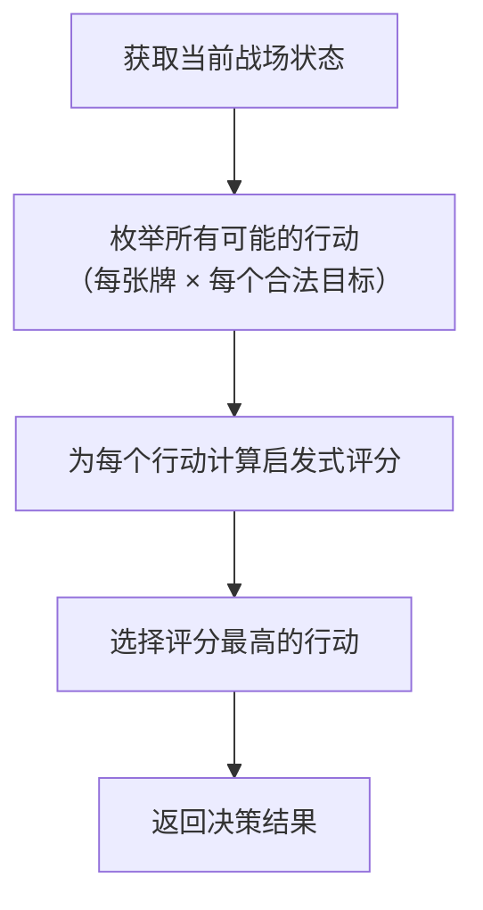

## 1. 产品概述

CardWars Arena是一款回合制AI卡牌对战游戏，玩家与AI对手进行策略卡牌对战。游戏融合了roguelike元素与策略卡牌机制，AI通过启发式评分函数动态决策，为玩家提供具有挑战性的对战体验。

- **核心目标**：构建流畅、具有策略深度的AI卡牌对战系统，让玩家体验与智能AI的博弈乐趣
- **目标用户**：卡牌游戏爱好者、策略游戏玩家
- **市场价值**：展示AI决策在游戏领域的应用，提供可扩展的卡牌对战框架

## 2. 核心功能

### 2.1 用户角色

| 角色 | 注册方法 | 核心权限 |
|------|----------|----------|
| 玩家 | 无需注册，直接游戏 | 进行对战、查看历史战绩、查看本局统计 |

### 2.2 功能模块

1. **主界面**：游戏入口、历史战绩列表、开始游戏按钮
2. **对战界面**：游戏主战场、手牌区、场上单位、血量显示、对战日志
3. **战绩统计**：本局数据展示、历史战绩查询

### 2.3 页面详情

| 页面名称 | 模块名称 | 功能描述 |
|----------|----------|----------|
| 主界面 | 战绩列表 | 展示历史对局记录（时间、结局、双方剩余血量） |
| 主界面 | 开始游戏 | 按钮进入对战界面，初始化新对局 |
| 对战界面 | 战场区域 | 显示双方英雄血量、护盾、场上单位 |
| 对战界面 | 手牌区 | 显示玩家手牌，支持选中和出牌操作 |
| 对战界面 | 对战日志 | 记录双方行动，自动滚动显示最新20条 |
| 对战界面 | 结算弹窗 | 游戏结束后显示本局统计数据 |

## 3. 核心流程

### 3.1 游戏主流程

### 3.2 AI决策流程

## 4. 用户界面设计

### 4.1 设计风格

- **整体风格**：深色主题，游戏感强，科技感与策略感并存
- **主色调**：深色渐变背景 #0f172a → #1e293b
- **卡牌类型色**：攻击牌 #ef4444（红）、防御牌 #3b82f6（蓝）、召唤牌 #22c55e（绿）
- **玩家行为色**：#3b82f6（蓝）、AI行为色：#ef4444（红）
- **字体**：采用具有游戏感的现代字体，标题粗体有力，正文清晰易读
- **动画**：卡牌选中上浮放大、出牌攻击动画、单位移动动画，所有过渡0.15-0.3秒
- **交互反馈**：hover状态变化、点击缩放、选中高亮

### 4.2 页面设计概述

| 页面名称 | 模块名称 | UI元素 |
|----------|----------|--------|
| 主界面 | 头部标题 | 游戏名称CardWars Arena，渐变色标题，发光效果 |
| 主界面 | 战绩列表 | 卡片式布局，每条记录显示对局时间、胜负标识、血量数据 |
| 主界面 | 开始按钮 | 大号渐变按钮，hover发光效果，点击动画 |
| 对战界面 | 敌方区域 | 顶部显示AI英雄，血量条、护盾值、场上单位（90x90格子） |
| 对战界面 | 战场中线 | 分隔双方区域，显示当前回合数 |
| 对战界面 | 己方区域 | 底部显示玩家英雄，血量条、护盾值、场上单位 |
| 对战界面 | 手牌区 | 底部120px高度区域，卡牌水平排列，间距16px |
| 对战界面 | 对战日志 | 右侧300px宽度，半透明背景，日志条目时间戳+颜色区分 |
| 结算弹窗 | 统计面板 | 居中弹窗，显示伤害输出、护盾吸收、消灭单位、回合数 |

### 4.3 响应式设计

- **设计优先级**：Desktop-first，针对桌面端优化
- **移动端适配**：当屏幕宽度小于1200px时，对战日志改为底部抽屉式显示
- **触控优化**：按钮和卡牌最小触控区域48x48px，确保移动端操作流畅

### 4.4 卡牌设计规范

- **尺寸**：120px × 170px，圆角8px
- **背景**：白色 #ffffff，边框2px solid #475569
- **顶部标识**：彩色条标识卡牌类型（攻击红、防御蓝、召唤绿）
- **卡牌图标**：攻击⚔️、防御🛡️、召唤💂
- **选中状态**：上浮20px，放大至110%，box-shadow增强
- **动画**：过渡0.2s ease-out

### 4.5 单位设计规范

- **尺寸**：90px × 90px正方形格子
- **背景**：半透明 #334155，边框1px solid #64748b
- **显示内容**：单位图标、攻击力、生命值
- **动画**：攻击时向前突进效果，受伤时红色闪烁

## 5. 性能要求

- **AI决策**：行动数<50时，1秒内完成决策
- **界面渲染**：每帧渲染时间≤16ms（60FPS）
- **卡牌动画**：时长≤0.3秒
- **日志滚动**：平滑无卡顿
- **网络请求**：API响应时间≤500ms
