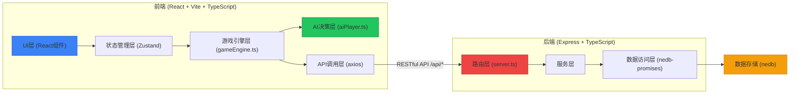
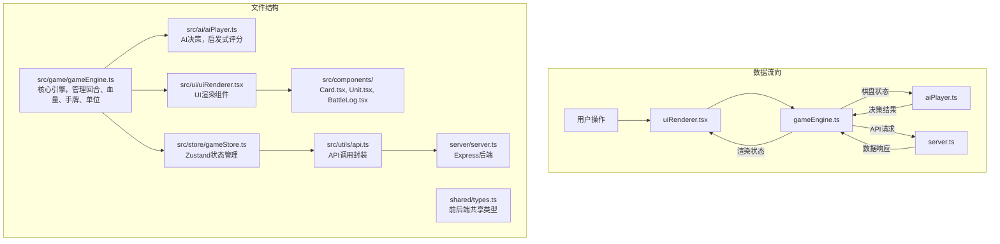
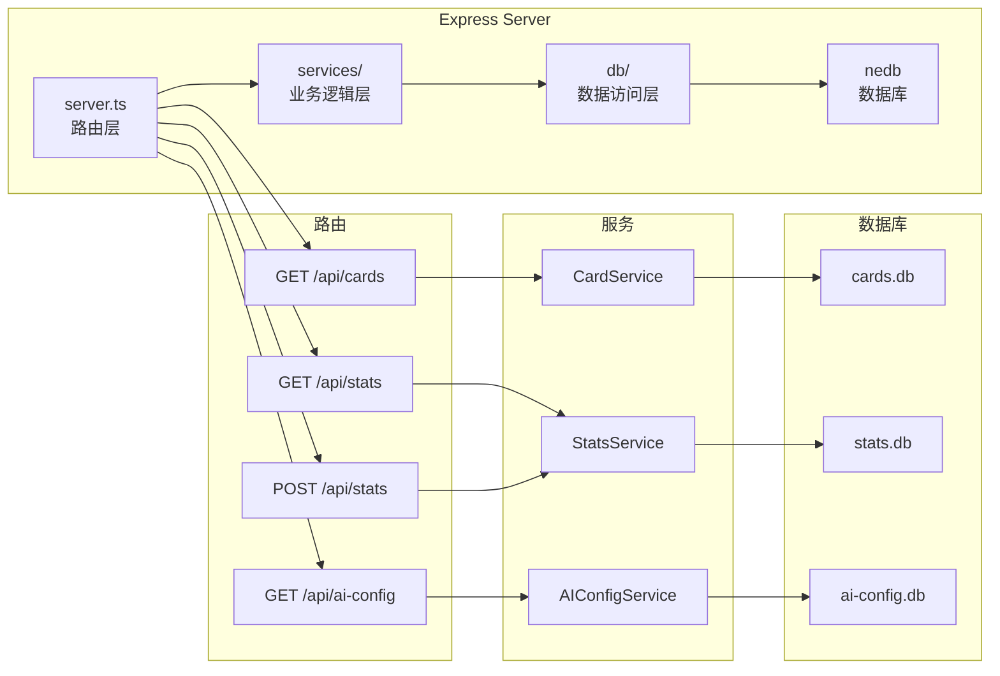
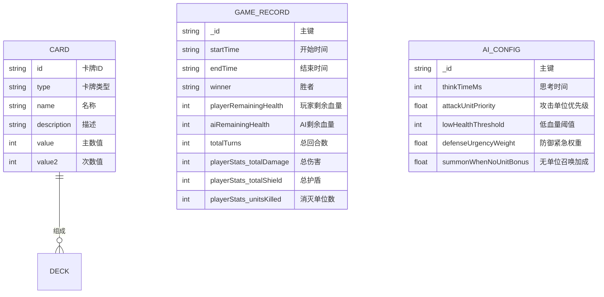

## 1. 架构设计



### 模块调用关系



## 2. 技术栈说明

| 层级 | 技术选型 | 版本要求 | 用途 |
|------|----------|----------|------|
| 前端框架 | React | ^18.2.0 | UI构建 |
| 前端语言 | TypeScript | ^5.0.0 | 类型安全 |
| 构建工具 | Vite | ^5.0.0 | 构建和开发服务器 |
| 状态管理 | Zustand | ^4.4.0 | 全局游戏状态 |
| HTTP客户端 | Axios | ^1.6.0 | API请求 |
| 后端框架 | Express | ^4.18.0 | RESTful API |
| 数据库 | nedb-promises | ^6.2.1 | 轻量级文档数据库 |
| 唯一标识 | uuid | ^9.0.0 | 生成卡牌ID、单位ID |
| 样式 | Tailwind CSS | ^3.4.0 | CSS框架 |

### 项目初始化方式

根据用户要求的依赖和启动脚本，使用 **react-express-ts** 模板初始化项目，然后调整依赖以匹配用户指定的包：
- 保留 react, react-dom, typescript 等核心依赖
- 替换路由/状态管理为用户指定的 axios
- 数据库使用 nedb-promises 而非默认选项

## 3. 路由定义

### 前端路由 (React Router)

| 路由 | 页面 | 用途 |
|------|------|------|
| `/` | 主界面 | 显示历史战绩、开始游戏按钮 |
| `/battle` | 对战界面 | 核心游戏对战界面 |

### 后端API路由 (Express)

| 方法 | 路由 | 用途 |
|------|------|------|
| GET | `/api/cards` | 获取卡牌库数据 |
| GET | `/api/stats` | 获取所有历史战绩 |
| POST | `/api/stats` | 保存新的战绩记录 |
| GET | `/api/ai-config` | 获取AI配置参数 |

## 4. API定义

### 4.1 类型定义 (shared/types.ts)

```typescript
// 卡牌类型
export type CardType = 'attack' | 'defense' | 'summon';

// 卡牌接口
export interface Card {
  id: string;
  type: CardType;
  name: string;
  description: string;
  value: number; // 攻击伤害/防御护盾/召唤攻击力
  value2?: number; // 召唤单位生命值
  cost: number; // 预留字段，当前未使用
}

// 场上单位
export interface Unit {
  id: string;
  owner: 'player' | 'ai';
  attack: number;
  health: number;
  maxHealth: number;
  hasAttacked: boolean;
}

// 英雄状态
export interface Hero {
  health: number;
  maxHealth: number;
  shield: number;
}

// 玩家状态
export interface PlayerState {
  hero: Hero;
  hand: Card[];
  deck: Card[];
  field: Unit[];
}

// 游戏状态
export interface GameState {
  turn: number;
  currentPlayer: 'player' | 'ai';
  phase: 'start' | 'playing' | 'end';
  player: PlayerState;
  ai: PlayerState;
  battleLog: LogEntry[];
  winner: 'player' | 'ai' | null;
}

// 对战日志条目
export interface LogEntry {
  id: string;
  timestamp: string;
  actor: 'player' | 'ai';
  message: string;
}

// 战绩记录
export interface GameRecord {
  _id?: string;
  startTime: string;
  endTime: string;
  winner: 'player' | 'ai';
  playerRemainingHealth: number;
  aiRemainingHealth: number;
  totalTurns: number;
  playerStats: {
    totalDamage: number;
    totalShield: number;
    unitsKilled: number;
  };
}

// AI配置
export interface AIConfig {
  thinkTimeMs: number;
  attackUnitPriority: number;
  lowHealthThreshold: number;
  defenseUrgencyWeight: number;
  summonWhenNoUnitBonus: number;
}

// 游戏统计
export interface GameStats {
  totalDamage: number;
  totalShield: number;
  unitsKilled: number;
  totalTurns: number;
}

// 行动类型
export interface Action {
  card: Card;
  targetId?: string; // 单位ID或'hero'
  targetType: 'hero' | 'unit';
}
```

### 4.2 API请求/响应

#### GET /api/cards
- 响应：`{ cards: Card[] }`

#### GET /api/stats
- 响应：`{ records: GameRecord[] }`

#### POST /api/stats
- 请求：`GameRecord` (不含_id)
- 响应：`{ success: boolean, record: GameRecord }`

#### GET /api/ai-config
- 响应：`{ config: AIConfig }`

## 5. 服务器架构



## 6. 数据模型

### 6.1 ER图



### 6.2 数据初始化

#### 卡牌库初始化数据 (server/data/cards.json)

```json
[
  {"id": "atk_1", "type": "attack", "name": "火球术", "description": "对目标造成3点伤害", "value": 3, "cost": 0},
  {"id": "atk_2", "type": "attack", "name": "重击", "description": "对目标造成4点伤害", "value": 4, "cost": 0},
  {"id": "atk_3", "type": "attack", "name": "致命一击", "description": "对目标造成5点伤害", "value": 5, "cost": 0},
  {"id": "def_1", "type": "defense", "name": "护盾术", "description": "获得2点护盾", "value": 2, "cost": 0},
  {"id": "def_2", "type": "defense", "name": "铁壁", "description": "获得3点护盾", "value": 3, "cost": 0},
  {"id": "def_3", "type": "defense", "name": "圣光庇护", "description": "获得4点护盾", "value": 4, "cost": 0},
  {"id": "sum_1", "type": "summon", "name": "小兵", "description": "召唤1攻1血单位", "value": 1, "value2": 1, "cost": 0},
  {"id": "sum_2", "type": "summon", "name": "战士", "description": "召唤2攻2血单位", "value": 2, "value2": 2, "cost": 0},
  {"id": "sum_3", "type": "summon", "name": "精英", "description": "召唤2攻3血单位", "value": 2, "value2": 3, "cost": 0},
  {"id": "sum_4", "type": "summon", "name": "骑士", "description": "召唤1攻3血单位", "value": 1, "value2": 3, "cost": 0}
]
```

#### AI配置初始化

```json
{
  "thinkTimeMs": 2000,
  "attackUnitPriority": 1.5,
  "lowHealthThreshold": 15,
  "defenseUrgencyWeight": 2.0,
  "summonWhenNoUnitBonus": 3.0
}
```

## 7. 核心模块设计

### 7.1 gameEngine.ts 核心引擎

```typescript
class GameEngine {
  // 初始化游戏
  initGame(cards: Card[]): GameState
  
  // 抽牌
  drawCard(player: 'player' | 'ai'): Card | null
  
  // 出牌
  playCard(
    player: 'player' | 'ai', 
    cardId: string, 
    target: { type: 'hero' | 'unit'; id?: string }
  ): { success: boolean; newState: GameState }
  
  // 单位攻击
  unitAttack(
    attackerId: string, 
    target: { type: 'hero' | 'unit'; id?: string }
  ): { success: boolean; newState: GameState }
  
  // 结束回合
  endTurn(): GameState
  
  // 检查游戏结束
  checkGameOver(): 'player' | 'ai' | null
  
  // 添加日志
  addLog(actor: 'player' | 'ai', message: string): void
}
```

### 7.2 aiPlayer.ts AI决策模块

```typescript
class AIPlayer {
  constructor(config: AIConfig)
  
  // 评估所有可能行动，选择最优
  chooseBestAction(state: GameState): Action | null
  
  // 启发式评分函数
  scoreAction(action: Action, state: GameState): number
  
  // 计算敌方单位威胁值
  calculateUnitThreat(unit: Unit): number
  
  // 评估防御牌使用时机
  shouldUseDefense(state: GameState): boolean
  
  // 估算敌方下回合伤害
  estimateEnemyDamage(state: GameState): number
}
```

### 评分策略

| 卡牌类型 | 评分因素 | 权重 |
|----------|----------|------|
| 攻击牌 | 敌方单位威胁值 × 攻击单位优先级 | 1.5 |
| 攻击牌 | 对英雄造成的伤害 | 1.0 |
| 防御牌 | 血量低于阈值 × 防御紧急权重 | 2.0 |
| 防御牌 | 预估敌方伤害 | 1.5 |
| 召唤牌 | 己方无单位 × 无单位召唤加成 | 3.0 |
| 召唤牌 | 单位战力（攻击+生命/2） | 1.0 |

## 8. 性能优化策略

1. **AI决策优化**：
   - 使用剪枝算法，提前排除明显劣势的行动
   - 缓存重复计算的威胁值
   - 行动数超过50时，抽样评估而非全量

2. **UI渲染优化**：
   - 使用 React.memo 避免不必要的重渲染
   - 对战日志使用虚拟滚动（只渲染可见区域）
   - 卡牌动画使用 CSS transform 而非 top/left
   - 状态更新使用 immer 保证不可变数据

3. **动画优化**：
   - 所有动画使用 CSS transition/animation
   - 使用 will-change 提示浏览器优化
   - 避免在动画期间进行重排操作
