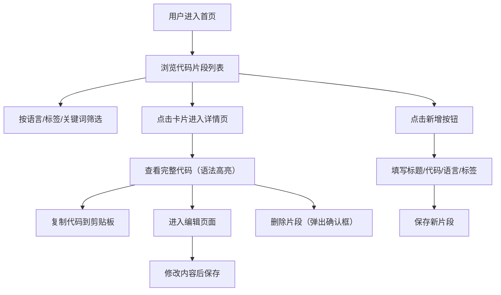

## 1. 产品概述

CodeSnippetVault 是一款面向开发者的代码片段收藏与检索工具，帮助开发者快速保存、标签分类和组织常用代码片段，并支持多维度模糊搜索，提升开发效率。

- 核心功能：代码片段的增删改查、标签分类、多语言支持、模糊搜索、收藏功能
- 目标用户：前端、后端、全栈开发者及编程爱好者
- 产品价值：解决开发者代码片段散乱、查找困难的痛点，提供统一的代码知识库管理平台

## 2. 核心功能

### 2.1 功能模块

1. **首页（代码片段列表）**：响应式卡片网格展示、多维筛选（语言/标签/关键词）、收藏切换、搜索
2. **新增/编辑代码片段页面**：表单输入、代码编辑器、语言选择、标签管理
3. **代码片段详情页**：完整代码展示（语法高亮）、复制代码、编辑/删除操作

### 2.2 页面详情

| 页面名称 | 模块名称 | 功能描述 |
|---------|---------|---------|
| 首页 | 顶部导航栏 | 应用Logo、搜索框、新增按钮、响应式汉堡菜单 |
| 首页 | 筛选区域 | 语言下拉筛选、标签筛选、关键词搜索输入 |
| 首页 | 代码片段卡片网格 | 响应式卡片布局、标题、语言标签、摘要、收藏按钮 |
| 首页 | 空状态提示 | 无匹配结果时展示友好提示 |
| 新增/编辑页 | 表单区域 | 标题输入、代码编辑器、语言下拉选择、标签输入组件 |
| 新增/编辑页 | 操作按钮 | 保存、取消按钮 |
| 详情页 | 代码展示区 | 全宽代码显示、prismjs语法高亮、行号、深色背景 |
| 详情页 | 操作按钮 | 复制代码、编辑、删除按钮 |
| 详情页 | 删除确认对话框 | 模态框、删除确认提示、取消/删除操作 |

## 3. 核心流程

用户进入首页浏览所有代码片段，可通过语言、标签、关键词多维度实时筛选；点击卡片进入详情页查看完整代码，支持一键复制；点击新增按钮可创建新片段，填写标题、代码、选择语言、添加标签后保存；在详情页可编辑或删除片段，删除时弹出确认对话框。

## 4. 用户界面设计

### 4.1 设计风格

- **主题**：深色模式，主背景 #0f172a，文字主色 #e2e8f0
- **配色方案**：
  - 卡片背景：#ffffff，标题文字 #1e293b
  - 代码区域背景：#1e293b
  - 导航栏背景：#1e293b，高度 60px
  - 主按钮渐变：#6366f1 → #8b5cf6
  - 收藏按钮：#f59e0b
  - 删除按钮：#ef4444
  - 语言标签配色：JavaScript #f7df1e、TypeScript #3178c6、Python #3776ab、HTML #e34f26、CSS #1572b6、JSON #888888
- **按钮风格**：圆角按钮，悬停变换背景色，点击有缩放反馈
- **字体**：系统无衬线字体 + 等宽字体（代码区域）
- **布局风格**：顶部导航栏 + 卡片网格布局，卡片圆角 12px，悬停上浮动画
- **动画**：卡片悬停 0.25s ease 过渡，复制反馈淡入淡出 0.3s，按钮点击波纹动画

### 4.2 页面设计概述

| 页面名称 | 模块名称 | UI元素 |
|---------|---------|--------|
| 首页 | 导航栏 | 固定高度60px，深色背景，左侧应用名称20px bold，右侧圆形渐变新增按钮带波纹动画 |
| 首页 | 筛选区 | 语言下拉、标签输入、关键词搜索框，横向排列 |
| 首页 | 卡片网格 | 响应式布局，卡片320px宽，白背景圆角12px，阴影0 2px 4px，悬停上浮4px加深阴影 |
| 首页 | 代码片段卡片 | 标题、语言彩色圆角标签、代码前80字符摘要、星形收藏按钮 |
| 详情页 | 代码展示区 | 全宽深色区域，14px monospace字体，prismjs语法高亮，左侧行号 |
| 详情页 | 操作按钮 | 复制按钮（成功后显示"已复制"2秒）、编辑按钮、红色删除按钮 |
| 详情页 | 删除确认框 | 半透明遮罩rgba(0,0,0,0.5)，中央360px宽白色圆角卡片 |
| 表单页 | 标签输入 | 输入按回车添加，标签显示为圆角矩形#e2e8f0背景#1e293b文字，带删除叉 |

### 4.3 响应式适配

- 桌面端：卡片每行3-4张
- 平板端（≤768px）：卡片每行2张，导航栏保持完整
- 移动端（≤480px）：卡片每行1张，导航栏折叠为汉堡菜单，筛选区域垂直排列

## 5. 性能要求

- 初次加载时间：≤2秒（良好网络）
- 搜索响应时间：≤300毫秒
- 列表渲染：20个卡片无卡顿
- 交互动画：60fps流畅无卡顿
