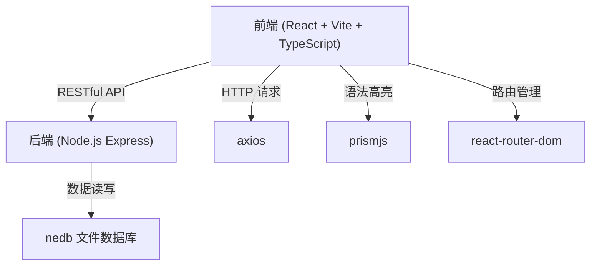
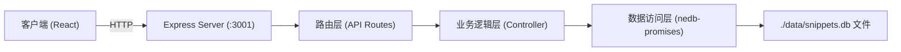
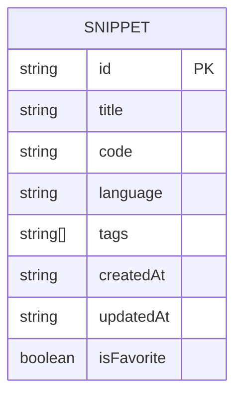

## 1. 架构设计



## 2. 技术描述

- **前端框架**：React 18 + TypeScript + Vite
- **前端路由**：react-router-dom
- **HTTP 客户端**：axios
- **语法高亮**：prismjs + @types/prismjs
- **UI 样式**：原生 CSS（无 UI 框架）
- **后端框架**：Express 4 + TypeScript
- **数据库**：nedb-promises（嵌入式文件数据库）
- **唯一 ID**：uuid
- **开发服务器**：
  - 前端 Vite 开发服务器：端口 3000
  - 后端 Express 服务器：端口 3001
- **构建工具**：Vite + @vitejs/plugin-react

## 3. 目录结构

```
auto131/
├── package.json
├── index.html
├── vite.config.ts
├── tsconfig.json
├── server/
│   └── index.ts          # Express 后端服务器
├── src/
│   ├── App.tsx           # 主应用组件 + 路由配置
│   ├── types.ts          # TypeScript 类型定义
│   ├── api/
│   │   └── snippets.ts   # axios API 封装
│   ├── components/
│   │   ├── SnippetList.tsx    # 代码片段列表
│   │   ├── CodeEditor.tsx     # 代码编辑器
│   │   └── SnippetForm.tsx    # 新增/编辑表单
│   └── pages/
│       ├── HomePage.tsx        # 首页
│       ├── AddSnippetPage.tsx  # 新增/编辑页
│       └── SnippetDetailPage.tsx # 详情页
```

## 4. 路由定义

| 路由 | 页面组件 | 用途 |
|------|---------|------|
| `/` | HomePage | 首页，展示代码片段列表和筛选 |
| `/add` | AddSnippetPage | 新增代码片段 |
| `/edit/:id` | AddSnippetPage | 编辑已有代码片段 |
| `/snippet/:id` | SnippetDetailPage | 代码片段详情页 |

## 5. API 定义

### 5.1 数据类型

```typescript
interface Snippet {
  id: string;
  title: string;
  code: string;
  language: 'JavaScript' | 'TypeScript' | 'Python' | 'HTML' | 'CSS' | 'JSON';
  tags: string[];
  createdAt: string;
  updatedAt: string;
  isFavorite: boolean;
}
```

### 5.2 RESTful API 接口

| 方法 | 路径 | 请求参数 | 响应 | 用途 |
|------|------|---------|------|------|
| GET | `/api/snippets` | Query: lang, tags, keyword, sortBy, order | `Snippet[]` | 获取代码片段列表（支持筛选排序） |
| GET | `/api/snippets/:id` | - | `Snippet` | 获取单个代码片段详情 |
| POST | `/api/snippets` | Body: `{ title, code, language, tags }` | `Snippet` | 创建新代码片段 |
| PUT | `/api/snippets/:id` | Body: `{ title, code, language, tags }` | `Snippet` | 更新代码片段 |
| DELETE | `/api/snippets/:id` | - | `{ success: boolean }` | 删除代码片段 |
| POST | `/api/snippets/:id/favorite` | - | `Snippet` | 切换收藏状态 |

### 5.3 查询参数说明

- `lang`：按语言筛选，如 `lang=JavaScript`
- `tags`：按标签筛选，多个标签用逗号分隔 `tags=react,css`
- `keyword`：关键词模糊搜索（匹配标题和代码内容）
- `sortBy`：排序字段，默认 `createdAt`
- `order`：排序方式，`asc` 或 `desc`，默认 `desc`

## 6. 服务器架构



## 7. 数据模型

### 7.1 ER 图



### 7.2 nedb 集合字段说明

nedb 为文档型数据库，每条记录为一个 JSON 文档，对应 Snippet 接口的所有字段。数据库文件存储在 `./data/snippets.db`，无需建表语句，首次写入时自动创建。

索引建议：
- `id`：唯一索引（主键）
- `language`：普通索引（加速语言筛选）
- `createdAt`：普通索引（加速排序）
- `tags`：数组字段索引（加速标签筛选）
