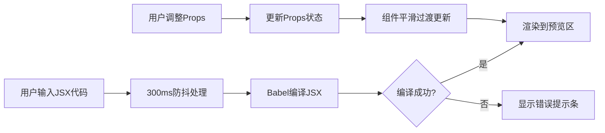

## 1. 产品概述
ReactSandbox是一个在线React组件交互探索环境，让开发者无需创建本地项目即可即兴编写JSX并实时预览组件效果，通过调整props值观察组件不同行为，大幅提升组件调试和原型开发效率。
- 面向前端开发者和React学习者，解决本地项目调试组件繁琐、反馈周期长的痛点
- 提供即时的代码-预览-调参闭环体验，成为开发者快速验证组件想法的首选工具

## 2. 核心功能

### 2.1 用户角色
| 角色 | 注册方式 | 核心权限 |
|------|----------|----------|
| 开发者用户 | 无需注册，直接使用 | 编写JSX代码、实时预览组件、调整Props参数 |

### 2.2 功能模块
1. **代码编辑器模块**：深色主题代码编辑区，支持语法高亮、自动补全括号、错误提示
2. **组件预览模块**：实时渲染JSX代码的组件预览区，支持平滑状态过渡
3. **Props控制面板**：动态生成多种类型的参数控制器，实时调整组件Props
4. **布局交互模块**：可拖拽分隔条、响应式布局、编辑器折叠功能

### 2.3 页面详情
| 页面名称 | 模块名称 | 功能描述 |
|----------|----------|----------|
| 主工作台 | 代码编辑器 | 左侧可折叠面板，默认宽度45%，深色背景#1e1e1e，Fira Code字体，300ms防抖更新 |
| 主工作台 | 可拖拽分隔条 | 中间6px宽分隔条，悬停变色，拖拽时两侧同步缩放 |
| 主工作台 | 组件预览区 | 右侧白色背景预览区，4px圆角，实时渲染组件 |
| 主工作台 | 错误提示条 | 编辑器底部红色错误条，0.3秒滑入动画，显示语法错误位置和描述 |
| 主工作台 | Props控制面板 | 编辑器下方60px高控制区，支持文本、滑块、颜色、布尔四种控制器 |

## 3. 核心流程
用户打开ReactSandbox后，在左侧编辑器编写React组件JSX代码，系统自动编译并在右侧预览区实时渲染；用户可通过底部Props控制面板调整组件参数，观察组件行为变化；若代码存在语法错误，编辑器底部会显示详细错误信息。

## 4. 用户界面设计

### 4.1 设计风格
- 主色调：#6366f1（靛蓝色），强调色：#ef4444（错误红）
- 深色主题：编辑器背景#1e1e1e，其他区域#111827，卡片#1f2937
- 文字颜色：主文字#f9fafb，次要文字#9ca3af
- 按钮样式：统一圆角8px，悬停亮度提升15%，阴影0 2px 8px rgba(99,102,241,0.4)，点击缩小到0.95倍
- 字体：编辑器使用Fira Code 14px，界面使用系统无衬线字体

### 4.2 页面设计概述
| 页面名称 | 模块名称 | UI元素 |
|----------|----------|--------|
| 主工作台 | 代码编辑器 | 深色背景、Fira Code字体、语法高亮、自动补全括号、左侧折叠按钮 |
| 主工作台 | 分隔条 | 6px宽度、#374151默认色、悬停#6366f1、col-resize光标、0.1秒过渡 |
| 主工作台 | 预览区 | 白色背景、4px圆角、轻微阴影、居中渲染组件 |
| 主工作台 | 错误提示条 | 红色#ef4444背景、40px高度、0.3秒从下方滑入、修复后500ms淡出 |
| 主工作台 | Props面板 | 60px高度、文本输入框、滑块(0-100步长1)、颜色选择器、布尔开关 |
| 主工作台 | 滑块控件 | 轨道#e5e7eb、按钮#6366f1、20px大小、拖拽时24px带阴影光环 |
| 主工作台 | 布尔开关 | 44×24px、关闭#d1d5db、开启#6366f1、20px圆形滑块、0.2秒过渡 |

### 4.3 响应式
- 桌面端优先设计，默认宽度编辑器45%、预览区55%
- 屏幕宽度小于768px时，编辑器自动隐藏，侧边显示打开按钮
- 触控设备优化滑块和开关的可点击区域
- 分隔条拖拽支持鼠标和触摸事件

### 4.4 动画与交互
- 分隔条拖拽：0.1秒线性过渡
- 组件状态更新：0.15秒平滑过渡
- 错误提示条：0.3秒滑入，修复后500ms淡出
- 按钮交互：悬停亮度提升、点击缩放0.95倍、0.1秒按下感
- 滑块拖拽：按钮放大到24px，阴影0 0 0 3px rgba(99,102,241,0.3)
- 布尔开关切换：0.2秒平滑过渡
