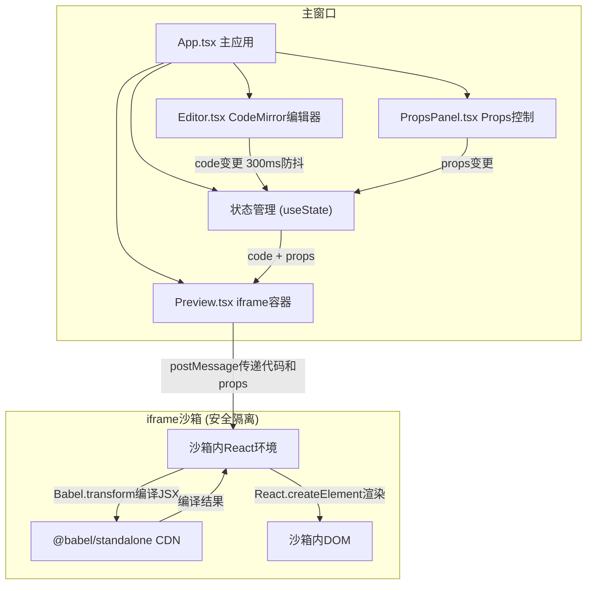

## 1. 架构设计
ReactSandbox采用纯前端架构，所有渲染和代码解析都在浏览器内完成，无服务端请求。整体分为UI组件层、状态管理层、编译渲染层三个核心层级，使用iframe沙箱确保代码执行安全。



## 2. 技术描述
- 前端框架：React@18 + TypeScript@5
- 构建工具：Vite@5 + @vitejs/plugin-react@4
- 代码编辑器：CodeMirror 6（专业代码编辑器，支持语法高亮、自动补全括号）
  - @codemirror/lang-javascript：JavaScript/JSX语法支持
  - @codemirror/theme-one-dark：深色主题
  - @codemirror/autocomplete：自动补全
  - @codemirror/closebrackets：括号自动闭合
- JSX编译：@babel/standalone（CDN引入 https://unpkg.com/@babel/standalone/babel.min.js）
- 代码执行安全：iframe沙箱 + postMessage通信
- 唯一标识生成：uuid@9
- 类型定义：@types/react、@types/react-dom、@types/babel__standalone、@types/uuid
- 样式方案：CSS Modules（每个组件独立样式文件）
- 无后端服务，纯浏览器端运行

## 3. 项目结构

```
react-sandbox/
├── .trae/documents/
│   ├── PRD_ReactSandbox.md
│   └── Technical_Architecture_ReactSandbox.md
├── src/
│   ├── components/
│   │   ├── Editor.tsx          # CodeMirror编辑器组件
│   │   ├── Editor.module.css   # 编辑器样式
│   │   ├── Preview.tsx         # iframe沙箱预览组件
│   │   ├── Preview.module.css  # 预览样式
│   │   ├── PropsPanel.tsx      # Props控制面板
│   │   └── PropsPanel.module.css # Props面板样式
│   ├── types/
│   │   └── index.ts            # 全局类型定义
│   ├── utils/
│   │   └── debounce.ts         # 防抖工具函数
│   ├── App.tsx                 # 主应用组件
│   ├── App.module.css          # 主应用样式
│   └── main.tsx                # 应用入口
├── tests/
│   ├── babel-loading.test.ts   # Babel加载验证测试
│   └── performance.test.ts     # 性能指标测试
├── index.html                  # 入口HTML
├── package.json                # 依赖配置
├── vite.config.ts              # Vite配置
└── tsconfig.json               # TypeScript配置
```

## 4. 核心类型定义

### 4.1 Props Schema 类型
```typescript
export type PropType = 'text' | 'slider' | 'color' | 'boolean';

export interface PropSchema {
  name: string;
  type: PropType;
  defaultValue: string | number | boolean;
  min?: number;
  max?: number;
  step?: number;
  label: string;
}

export interface PropsMap {
  [key: string]: string | number | boolean;
}
```

### 4.2 组件Props定义
```typescript
// Editor组件
export interface EditorProps {
  code: string;
  onChange: (code: string) => void;
  error: string | null;
  onError: (error: string | null) => void;
  collapsed: boolean;
  onToggleCollapse: () => void;
}

// Preview组件
export interface PreviewProps {
  code: string;
  props: PropsMap;
  onError: (error: string | null) => void;
}

// PropsPanel组件
export interface PropsPanelProps {
  schema: PropSchema[];
  values: PropsMap;
  onChange: (name: string, value: string | number | boolean) => void;
}

// App组件状态
export interface AppState {
  code: string;
  props: PropsMap;
  schema: PropSchema[];
  error: string | null;
  editorWidth: number;
  isDragging: boolean;
  isMobile: boolean;
  mobileEditorOpen: boolean;
}

// iframe消息类型
export interface SandboxMessage {
  type: 'render' | 'error' | 'ready';
  code?: string;
  props?: PropsMap;
  error?: string;
}
```

## 5. 核心模块说明

### 5.1 Editor 组件
- 使用CodeMirror 6专业代码编辑器
- 配置@codemirror/lang-javascript支持JSX语法高亮
- 配置@codemirror/closebrackets实现括号自动补全
- 配置@codemirror/theme-one-dark深色主题
- 实现300ms防抖的onChange处理
- 语法错误捕获与格式化显示
- CSS Module样式，深色主题#1e1e1e背景
- Fira Code字体14px，支持连字
- 错误提示条动画（0.3秒滑入，修复后500ms淡出）

### 5.2 Preview 组件
- 使用iframe沙箱隔离代码执行环境
- 通过postMessage与沙箱通信，传递代码和props
- 沙箱内独立加载React、ReactDOM和Babel
- 沙箱内使用Babel.transform编译JSX为React.createElement调用
- 使用React.createElement动态渲染用户组件
- useEffect监听code和props变化，0.15秒平滑过渡
- 编译错误捕获与上报
- 严格的CSP安全策略，禁止沙箱访问主窗口

### 5.3 PropsPanel 组件
- 根据schema动态渲染四种控制器
- 文本输入框：受控组件，onChange实时更新
- 滑块：范围0-100，步长1，自定义样式
  - 轨道颜色#e5e7eb
  - 按钮颜色#6366f1，大小20px
  - 拖拽时按钮放大到24px，阴影0 0 0 3px rgba(99,102,241,0.3)
- 颜色选择器：原生input[type="color"]，宽度60px，高度30px，圆角6px
- 布尔开关：44×24px，关闭#d1d5db，开启#6366f1，20px圆形滑块，0.2秒过渡
- 所有控制器带0.2秒过渡动画

### 5.4 App 组件
- 管理code、props、schema、error、editorWidth等状态
- 实现可拖拽分隔条逻辑：
  - mousedown/mousemove/mouseup事件处理
  - 6px宽度，#374151默认色，悬停#6366f1
  - col-resize光标，0.1秒线性过渡
  - 拖拽时预览和编辑区域同时缩放
- 响应式布局：<768px时编辑器自动隐藏，侧边显示打开按钮
- 组织三个子组件的布局结构
- 防抖函数封装
- 组件状态更新的0.15秒平滑过渡

## 6. 安全架构

### 6.1 iframe沙箱设计
- iframe设置sandbox属性：allow-scripts allow-same-origin
- iframe使用srcdoc注入HTML，避免跨域问题
- 主窗口与iframe通过postMessage通信，指定targetOrigin
- 沙箱内代码无法访问主窗口的window、document、localStorage
- 沙箱内代码无法访问主窗口的React实例
- 消息验证：只接受特定类型的消息，防止消息注入

### 6.2 消息通信协议
```typescript
// 主窗口 -> 沙箱
{ type: 'render', code: string, props: PropsMap }

// 沙箱 -> 主窗口
{ type: 'ready' }
{ type: 'error', error: string }
```

## 7. 性能优化
- 防抖处理：代码变更300ms延迟后编译，避免频繁重渲染
- 状态隔离：编辑器、预览、Props面板状态独立管理
- CSS硬件加速：动画使用transform和opacity
- 编译缓存：相同code不重复编译（沙箱内维护缓存）
- 渲染延迟：确保代码变更到预览更新不超过500ms
- CodeMirror 6虚拟滚动，处理大文件性能

## 8. 测试与验证

### 8.1 功能测试
- Babel standalone加载验证：检查window.Babel是否可用
- JSX编译验证：测试简单JSX能否正确编译为React.createElement
- 代码执行验证：测试组件能否正确渲染
- 错误处理验证：测试语法错误能否正确捕获和显示

### 8.2 性能测试
- 防抖延迟测试：验证代码变更后300ms才触发编译
- 渲染延迟测试：验证从代码变更到预览更新不超过500ms
- 内存泄漏测试：长时间运行检查内存使用

### 8.3 交互测试
- 分隔条拖拽测试：验证拖拽时两侧同步缩放
- 响应式布局测试：验证<768px时编辑器自动隐藏
- Props控制测试：验证四种控制器的交互效果

## 9. 动画与交互规范

### 9.1 分隔条
- 宽度：6px
- 默认颜色：#374151
- 悬停颜色：#6366f1
- 光标：col-resize
- 过渡：0.1s linear
- 拖拽时：两侧区域同时缩放

### 9.2 错误提示条
- 背景：#ef4444
- 高度：40px
- 出现动画：0.3s从下方滑入
- 消失动画：修复后500ms淡出

### 9.3 组件状态更新
- 过渡：0.15s平滑过渡
- 属性：opacity, transform

### 9.4 按钮交互
- 圆角：8px
- 悬停：亮度提升15%，阴影0 2px 8px rgba(99,102,241,0.4)
- 点击：缩小到0.95倍，0.1s过渡

### 9.5 滑块
- 轨道：#e5e7eb
- 按钮：#6366f1，20px
- 拖拽时：24px，阴影0 0 0 3px rgba(99,102,241,0.3)

### 9.6 布尔开关
- 尺寸：44×24px
- 关闭：#d1d5db
- 开启：#6366f1
- 滑块：20px圆形
- 过渡：0.2s

### 9.7 颜色选择器
- 宽度：60px
- 高度：30px
- 圆角：6px

## 10. 响应式设计规范

### 10.1 断点
- 桌面端：≥768px，编辑器默认45%宽度
- 移动端：<768px，编辑器默认隐藏

### 10.2 移动端行为
- 编辑器自动隐藏
- 侧边显示打开按钮
- 点击按钮编辑器从侧边滑入
- 预览区域占满屏幕宽度
