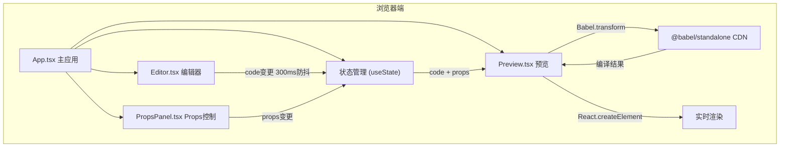

## 1. 架构设计
ReactSandbox采用纯前端架构，所有渲染和代码解析都在浏览器内完成，无服务端请求。整体分为UI组件层、状态管理层、编译渲染层三个核心层级。



## 2. 技术描述
- 前端框架：React@18 + TypeScript@5
- 构建工具：Vite@5 + @vitejs/plugin-react@4
- JSX编译：@babel/standalone（CDN引入 https://unpkg.com/@babel/standalone/babel.min.js）
- 唯一标识生成：uuid@9
- 类型定义：@types/react、@types/react-dom、@types/babel__standalone（devDependencies）
- 样式方案：CSS Modules（每个组件独立样式文件）
- 无后端服务，纯浏览器端运行

## 3. 项目结构

```
react-sandbox/
├── .trae/documents/
│   ├── PRD_ReactSandbox.md
│   └── Technical_Architecture_ReactSandbox.md
├── src/
│   ├── components/
│   │   ├── Editor.tsx          # 代码编辑器组件
│   │   ├── Editor.module.css   # 编辑器样式
│   │   ├── Preview.tsx         # 组件预览组件
│   │   ├── Preview.module.css  # 预览样式
│   │   ├── PropsPanel.tsx      # Props控制面板
│   │   └── PropsPanel.module.css # Props面板样式
│   ├── App.tsx                 # 主应用组件
│   ├── App.module.css          # 主应用样式
│   └── main.tsx                # 应用入口
├── index.html                  # 入口HTML
├── package.json                # 依赖配置
├── vite.config.ts              # Vite配置
└── tsconfig.json               # TypeScript配置
```

## 4. 核心类型定义

### 4.1 Props Schema 类型
```typescript
type PropType = 'text' | 'slider' | 'color' | 'boolean';

interface PropSchema {
  name: string;
  type: PropType;
  defaultValue: string | number | boolean;
  min?: number;      // slider专用
  max?: number;      // slider专用
  step?: number;     // slider专用
  label: string;
}

interface PropsMap {
  [key: string]: string | number | boolean;
}
```

### 4.2 组件Props定义
```typescript
// Editor组件
interface EditorProps {
  code: string;
  onChange: (code: string) => void;
  error: string | null;
  onError: (error: string | null) => void;
  collapsed: boolean;
  onToggleCollapse: () => void;
}

// Preview组件
interface PreviewProps {
  code: string;
  props: PropsMap;
}

// PropsPanel组件
interface PropsPanelProps {
  schema: PropSchema[];
  values: PropsMap;
  onChange: (name: string, value: string | number | boolean) => void;
}

// App组件状态
interface AppState {
  code: string;
  props: PropsMap;
  schema: PropSchema[];
  error: string | null;
  editorWidth: number;
  isDragging: boolean;
}
```

## 5. 核心模块说明

### 5.1 Editor 组件
- 使用textarea模拟代码编辑器
- 实现300ms防抖的onChange处理
- 括号自动补全功能
- 语法错误捕获与格式化显示
- 深色主题CSS Module样式
- 错误提示条动画（滑入/淡出）

### 5.2 Preview 组件
- 通过CDN加载的Babel.transform编译JSX
- 使用React.createElement动态渲染组件
- useEffect监听code和props变化
- 组件状态更新的0.15秒平滑过渡
- 编译错误捕获与上报

### 5.3 PropsPanel 组件
- 根据schema动态渲染四种控制器
- 文本输入框：受控组件，onChange实时更新
- 滑块：范围0-100，步长1，自定义样式
- 颜色选择器：原生input[type="color"]
- 布尔开关：自定义CSS实现的切换按钮
- 所有控制器带0.2秒过渡动画

### 5.4 App 组件
- 管理code、props、schema、error状态
- 实现可拖拽分隔条逻辑（mousedown/mousemove/mouseup）
- 响应式布局：<768px时编辑器折叠
- 组织三个子组件的布局结构
- 防抖函数封装

## 6. 性能优化
- 防抖处理：代码变更300ms延迟后编译，避免频繁重渲染
- 状态隔离：编辑器、预览、Props面板状态独立管理
- CSS硬件加速：动画使用transform和opacity
- 编译缓存：相同code不重复编译
- 渲染延迟：确保代码变更到预览更新不超过500ms

## 7. 安全考量
- 仅在浏览器端运行，无服务端代码执行风险
- 使用iframe隔离预览区域（可选，若需要更严格的安全）
- 输入内容不存储在本地，刷新即清除
- 无用户数据上传或存储
