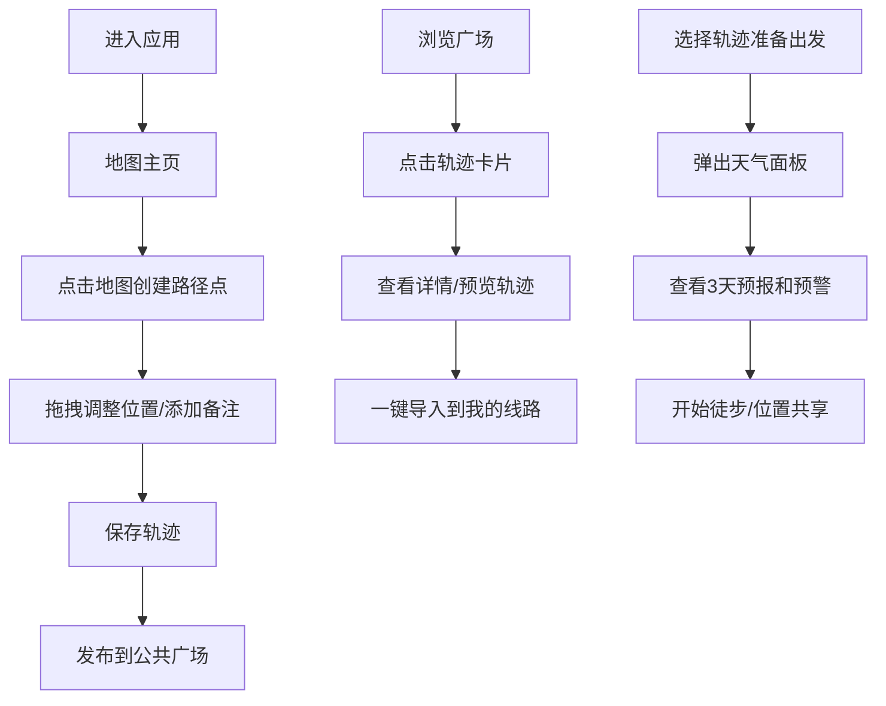

## 1. 产品概述

徒步轨迹社交应用是一款面向徒步爱好者的在线平台，解决传统路书App本地编辑不便、他人分享轨迹无法直接复用、缺少路况和天气动态预警等痛点。用户可在地图上直观创建、编辑轨迹，分享到公共广场，一键导入他人优质线路，并在出发前获取天气预警信息。

- 目标用户：户外徒步爱好者、徒步领队、户外运动社群成员
- 核心价值：便捷的轨迹绘制、开放的线路共享、智能的天气预警、活跃的徒步社交

## 2. 核心功能

### 2.1 用户角色

| 角色 | 注册方式 | 核心权限 |
|------|----------|----------|
| 普通用户 | 匿名/注册 | 创建轨迹、浏览广场、导入轨迹、查看天气、关注他人 |

### 2.2 功能模块

1. **地图主页**：Leaflet高清地图、路径点绘制与拖拽、富文本备注编辑
2. **公共广场**：瀑布流卡片展示、轨迹预览、一键导入、点赞互动
3. **天气预警**：出发前天气面板、未来3天预报、颜色预警提示
4. **社交动态**：关注徒步者、动态首页、成就徽章、位置共享

### 2.3 页面详情

| 页面名称 | 模块名称 | 功能描述 |
|---------|----------|----------|
| 地图主页 | 地图渲染 | Leaflet地图展示知名徒步区域高清俯视图，支持缩放平移 |
| 地图主页 | 路径点编辑 | 点击创建路径点、拖拽调整位置、添加海拔/路况/耗时备注 |
| 地图主页 | 侧边栏 | 可折叠信息面板，展示当前轨迹详情和操作按钮 |
| 公共广场 | 瀑布流列表 | 360px宽卡片瀑布流，渐变边框，悬停上浮动画 |
| 公共广场 | 卡片组件 | 缩略图、标题、难度等级(1-5个山图标)、里程、点赞数 |
| 公共广场 | 详情模态框 | 点击卡片放大展开，完整轨迹预览，一键导入 |
| 天气面板 | 天气预报 | 半透明深蓝背景，未来3天温度/降水/风力展示 |
| 天气面板 | 预警系统 | 绿色安全、黄色注意、红色警告三色预警条 |
| 社交动态 | 关注系统 | 关注其他徒步者，查看其轨迹发布和成就徽章 |
| 社交动态 | 位置共享 | 可选开启，5分钟更新位置，轨迹线透明度0.6 |

## 3. 核心流程

## 4. 用户界面设计

### 4.1 设计风格

- **主色调**：自然大地色系 - 深林绿#2d6a4f、翠绿#52b788、浅绿#95d5b2
- **辅助色**：冷灰色 - 深灰#334155、中灰#94a3b8
- **特殊色**：渐变边框#10b981到#3b82f6、预警绿#22c55e、预警黄#eab308、预警红#ef4444
- **字体**：Inter，标题加粗18px，正文14px
- **卡片风格**：白色#ffffff背景，圆角12px，渐变边框，悬停上浮4px加深阴影
- **按钮风格**：圆角8px，背景主色调，悬停轻微变暗

### 4.2 页面设计概览

| 页面名称 | 模块名称 | UI元素 |
|---------|----------|--------|
| 地图主页 | 整体布局 | 左侧可折叠侧边栏(320px，默认展开)，右侧65%宽度地图区域 |
| 地图主页 | 侧边栏 | #1e293b深色背景，#f1f5f9白色文字，0.2秒水平滑动动画 |
| 地图主页 | 路径点 | 圆点标记，按住拖拽0.15秒弹性动画反馈 |
| 公共广场 | 卡片容器 | 瀑布流布局，卡片间距16px，响应式调整 |
| 公共广场 | 卡片悬停 | transform: translateY(-4px)，box-shadow加深，0.3s ease过渡 |
| 公共广场 | 模态框 | dimmed遮罩rgba(0,0,0,0.5)，800px宽内容容器，圆角12px，中心放大0.25s ease-out |
| 天气面板 | 容器 | 半透明深蓝rgba(30,41,59,0.9)，圆角8px |
| 天气面板 | 预警条 | 水平颜色条，根据天气阈值切换绿/黄/红 |

### 4.3 响应式设计

- **桌面端(>768px)**：侧边栏左侧展开，地图占65%宽度，卡片360px固定宽度
- **移动端(<768px)**：侧边栏自动折叠为底部弹出面板，卡片宽度100%，减少内边距，触摸优化

### 4.4 性能指标

- 地图与轨迹渲染：桌面端50FPS以上
- 列表滚动：即时加载，无明显卡顿
- 搜索响应：<300ms
- 动画帧率：所有过渡动画保持60FPS流畅度
