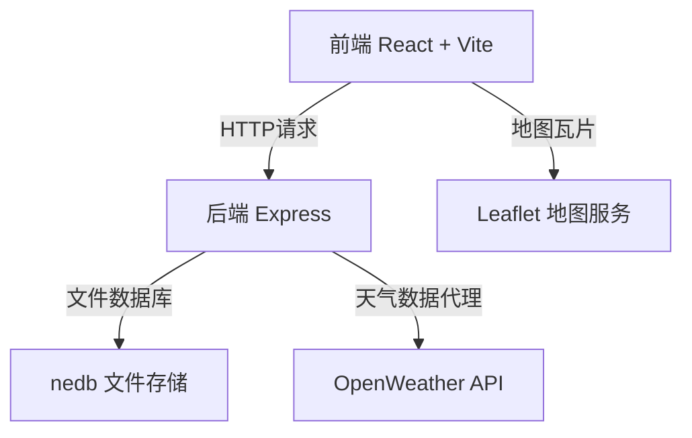
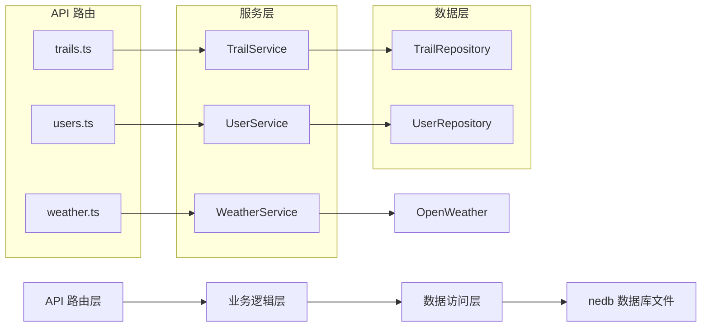
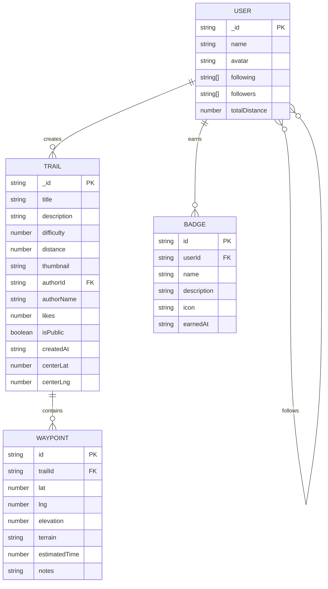

## 1. 架构设计



## 2. 技术描述

- **前端**：React@18 + TypeScript + Vite@5
- **后端**：Express@4 + TypeScript + nedb-promises
- **地图**：Leaflet@1.9 + react-leaflet@4
- **HTTP客户端**：axios@1
- **工具库**：uuid@9
- **构建工具**：Vite + @vitejs/plugin-react
- **类型系统**：TypeScript 严格模式

## 3. 路由定义

| 路由 | 用途 |
|------|------|
| / | 主应用入口，包含地图视图和广场视图切换 |
| /api/trails | GET获取轨迹列表，POST创建轨迹 |
| /api/trails/:id | GET获取单条轨迹，PUT更新，DELETE删除 |
| /api/trails/:id/like | POST点赞轨迹 |
| /api/trails/:id/import | POST导入轨迹到个人库 |
| /api/users/:id/follow | POST关注用户 |
| /api/weather | GET获取指定坐标天气数据 |

## 4. API 定义

### TypeScript 类型定义

```typescript
interface Waypoint {
  id: string;
  lat: number;
  lng: number;
  elevation?: number;
  terrain?: string;
  estimatedTime?: number;
  notes?: string;
}

interface Trail {
  _id: string;
  title: string;
  description?: string;
  difficulty: number; // 1-5
  distance: number; // 公里
  waypoints: Waypoint[];
  thumbnail?: string;
  authorId: string;
  authorName: string;
  likes: number;
  isPublic: boolean;
  createdAt: string;
  centerLat: number;
  centerLng: number;
}

interface User {
  _id: string;
  name: string;
  avatar?: string;
  following: string[];
  followers: string[];
  totalDistance: number;
  badges: Badge[];
}

interface Badge {
  id: string;
  name: string;
  description: string;
  icon: string;
  earnedAt: string;
}

interface WeatherDay {
  date: string;
  tempMin: number;
  tempMax: number;
  precipitation: number; // 概率 0-100
  windSpeed: number;
  windDirection: number;
  condition: string;
  warningLevel: 'safe' | 'caution' | 'danger';
}
```

### 请求响应模式

```typescript
// GET /api/trails?page=1&limit=20
interface TrailListResponse {
  trails: Trail[];
  total: number;
  page: number;
  limit: number;
}

// POST /api/trails
interface CreateTrailRequest {
  title: string;
  description?: string;
  difficulty: number;
  waypoints: Waypoint[];
  isPublic: boolean;
}

// GET /api/weather?lat=xx&lng=xx
interface WeatherResponse {
  location: string;
  days: WeatherDay[];
}
```

## 5. 服务器架构图



## 6. 数据模型

### 6.1 数据模型定义



### 6.2 数据库初始化

nedb 是文件型数据库，无需 DDL，首次插入数据时自动创建集合文件：
- `data/trails.db` - 轨迹数据集合
- `data/users.db` - 用户数据集合

后端启动时自动初始化示例数据，包括若干条预设徒步轨迹。
