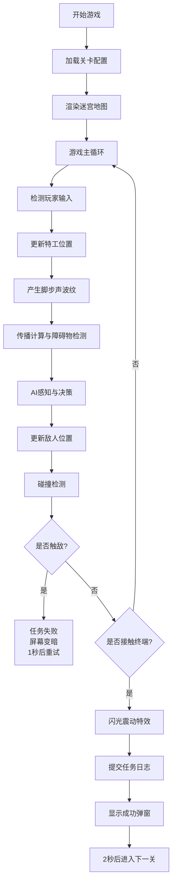

## 1. 产品概述

StealthSignal是一款2D俯视视角的潜行战术通讯模拟器游戏，玩家控制特工在迷宫中利用声音传播和电磁干扰机制躲避巡逻AI，完成窃取数据的任务。

- 核心玩法：通过控制脚步声传播、利用环境干扰躲避AI，策略性地完成数据窃取任务
- 目标用户：喜欢策略潜行类游戏的玩家
- 产品价值：提供独特的声音传播战术体验，考验玩家的策略规划和时机把控能力

## 2. 核心功能

### 2.1 用户角色

| 角色 | 注册方式 | 核心权限 |
|------|----------|----------|
| 玩家 | 无需注册，直接进入游戏 | 控制特工移动、完成关卡任务、查看游戏状态 |

### 2.2 功能模块

1. **游戏主界面**：2D俯视迷宫地图、特工控制、敌人AI巡逻、状态信息显示
2. **声音传播系统**：脚步声波纹、障碍物遮挡检测、敌人听觉响应
3. **电磁干扰系统**：EMP区域效果、信号阻断、敌人失聪机制
4. **任务系统**：数据终端窃取、任务日志提交、关卡切换、失败重试
5. **AI系统**：巡逻路线规划、声音来源追踪、通信中断响应

### 2.3 页面详情

| 页面名称 | 模块名称 | 功能描述 |
|----------|----------|----------|
| 游戏主界面 | 地图渲染模块 | 20x15格子迷宫地图，墙壁#374151，地板#d1d5db，40x40像素每格 |
| 游戏主界面 | 角色控制模块 | WASD键盘控制特工移动，速度3格/秒，蓝色圆形#3b82f6 |
| 游戏主界面 | 敌人AI模块 | 红色三角形#ef4444，巡逻速度1.5格/秒，朝向移动方向 |
| 游戏主界面 | 声音系统模块 | 脚步声波纹扩散，半透明白色，6格/秒传播速度，持续0.5秒 |
| 游戏主界面 | EMP系统模块 | 紫色圆环#a855f7标记，半径2格，阻断声音，敌人失聪3秒 |
| 游戏主界面 | 任务系统模块 | 绿色终端#22c55e，接触后1.5秒闪光震动，提交日志，进入下一关 |
| 游戏主界面 | 状态显示模块 | 关卡编号、任务概要、信号隐身值、数据窃取数量 |
| 游戏主界面 | 特效系统模块 | 粒子效果、屏幕闪光、震动、边缘红闪 |

## 3. 核心流程

玩家进入游戏后，使用WASD控制蓝色特工在迷宫中移动，需要躲避红色巡逻敌人。移动时会产生声音波纹，若被敌人听到（无障碍物遮挡且在传播范围内），敌人会被吸引到声源位置。玩家可以利用EMP区域阻断声音传播或使敌人暂时失聪。找到绿色数据终端并接触后完成任务，提交日志并进入下一关。若被敌人触碰则任务失败，重试本关。

## 4. 用户界面设计

### 4.1 设计风格

- **整体风格**：暗调科幻风格，深蓝黑色渐变背景#0f172a到#1e293b
- **主色调**：蓝色#3b82f6（特工）、红色#ef4444（敌人）、绿色#22c55e（终端）、紫色#a855f7（EMP）
- **强调色**：黄色#eab308（数据计数）、发光紫#6366f1（分割线）
- **字体**：monospace等宽字体，科技感
- **布局**：地图区域居中800x600px，四周留白显示状态信息
- **动画**：平滑过渡、粒子效果、发光特效

### 4.2 页面设计概述

| 页面名称 | 模块名称 | UI元素 |
|----------|----------|--------|
| 游戏主界面 | 顶部状态栏 | 发光分割线#6366f1，高度2px，发光阴影0 0 6px #6366f1 |
| 游戏主界面 | 左上角 | 关卡编号：白色18px monospace；任务概要：灰色14px |
| 游戏主界面 | 右上角 | 信号隐身值（初始100，低于20闪烁）；数据窃取数量（黄色#eab308） |
| 游戏主界面 | 地图区域 | 居中800x600px，20x15格子迷宫 |
| 游戏主界面 | 特效层 | 声音波纹、EMP光环、粒子效果、屏幕闪光、震动 |
| 游戏主界面 | 弹窗 | 半透明绿色成功弹窗、失败变暗提示 |
| 响应式界面 | 移动端适配 | 视口<900px时画布等比缩小，状态栏竖排左侧 |

### 4.3 响应式

- **桌面优先**：默认居中布局，地图800x600px
- **移动适配**：视口宽度<900px时，画布按比例缩小至适配宽度
- **布局调整**：小屏时状态栏从水平变为竖排，移至左侧显示

### 4.4 动画效果

- **敌人移动**：脚底微小粒子，0.3秒生成间隔，持续0.5秒消失
- **特工受击**：屏幕边缘红色闪现，0.2秒淡出
- **声音波纹**：扩散时带微弱白色内发光
- **终端接触**：1.5秒白色闪光+全屏4px震动
- **信号低下**：特工半透明闪烁
- **敌人失聪**：头顶紫色问号标记

### 4.5 性能约束

- 游戏主循环稳定60FPS
- 声音传播计算（含障碍物检测）每帧≤2ms
- 后端API响应≤200ms
