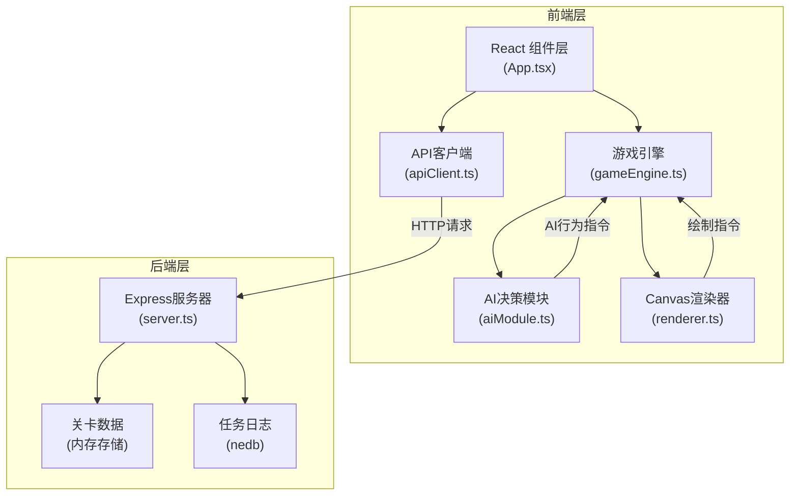
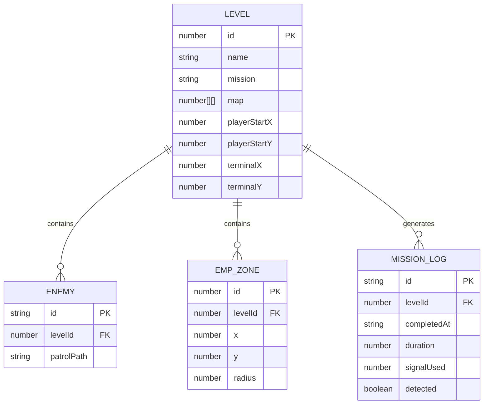

## 1. 架构设计



## 2. 技术描述

- **前端框架**: React@18 + TypeScript@5 + Vite@5
- **构建工具**: Vite@5 + @vitejs/plugin-react@4
- **游戏渲染**: HTML5 Canvas API
- **HTTP客户端**: axios@1
- **后端**: Express@4 + TypeScript
- **数据库**: nedb-promises@6 (嵌入式文档数据库)
- **工具库**: uuid@9 (ID生成)
- **启动脚本**: `npm run dev` 同时启动前端开发服务器和后端API服务器

## 3. 项目结构

```
StealthSignal/
├── package.json              # 项目依赖和脚本
├── index.html                # 入口HTML
├── vite.config.js            # Vite配置
├── tsconfig.json             # TypeScript配置
├── src/
│   ├── main.tsx              # React入口
│   ├── App.tsx               # 主应用组件
│   ├── gameEngine.ts         # 游戏引擎主循环
│   ├── aiModule.ts           # AI决策模块
│   ├── renderer.ts           # Canvas渲染器
│   ├── apiClient.ts          # API客户端
│   └── types.ts              # TypeScript类型定义
└── server/
    └── server.ts             # Express后端服务器
```

## 4. 核心模块职责

### 4.1 游戏引擎 (gameEngine.ts)
- 60FPS游戏主循环管理
- 玩家输入处理（WASD键盘控制）
- 碰撞检测（墙壁、敌人、终端）
- 声音传播模拟（含障碍物路径检测）
- EMP区域效果管理
- 任务状态管理
- 与AI模块和渲染器交互

### 4.2 AI模块 (aiModule.ts)
- 独立于游戏循环的决策逻辑
- 接收游戏状态（声音来源、位置信息）
- 计算敌人巡逻路线
- 响应声音刺激（调整巡逻路径）
- 处理失聪状态

### 4.3 渲染器 (renderer.ts)
- Canvas场景绘制
- 地图、特工、敌人渲染
- 声音波纹、EMP特效绘制
- 粒子效果、屏幕闪光、震动效果
- 响应式缩放处理

### 4.4 API客户端 (apiClient.ts)
- axios HTTP请求封装
- GET /api/levels 获取关卡配置
- POST /api/logs 提交任务日志

### 4.5 后端服务器 (server.ts)
- Express中间件配置
- CORS处理
- RESTful API接口
- nedb数据持久化
- 关卡配置数据（内置3个关卡）

## 5. 路由定义

| 路由 | 用途 |
|------|------|
| / | 游戏主页面 |
| GET /api/levels | 获取所有关卡配置 |
| POST /api/logs | 提交任务完成日志 |

## 6. API定义

### 6.1 GET /api/levels
**响应**:
```typescript
interface Level {
  id: number;
  name: string;
  mission: string;
  map: number[][];        // 20x15迷宫，0=地板，1=墙壁
  playerStart: { x: number; y: number };
  dataTerminal: { x: number; y: number };
  enemies: EnemyConfig[];
  empZones: EMPZone[];
}

interface EnemyConfig {
  id: string;
  patrolPath: { x: number; y: number }[];
}

interface EMPZone {
  x: number;
  y: number;
  radius: number;
}
```

### 6.2 POST /api/logs
**请求**:
```typescript
interface MissionLog {
  levelId: number;
  completedAt: string;
  duration: number;      // 毫秒
  signalUsed: number;    // 剩余信号值
  detected: boolean;     // 是否被检测过
}
```
**响应**:
```typescript
{ success: boolean; logId: string }
```

## 7. 数据模型

### 7.1 实体关系图



### 7.2 游戏运行时状态

```typescript
interface GameState {
  level: Level;
  player: {
    x: number;           // 格子坐标
    y: number;
    signal: number;      // 0-100
    inEMP: boolean;
    opacity: number;     // 低信号时闪烁
  };
  enemies: EnemyState[];
  soundWaves: SoundWave[];
  particles: Particle[];
  effects: ScreenEffect[];
  dataCollected: number;
  status: 'playing' | 'success' | 'failed' | 'transition';
  startTime: number;
}

interface EnemyState {
  id: string;
  x: number;
  y: number;
  direction: number;     // 弧度
  patrolIndex: number;
  patrolPath: { x: number; y: number }[];
  distracted: boolean;
  distractedTarget: { x: number; y: number } | null;
  distractedTimer: number;
  deaf: boolean;
  deafTimer: number;
  lastParticleTime: number;
}

interface SoundWave {
  x: number;
  y: number;
  radius: number;
  maxRadius: number;     // 3格
  opacity: number;
  startTime: number;
  duration: number;      // 0.5秒
}

interface Particle {
  x: number;
  y: number;
  startTime: number;
  duration: number;
}

interface ScreenEffect {
  type: 'flash' | 'shake' | 'edgeRed' | 'successPopup' | 'failedOverlay';
  startTime: number;
  duration: number;
  intensity?: number;
}
```

## 8. 性能优化策略

### 8.1 声音传播优化
- 使用Bresenham算法进行视线检测，每帧≤2ms
- 预计算地图的可通行区域
- 声音波纹对象池复用

### 8.2 渲染优化
- Canvas分层渲染（静态地图层、动态层、特效层）
- 离屏Canvas缓存静态地图
- requestAnimationFrame精确计时

### 8.3 AI优化
- AI决策与游戏循环分离，独立时间步长
- 路径计算缓存，避免重复计算
- 事件驱动的状态更新

## 9. 常量定义

```typescript
const GRID_SIZE = 40;          // 每格像素
const MAP_WIDTH = 20;          // 地图宽度（格）
const MAP_HEIGHT = 15;         // 地图高度（格）
const PLAYER_SPEED = 3;        // 格/秒
const ENEMY_SPEED = 1.5;       // 格/秒
const SOUND_SPEED = 6;         // 格/秒
const SOUND_MAX_RADIUS = 3;    // 格
const SOUND_DURATION = 0.5;    // 秒
const EMP_RADIUS = 2;          // 格
const SIGNAL_DECREASE_RATE = 10; // 每秒
const SIGNAL_RECOVERY_RATE = 5;  // 每秒
const SIGNAL_LOW_THRESHOLD = 20;
const DEAF_DURATION = 3;       // 秒
const DISTRACT_DURATION = 5;   // 秒
const PARTICLE_INTERVAL = 0.3; // 秒
const PARTICLE_DURATION = 0.5; // 秒
const FLASH_DURATION = 1.5;    // 秒
const SHAKE_AMOUNT = 4;        // 像素
const EDGE_RED_DURATION = 0.2; // 秒
const SUCCESS_POPUP_DELAY = 2; // 秒
const FAILED_RETRY_DELAY = 1;  // 秒
```
