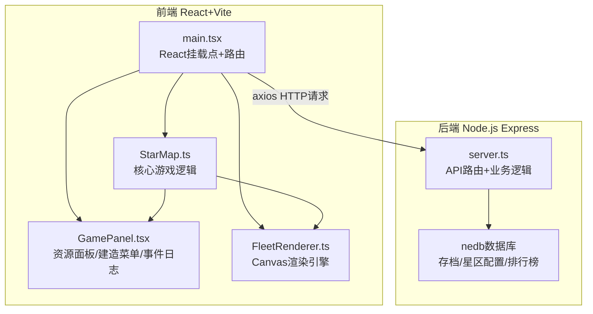
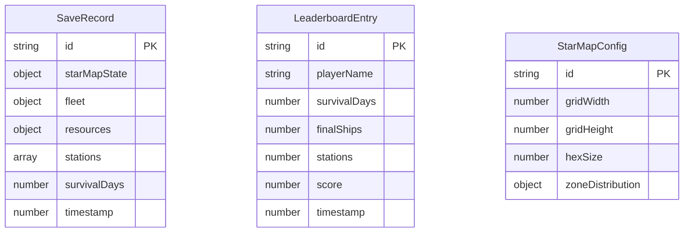

## 1. 架构设计



数据流向：
- 玩家交互 → React UI事件 → StarMap更新状态 → 通知FleetRenderer渲染 + GamePanel重绘
- 存档/排行榜请求 → axios HTTP → Express API → nedb读写 → 返回JSON

## 2. 技术说明

- 前端：React@18 + TypeScript + Vite + Tailwind CSS + Zustand状态管理 + Canvas API
- 初始化工具：vite-init (react-express-ts模板)
- 后端：Express@4 + TypeScript + nedb-promises
- 数据库：nedb（嵌入式，文件存储）
- 渲染引擎：Canvas 2D API，requestAnimationFrame驱动60FPS
- AI模块：集成在StarMap.ts中，BFS寻路算法保证<5ms/次

## 3. 路由定义

| 路由 | 用途 |
|------|------|
| / | 游戏主页面（星图+信息面板） |
| /leaderboard | 排行榜页面 |

## 4. API定义

### 4.1 存档管理

```typescript
// 保存游戏
POST /api/saves
Request: {
  starMapState: HexCell[];      // 星图探索状态
  fleet: FleetState;            // 舰队属性
  resources: ResourceState;     // 资源数
  stations: StationState[];     // 已建造空间站
  survivalDays: number;         // 存活天数
}
Response: { id: string; timestamp: number }

// 获取最近存档列表
GET /api/saves
Response: SaveRecord[]  // 最多3个，按时间倒序

// 加载存档
GET /api/saves/:id
Response: SaveRecord

// 删除存档
DELETE /api/saves/:id
Response: { success: boolean }
```

### 4.2 星区配置

```typescript
// 获取星区模板配置
GET /api/config/starmap
Response: {
  gridWidth: number;           // 20
  gridHeight: number;          // 20
  hexSize: number;             // 40
  zoneDistribution: {          // 星区类型分布比例
    safe: number;              // 0.4
    resource: number;          // 0.35
    danger: number;            // 0.25
  }
}
```

### 4.3 排行榜

```typescript
// 上传得分
POST /api/leaderboard
Request: {
  playerName: string;
  survivalDays: number;
  finalShips: number;
  stations: number;
  score: number;  // 存活天数×10 + 剩余飞船数×5 + 空间站数×20
}
Response: { rank: number }

// 获取排行榜
GET /api/leaderboard
Response: LeaderboardEntry[]
```

## 5. 服务端架构图

```mermaid
graph LR
    "Controller<br/>路由处理" --> "Service<br/>业务逻辑" --> "Repository<br/>nedb数据访问" --> "Database<br/>nedb文件存储"
```

## 6. 数据模型

### 6.1 数据模型定义



### 6.2 核心前端数据结构

```typescript
interface HexCell {
  q: number;                    // 六边形列坐标
  r: number;                    // 六边形行坐标
  type: 'safe' | 'resource' | 'danger';
  explored: boolean;
  hasStation: boolean;
  stationBuiltAt?: number;
}

interface FleetState {
  ships: number;                // 飞船数量
  position: { q: number; r: number };
  fuel: number;                 // 燃料
  maxFuel: number;              // 最大燃料
  powerCoeff: number;           // 军力系数
}

interface ResourceState {
  ore: number;                  // 矿石
  alloy: number;                // 合金
}

interface EnemyFleet {
  id: string;
  ships: number;
  position: { q: number; r: number };
  path: { q: number; r: number }[];
}

interface StationState {
  position: { q: number; r: number };
  buildTime: number;
}

interface GameLog {
  type: 'explore' | 'gather' | 'combat' | 'build';
  message: string;
  timestamp: number;
}
```
